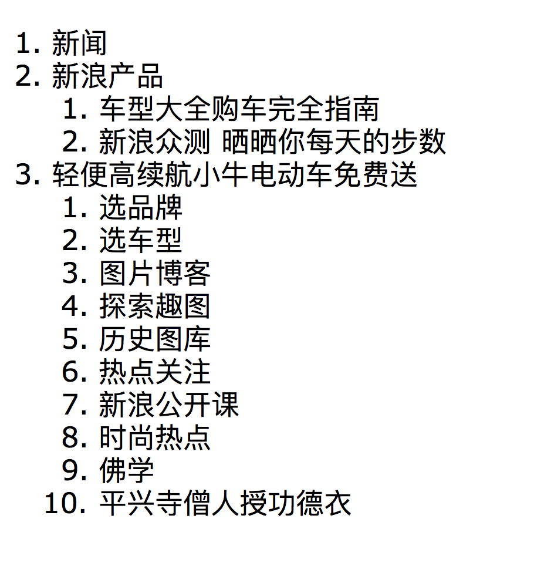

# HTML 大纲

可以使用这个网站：[https://gsnedders.html5.org/outliner/](https://gsnedders.html5.org/outliner/)，来检测你的 HTML 结构是否合乎 HTML 大纲的规范。

我把新浪的首页链接放进去检测，得到的结果如下：

可以看到，还是很标准的，那么你写的 HTML 结构标准吗？试一试吧！

那么，怎样写，才标准呢？