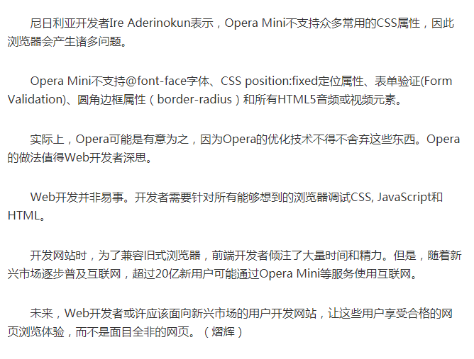

# 英文缩写

oss: object save server

cos: cloud object storage

PaaS（platform-as-a-service 平台即服务）

【CI\CD】

CI\CD 其实说的是三件事情：「持续集成（Continuous Integration）」、「持续交付（Continuous Delivery）」、「持续部署（Continuous Deployment）」。

因为「持续交付」和「持续部署」的英文缩写是一样的，所以这三件事情缩写成了 CI\CD 。


- Showing 1 changed file with 1 addition and 0 deletions. 【改了一个文件，添加了一行内容，删除了0行内容。】

- Unsynced   没有同步的版本
- Revert this Commit   抵消这次版本
- Roll Back to this Commit    回滚到这个版本
- Synced   同步
- Collaborators   合作者
- And converting them into collaborators    把他们变成合作者
- This pull request can be automatically merged by project collaborators  这个pull request可以被项目的collaborator 自动融合。


【github中的快捷键】
- 在issues中就某个问题回复，可以选中要回复的问题，然后按快捷键R

- 在github中，其实是有查找功能的，搜索查找快捷键


【收藏 - 博客】
技术博客|个人博客|learning plan
---|---|---
[腾讯全端 AlloyTeam 团队 Blog](http://www.alloyteam.com/)|[byvoid 网站](https://www.byvoid.com/zhs/blog/list)| -[x] [didi-肖磊](https://github.com/CommanderXL/Biu-blog)
[好多视频](http://haoduoshipin.com/)|[Layui 作者个人博客](http://sentsin.com/)
[陈秋歌发布的内容](http://geek.csdn.net/user/publishlist/chenqiuge1984)|[yilia 主题作者 litten 博客](http://litten.me/)
[dwqs/blog](https://github.com/dwqs/blog)|[阮一峰的个人网站](http://www.ruanyifeng.com/home.html)
[滴滴团队技术blog](https://github.com/DDFE/DDFE-blog)|[NexT主题作者IIssNan博客](http://notes.iissnan.com/)
[饿了么前端博客](https://fe.ele.me/)|[玉伯的博客](https://github.com/lifesinger/blog/issues)
s|[万神劫的博客](http://chaoskeh.com/archive.html)
s|[李炎恢的博客](http://www.liyanhui.com/)
s|[使用NexT主题的博客](https://github.com/iissnan/hexo-theme-next/issues/119)
s|[晚晴幽草轩](http://www.jeffjade.com/)
s|[https://github.com/creeperyang/blog](https://github.com/creeperyang/blog)
s|[王垠的博客](http://www.yinwang.org/)
s|[张云龙博客](https://github.com/fouber/blog)
s|[天猪部落阁](https://github.com/atian25/blog)

```
更新中...
```


【收藏-专栏】
[尤雨溪 - 知乎](https://www.zhihu.com/people/evanyou/)

[黄轶 - 掘金](https://juejin.im/user/586db400a22b9d005695a69d/posts)

[YoungZ - 掘金](https://juejin.im/user/59a7a5a96fb9a02487554b86)

【收藏 - 教程/课程】
# Node.js
1、Node.js 包教不包会 by alsotang 课程
https://github.com/alsotang/node-lessons

2、使用 Express + MongoDB 搭建多人博客
https://github.com/nswbmw/N-blog

# 二、Node.js API
- [https://nodejs.org/api/](https://nodejs.org/api/)

# 三、AMD
- [AMD](https://github.com/amdjs/amdjs-api/wiki/AMD-(%E4%B8%AD%E6%96%87%E7%89%88))
- [AMD 中的 require()函数](https://github.com/amdjs/amdjs-api/wiki/require-(%E4%B8%AD%E6%96%87%E7%89%88))
- [Loader Plugins](https://github.com/amdjs/amdjs-api/wiki/Loader-Plugins(%E4%B8%AD%E6%96%87%E7%89%88))

# 四、阮一峰 JS 教程
- [JavaScript 标准参考教程（alpha）](http://javascript.ruanyifeng.com/)

# 五、阮一峰 webpack 教程
- [阮一峰 webpack 教程](https://github.com/ruanyf/webpack-demos)

# 微信小应用的入门过程
- [分享我用cnode社区api做微信小应用的入门过程](https://cnodejs.org/topic/57ea257b3670ca3f44c5beb6)

# 前端资源教程
- [前端资源教程](https://cnodejs.org/topic/56ef3edd532839c33a99d00e)

# react

[React.js 小书](http://huziketang.com/books/react/)
【收藏 - 课程/教程 - END】


【收藏 - 图片站点】

[500px](https://500px.com/)

[视觉中国](https://www.vcg.com/)


【收藏的文章】
收藏的文章

|s|s|
|---|---|
|[没有功能需求设计文档？对不起，拒绝开发！](http://blog.jobbole.com/110645/)|[漫画赏析：Linux 内核到底长啥样](http://blog.jobbole.com/110581/)|
|[从一个奇怪的错误出发理解 Vue 基本概念](https://zhuanlan.zhihu.com/p/25486761#tipjar)|[样式化加载失败的图片](http://web.jobbole.com/90430/)|
|[使用Service worker实现加速/离线访问静态blog网站](http://web.jobbole.com/90421/)|[和少妇白洁一起学JavaScript](https://segmentfault.com/a/1190000008449808)|
|[在 Node.js 中引入模块](http://huziketang.com/blog/posts/detail?postId=58eaf471a58c240ae35bb8e3)|s|


【网站&工具】
[在线代码演示](http://jsbin.com/?html,output)


【收藏 - 访谈】
|s|s|
|--|--|
|[阮一峰：为什么写博客？（图灵访谈）](http://www.ituring.com.cn/article/111023)|[vue.js作者谈vue的创作过程](http://www.csdn.net/article/1970-01-01/2825439)|
|[周爱民：真正的架构师是没有title的（图灵访谈）](http://www.ituring.com.cn/article/120377)|[Vue作者尤雨溪：以匠人的态度不断打磨完善Vue （图灵访谈）](http://www.ituring.com.cn/article/273032)|
|[朴灵：打破限制，从前端到全栈（图灵访谈）](http://www.ituring.com.cn/article/197773)|[比较详细的采访 Vue 作者尤雨溪(英文)](https://medium.freecodecamp.com/between-the-wires-an-interview-with-vue-js-creator-evan-you-e383cbf57cc4)|
|[七牛首席架构师李道兵：在开源世界里逼自己成长（图灵访谈）](http://www.ituring.com.cn/article/200305)|[比较详细的采访 Vue 作者尤雨溪(中文)](http://zcfy.cc/article/an-interview-with-vue-js-creator-evan-you-3143.html?t=selection)|
|[云巴创始人张虎：一个优秀的软件工程师必然是全栈工程师（图灵访谈）](http://www.ituring.com.cn/article/199457)|s|
|[《CSS 揭秘》作者Lea Verou：我喜欢分享开源的行业文化（图灵访谈）](http://www.ituring.com.cn/article/261344)|s|
|s|s|


【收藏 - 前端面试相关问题】

[https://github.com/h5bp/Front-end-Developer-Interview-Questions](https://github.com/h5bp/Front-end-Developer-Interview-Questions)

[https://github.com/markyun/My-blog/tree/master/Front-end-Developer-Questions](https://github.com/markyun/My-blog/tree/master/Front-end-Developer-Questions)


【关于opera-mini浏览器的一些认识】
## Opera

opera mini是挪威opera公司推出的一款浏览器，除此之外还有opera mobile ，与中国团队合作开发的欧朋，开奇 opera mini以带来一流的浏览体验而著称。快速，省流量，精致小巧，对网页的还原性很强。当然，因为这并不是针对中国本土的浏览器，有些方面可能不太完美，像不支持三大运营商的wifi登陆界面（支持wifi上网），对wap浏览省流量效果不太理想，不支持夜间模式，排版有时候可能有点问题。总的来说opera mini是我用过最好的浏览器。在速度，省流量和排版方面的浏览体验比之uc，遨游，qq之类都要更好。其实最令人感动的是opera mini 为低端配置手机所做的努力

Opera Mini 是瘦客户端浏览器，适用于几乎所有手机，它使用 Opera 先进的服务器压缩技术压缩页面后再传回手机，渲染引擎在服务器端。
Opera Mobile 是全功能的浏览器，适用于智能手机，它直接访问网站下载页面使用手机端渲染引擎 – Opera Presto – 渲染页面。
Opera Mobile 提供高度友好的浏览体验，推荐在拥有 Wi-Fi 网络或无限流量套餐时使用。而 Opera Mini 拥有快如闪电的速度，同时还能帮您节省大量上网费用。很多用户在有 Wi-Fi 时使用 Opera Mobile，其他时候则使用 Opera Mini。

## 相关资料链接

[Opera Mini 与 JavaScript](http://tieba.baidu.com/p/2006880516)
[https://www.v2ex.com/t/3905](https://www.v2ex.com/t/3905)


[opera mini主流版本详尽介绍](http://tieba.baidu.com/p/670744164)

Opera Mini
[Opera mini 互动百科](http://www.baike.com/wiki/Opera+mini)
[https://dev.opera.com/articles/opera-binary-markup-language/](https://dev.opera.com/articles/opera-binary-markup-language/)
[Android 版 Opera 常见问题](https://www.opera.com/zh-cn/help/mobile/android)


[Opera Mini浏览器体验欠佳 但用户量已超过3亿](http://tech.qq.com/a/20151225/023653.htm)

## 重要点



【一些实战的代码优化小技巧】
代码优化是一门很深的学问，考验一个人的基本功，内力，经验，以及工作中的思考和总结。如果对这块感兴趣的，可以专门看书学习一下。【列一些专业的书籍】

下面，是我在实战中的一些总结。
```
if(jqXHR.statusText === "Hello" || jqXHR.statusText === "OK" || jqXHR.statusText === "success") {...}
// 改为
if(['Hello', 'OK', 'success'].indexOf(jqXHR.statusText) > -1) {...}
```


