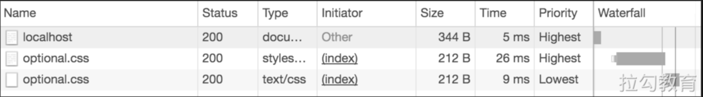

# 前端性能优化

## 请求和响应优化

- 减少 DNS 查找：每次主机名的解析都需要一次网络往返，从而增加了请求的延迟时间，同时还会阻塞后续的请求。
- 重用 TCP 连接：尽可能的使用持久连接，以消除因 TCP 握手和慢启动导致的延迟。
- 减少 HTTP 重定向：HTTP 冲定向需要额外的 DNS 查询、TCP 握手等非常耗时，最佳的重定向次数为0。
- 压缩传输的资源：比如 Gzip、图片压缩。
- 使用缓存：比如 HTTP 缓存、CDN 缓存、Service Worker 缓存。
- 使用 CDN（内容分发网络）：把数据放在离用户地理位置更近的地方，可以明显减少每次 TCP 连接的网络延迟，增大吞吐量。
- 删除没有必要请求的资源
- 在客户端缓存资源：缓存必要的应用资源，避免每次都重复请求相同的内容，例如多图片下载可以考虑使用缓存。
- 内容在传输前先压缩：传输数据之前应该先压缩应用资源，把要传输的字节减少到最小，在压缩的时候确保对每种不同的资源采用最好的压缩手段。
- 消除不必要的请求开销：减少请求的 HTTP 首部数据（比如 HTTP COokie）
- 并行处理请求和响应：请求和响应的排队都会导致延迟，可以尝试并行的处理请求和响应（利用多个 HTTP1.1 连接实现并行下载，在可能的情况下使用 HTTP 管道计数）。
- 针对协议版本采取优化措施。升级到 HTTP2.0。
- 根据需要采用服务端渲染方式。这种方式可以解决 SPA 应用首屏渲染慢的问题。
- 采用预渲染的方式快速加载静态页面。页面渲染的极致性能，比较适合静态页面。


## 渲染优化
### 关键渲染路径优化

1、优化DOM

缩小文件的尺寸（Minify）、使用gzip压缩（Compress）、使用缓存（HTTP Cache）

2、优化 CSSOM

CSS 是构建渲染树的必备元素，首次构建网页时，JavaScript 常常受阻于 CSS。
确保将任何非必需的 CSS 都标记为非关键资源（例如打印和其他媒体查询），并应确保尽可能减少关键 CSS 的数量，以及尽可能缩短传送时间。

- 阻塞渲染的 CSS

```html
<link href="style.css" rel="stylesheet">
<link href="print.css" rel="stylesheet" media="print">
<link href="other.css" rel="stylesheet" media="(min-width: 40em)">
<link href="portrait.css" rel="stylesheet" media="orientation:portrait">
```

- 避免在 CSS 中使用 `@import`

3、优化 JavaScript 的使用

- 使用 defer 延迟加载 JavaScript
- 使用 async 延迟加载 JavaScript
- 使用 defer，js 的执行会按照 js 书写的顺序进行执行，而 async 是谁先加载完就立刻执行

### JavaScript 执行优化

1、实现动画效果

- 利用 `window.requestAnimationFrame` 来代替 setInterval 和 setTimeout。
```html
<!DOCTYPE html>
<html lang="en">
<head>
  <meta charset="UTF-8">
  <meta http-equiv="X-UA-Compatible" content="IE=edge">
  <meta name="viewport" content="width=device-width, initial-scale=1.0">
  <title>Document</title>
  <style>
    .box {
      width: 100px;
      height: 100px;
      position: absolute;
      background-color: skyblue;
    }
  </style>
</head>

<body>
  <div class="box"></div>
  <script>
    const element = document.querySelector('.box')
    let start

    function step(timestamp) {
      if (!start) {
        start = timestamp
      }
      const progress = timestamp - start
      // 在这里使用 Math.min() 确保元素刚好停在 200px 的位置
      element.style.left = `${Math.min(progress / 10, 200)}px`
      // 在两秒后停止动画
      if (progress < 2000) {
        window.requestAnimationFrame(step)
      }
    }
    window.requestAnimationFrame(step)
  </script>
</body>
</html>
```

2、恰当使用 Web Worker

可将一些纯计算的工作迁移到 Web Worker 上处理，它为 JavaScript 的执行提供了多线程环境。
```html
<!DOCTYPE html>
<html lang="en">
<head>
  <meta charset="UTF-8">
  <meta http-equiv="X-UA-Compatible" content="IE=edge">
  <meta name="viewport" content="width=device-width, initial-scale=1.0">
  <title>Web Worker</title>
</head>
<body>
  <input type="number" id="num1" value="1">+
  <input type="number" id="num2" value="2">
  <button id="btn">=</button>
  <strong id="result">0</strong>
  <script>
    const worker = new Worker('worker.js')
    const num1 = document.querySelector('#num1')
    const num2 = document.querySelector('#num2')
    const result = document.querySelector('#result')
    const btn = document.querySelector('#btn')
    btn.addEventListener('click', () => {
      worker.postMessage({
        type: 'add',
        data: {
          num1: num1.value - 0,
          num2: num2.value - 0
        }
      })
    })
    worker.addEventListener('message', e => {
      const { type, data } = e.data
      if (type === 'add') {
        result.textContent = data
      }
    })
  </script>
</body>
</html>
```

```js
// worker.js
onmessage = function (e) {
  const { type, data } = e.data
  if (type === 'add') {
    const ret = data.num1 + data.num2
    postMessage({
      type: 'add',
      data: ret
    })
  }
}
```


3、事件节流和事件防抖
```js
// 参数1：函数
// 参数2：时间
// 返回值：被节流的函数
// document.onscroll = _.throttle(function () {
//   console.log('hello')
// }, 1000)

function throttle(fn, delay) {
   let lastTime
   let timer
   delay || (delay = 300) // 默认间隔为300ms
   return function (arguments) {
     let context = this
     let args = arguments
     let nowTime = +new Date() // 获取系统当前的时间
     if (lastTime && nowTime < lastTime + delay) {
       // 当前距离上次执行的时间小于设置的时间间隔
       clearTimeout(timer) // 清除定时器
       timer = setTimeout(function () {
         // delay时间后，执行函数
         lastTime = nowTime
         fn.apply(context, args)
       }, delay)
     } else {
       // 当前距离上次执行的时间大于等于设置的时间，直接执行函数
       lastTime = nowTime
       fn.apply(context, args)
     }
   }
 }
```

```js
// 参数1：函数
// 参数2：时间
// 返回值：被节流的函数
// document.onscroll = _.debounce(function () {
//   console.log('hello')
// }, 500)

function debounce(fun, delay) {
  return function (arguments) {
    //获取函数的作用域和变量
    let that = this
    let args = arguments
    clearTimeout(fun.id) // 清除定时器
    fun.id = setTimeout(function () {
      fun.call(that, args)
    }, delay)
  }
}
```

### 计算样式优化

1、减少要计算样式的元素数量
+ 使用类选择器替代标签选择器
+ 避免使用通配符做选择器

2、降低选择器的复杂性

3、使用 BEM 规范

BEM 是一种 CSS 的书写规范，它的名称是由三个单词的首字母组成的，分别是块（Block）、元素（Element）和修饰符（Modifier）。

理论上它希望每行 CSS 代码只有一个选择器，这就是为了降低选择器的复杂性，对选择器的命名要求通过以下三个符号的组合来实现。

中画线`（-）`：仅作为连字符使用，表示某个块或子元素的多个单词之间的连接符。

单下画线`（_）`：作为描述一个块或其子元素的一种状态。

双下画线`（__）`：作为连接块与块的子元素。
```css
/* 自定义列表下子元素大、中、小三种尺寸的类选择器 */
.mylist__item_big {}

.mylist__item_normal {}

.mylist__item_small {}

/* 带自定义尺寸修饰符的类选择器 */
.mylist__item_size-10 {}
```

### 页面布局与重绘优化

1、避免对样式的频繁改动
+ 使用类名对样式逐条修改
+ 缓存对敏感属性值的计算

2、使用 requestAnimationFrame 方法控制渲染帧

3、降低绘制复杂度

### 资源加载优化
1、图片延迟加载

2、视频加载
+ 不需要自动播放
+ 视频代替 GIF 动画

3、路由懒加载

4、资源优先级

浏览器基于自身的**启发式算法**，会对资源的重要性进行判断来划分优先级，通常从低到高分为：Lowest、Low、High、Highest等。

5、预加载

使用 标签告诉浏览器当前所指定的资源，应该拥有更高的优先级，例如：
```html
<link rel="preload" as="style" href="a.css">
<link rel="preload" as="script" href="b.js">
```

- [预连接](https://web.dev/uses-rel-preconnect/)


通常在速度较慢的网络环境中建立连接会非常耗时，如果建立安全连接将更加耗时。其原因是整个过程会涉及 DNS 查询、重定向和与目标服务器之间建立连接的多次握手，所以若能提前完成上述这些功能，则会给用户带来更加流畅的浏览体验，同时由于建立连接的大部分时间消耗是等待而非数据交换，这样也能有效地优化带宽的使用情况。解决方案就是所谓的**预连接**：

`<link rel=“preconnect” href=“https://example.com”>`

通过标签指令，告知浏览器当前页面将与站点建立连接，希望尽快启动该过程。虽然这么做的成本较低，但会消耗宝贵的 CPU 时间，特别是在建立 HTTPS 安全连接时。如果建立好连接后的 10s 内，未能及时使用连接，那么浏览器关闭该连接后，之前为建立连接所消耗的资源就相当于完全被浪费掉了。

另外，还有一种与预连接相关的类型 ，也就是常说的 DNS 预解析，它仅用来处理 DNS 查询，但由于其受到浏览器的广泛支持，且缩短了 DNS 的查询时间的效果显著，所以使用场景十分普遍。

- [预解析 DNS](https://developer.mozilla.org/zh-CN/docs/Web/Performance/dns-prefetch)

- 预提取

预提取最适合的场景是为用户下一步可能进行的操作做好必要的准备，如在电商平台的搜索框中查询某商品，可预提取查询结果列表中的首个商品详情页；或者使用搜索查询时，预提取查询结果的分页内容的下一页：

`<link rel=“prefetch” href=“page-2.html”>`


**需要注意的是，预提取不能递归使用**，比如在搜索查询的首页 `page-1.html` 时，可以预提取当前页面的下一页 `page-2.html` 的 HTML 内容，但对其中所包含的任何额外资源不会提前下载，除非有额外明确指定的预提取。

另外，预提取不会降低现有资源的优先级，比如在如下 HTML 中：
```html
<html>
  <head>
    <link rel="prefetch" href="style.css">
    <link rel="stylesheet" href="style.css">
  </head>
  <body>
    Hello World!
  </body>
</html>
```

可能你会觉得对 `style.css` 的预提取声明，会降低接下来 `<link rel="stylesheet" href="style.css">` 的优先级，但其真实的情况是，该文件会被提取两次，第二次可能会使用缓存，如下图所示。


显然两次提取对用户体验来说非常糟糕，因为这样不但需要等待阻塞渲染的 CSS，而且如果第二次提取没有命中缓存，必然会产生带宽的浪费，所以在使用时应充分考虑。


## 图片优化
1. 适合用矢量图的地方首选矢量图。
2. 使用位图时首选WebP，对不支持的浏览器场景进行兼容处理。
3. 尽量为位图图像格式找到最佳质量设置。
4. 删除图像文件中多余的元数据。
5. 对图像文件进行必要的压缩。
6. 为图像提供多种缩放尺寸的响应式资源。
7. 对工程化通用图像处理流程尽量自动化。

