# 摩拜部门领导小春(张耀春)疑似性骚扰女下属

摩拜女员工发邮件举报，原文如下：

尊敬的领导，
您好，我是来自摩拜 SPE 前端组的一名普通员工，在这里恳请您花一点时间阅读我写的内容。
我是一名女生，一名来自摩拜SPE-前端组的工程师，于2017年8月来到摩拜就职。我曾经为我所在的  Mobike  FE  感到骄傲和自豪。因为这个组看起来十分年轻有活力、充满干劲，leader 张耀春看起来专业有实力、领导力强，也十分善于团结组员。
然而随着时间的推移，以及越来越多的接触，我和我身边的很多同事都对前端组的一切有了截然相反的看法。
因为客户端&前端组负责人，张耀春（小春），对包括我在内的3名女下属有不同程度的性骚扰；利用职权打压违背自己意愿的同事；利用职权之便招录想要发展情人关系的女生入职；工作上以挣钱为目的，技术产出甚少。我和我身边的女同事不堪其扰，严重影响了生活和工作，对于个人情感和状态都有较为严重伤害。前端组现在女员工已超过半数绝非偶然，张耀春对女下属格外“关心”，我们不知道具体有多少同事正在承受这种困扰，又有多少人在即将承受这份困扰的路上。
我们认为摩拜是一个年轻有朝气有社会责任感的企业，张耀春这种不道德不负责的行为对于摩拜的企业形象和工作氛围都有严重的损害，对团队的工作效率和未来发展也十分不利。
我们曾想过忍气吞声，但张耀春的行为逐渐变本加厉，因此经过反复思考，我们决定站出来，为了自己不再承受如此恶劣的言行，为了团队能够更有效率，为了公司能够更健康的运行，举报张耀春。希望能够得到公司的重视并采取相应措施，我们都不希望之后发生更加严重的事。

#### 事实1：利用职务之便招录女性朋友入职，并意图单方面与该女性发展情人关系（小春已婚，且有一个刚满半岁的儿子）

今年5月，小春授意我替他转发一封内推简历，并告诉我不要对任何人说。那封简历是小春的前同事q的，后来q来公司面试，顺利入职。小春告知q在摩拜要假装不认识彼此。此时q是单身状态，随后小春企图与其发展关系：三番五次的要求女生去他家给自己做饭、深夜去车站接他，将职场当成自己的后宫，言语中常常暗示自己位高权重能给与对方工作上的帮助和便利。后来q与男友复合并结婚，小春知道后暴跳如雷，通过电话、微信辱骂q，称：你男朋友能给你什么？我能给你什么，你自己不想想。言下之意小春能够给q工作上和物质上更多帮助，而他男朋友不能。并删除q微信，不给她分配工作需求，排挤致其离职。事实上q离职那天曾经去过胡阿姨的办公室想要举报，但阿姨不在办公室。
q是我们组受伤害最严重的女同事，工作受到严重影响以致于被迫离职，刚入职两个月就要重新找工作，情感上遭遇上级骚扰，内心困扰厌烦甚至恶心，胡阿姨同为女性，一定理解我们的感受。

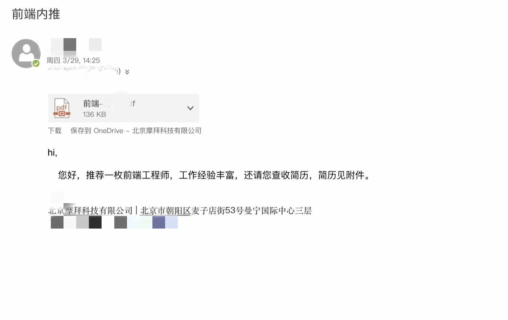

图为小春让我内推q的邮件记录，以权谋私，后来才知道他是为了挣内推奖，直接上司内推下属入职没有奖金，他是为了挣钱。发简历前说给我挣钱，成功入职后说，我想想要给你分多少钱，看你表现了。

#### 事实2：对女下属言语试探、骚扰，甚至暗示女下属能够利用权力为其提供便利。

作为一名刚毕业初涉职场的女生，我对职场是充满憧憬的。我想要努力工作、提升专业水平，有更好的职业发展，对领导也是十分尊重，想要从领导身上学到技能、经验和沟通方法。然而小春不断的言语试探、骚扰、暗示甚至威胁都让我渐渐三观崩塌、内心焦灼、无心工作。
例如他会在周末让我帮他写PPT、周末让我给他送饭、让我发自拍，深夜去车站“接驾”，三番五次让我请他吃饭，请他喝可乐等等，我都用各种借口都一推再推。最近我告诉小春我妈妈来北京照顾我了，他便反复问我妈妈是否已经离开北京了。只要不顺从他的意思，他会在工作上对我挑刺，并辱骂我，使用“滚”的字眼。我真的又害怕又恶心，无法正常工作。作为一个独自在北京奋斗的北漂，在这种环境中我感到孤立无援，请公司为我们提供一个公正的环境。由于本人之前的手机被偷，聊天记录只能找到这些。

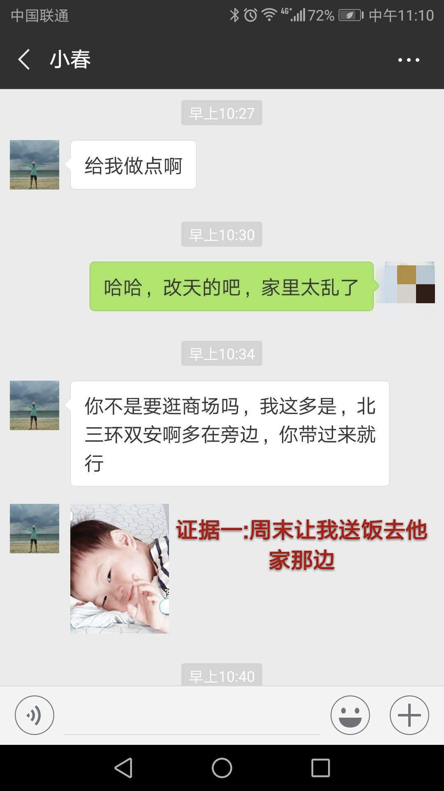

周末让我送饭去他家那边

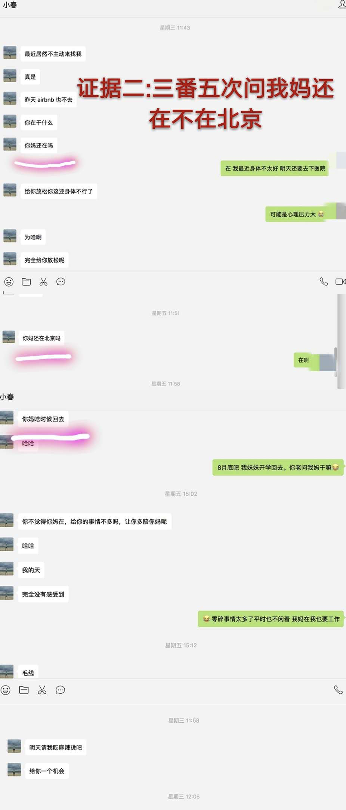

好几次问我妈在不在北京

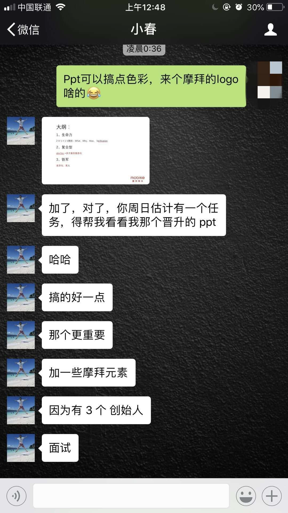
让我帮他准备晋升ppt, 之后还让我帮他根据他在外面分享的音频整理成文章，让我整理客户端和前端五十多人的绩效汇总

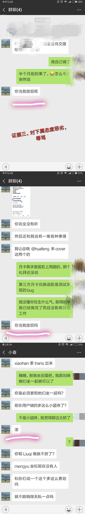
只要没有顺着他的意思，就开始骂人，毫无道理可言

三番五次让我自拍

#### 事实3：工作上有技术含量的成果输出较少，混圈子，利用公司ip挣钱，薅公司羊毛，甚至“蹭”他人的研究成果

他对外宣称是热爱摩拜来到这里，真实原因是之前在滴滴和团队的人闹矛盾而走，滴滴团队共同写了一本书，到结账的时候，他一个人独吞80000左右的收入，只给团队的几个人分了8000。今年这个套路同样在摩拜进行，利用摩拜小程序的ip, 让小程序团队共同出了一本掘金小册，这件事他也曾经要求我在晚上熬夜读完小册给建议。私下他还找过我要求跟他一起做一个教学视频，被我拒绝后处处给我挑刺。他口口声声说为了扩大团队影响力，实则是为了挣钱，在摩拜和滴滴都是拿着团队的共同的劳动成果来名利双收。有经验的有想法的同事都了解他的真实技术水平，混圈子不学无术。此人非常爱财，私下经常要求同事请他吃饭喝水，他生病了还要求同事给他买药，利用公司的骑车分享和分销半年卡项目赚了好几千。

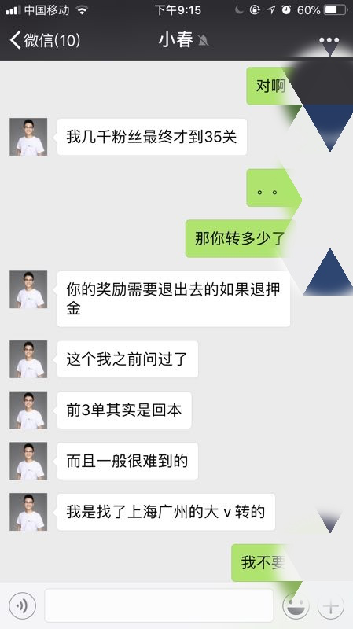
利用公司的分销半年卡活动赚了很多钱

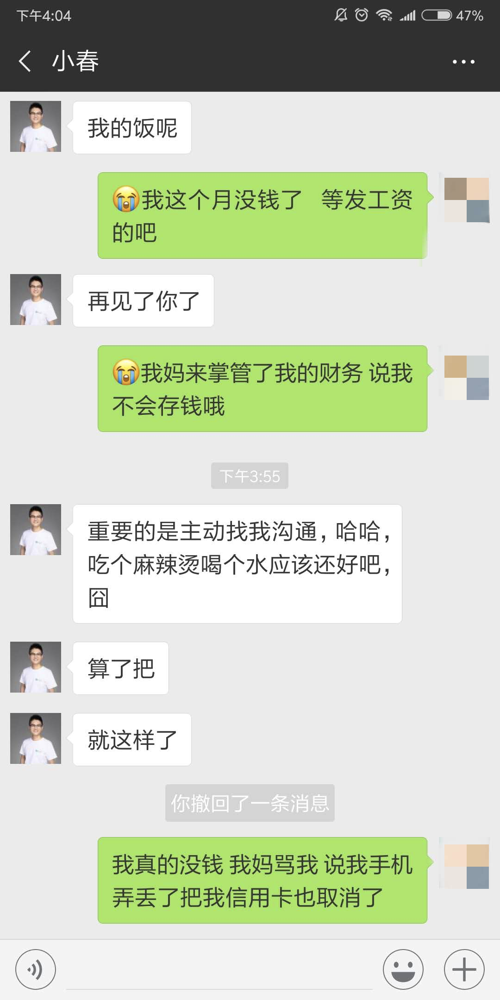
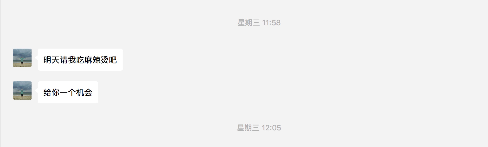
多次让我找他沟通，要求请他吃饭和喝水

此人在团队引起众人不满，尤其是他升职后，情况愈来愈恶劣，对团队施压，对女同事不断骚扰，稍不顺他的心意就会暴跳如雷，技术上毫无贡献，每天专注于卖书。。同事们无法安心工作，我本人更是害怕看到他给我发微信。如果公司要调查，可以问前端组同事，几乎没人支持他。关于他贪图利益，可以问之前他在滴滴的同事，滴滴的当事人表示愿意视频或者电话证明此人的恶劣行径。此人在滴滴是身败名裂离职，这不是正常的上班。恳请领导们重视，如果放任不管，同事们无法正常工作，女同事的安全更是无法保障！

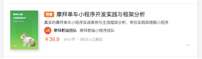

下图为他在滴滴和摩拜利用公司团队成果赚钱，目前摩拜小程序小册还未结账，在滴滴是一个人独吞很多钱

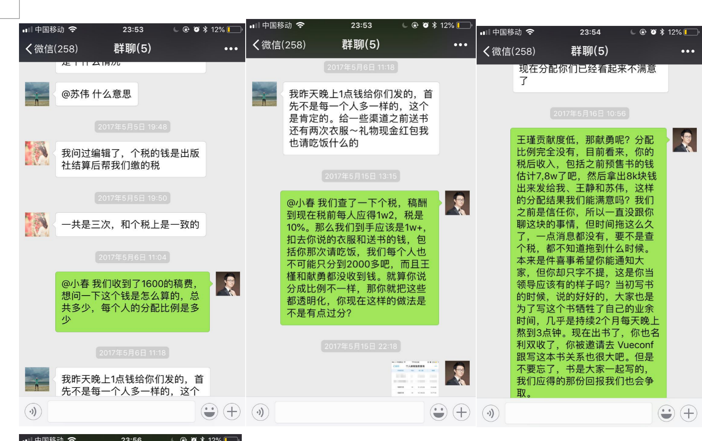
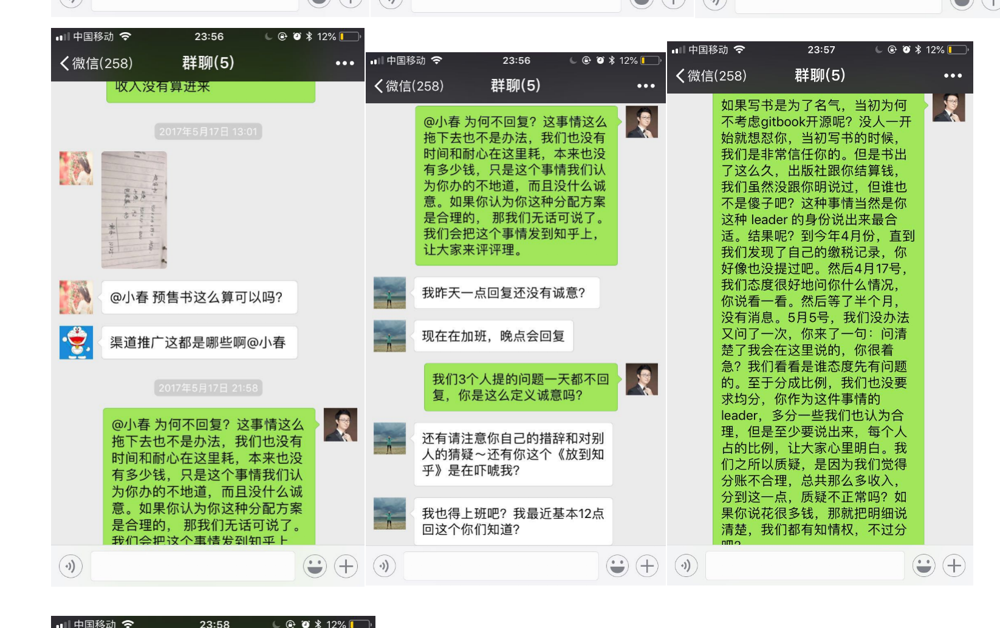
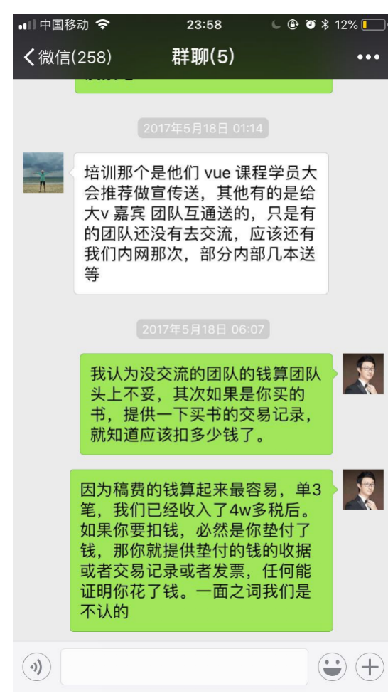
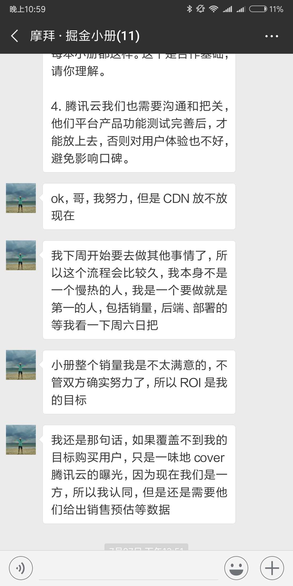
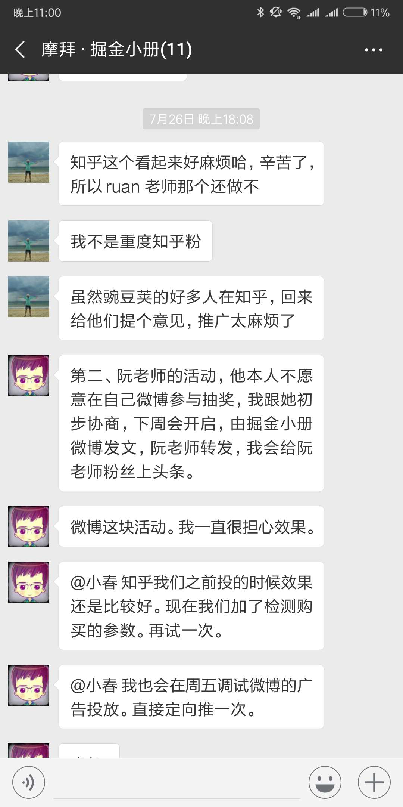
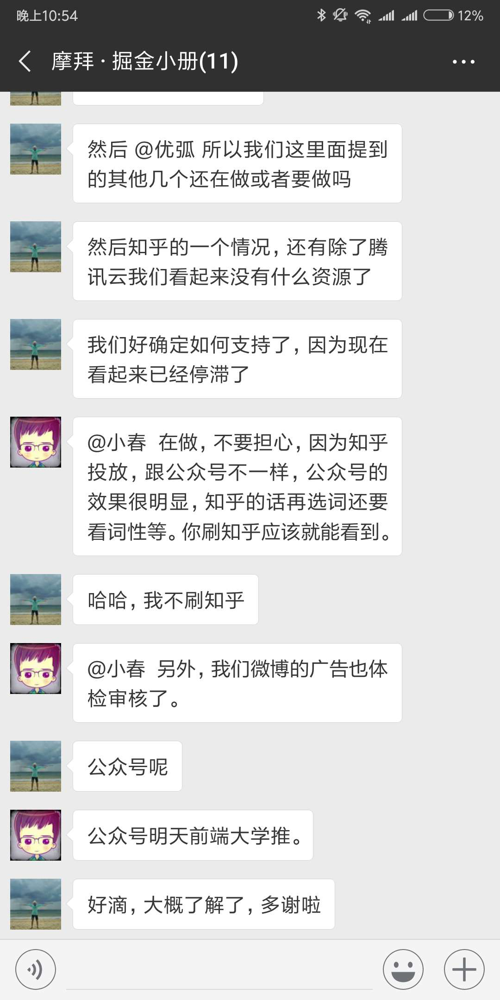

---
相关阅读1：

📖 [如何看待摩拜部门领导小春(张耀春)疑似性骚扰女下属？](https://www.zhihu.com/question/289146339)

---
相关阅读2：

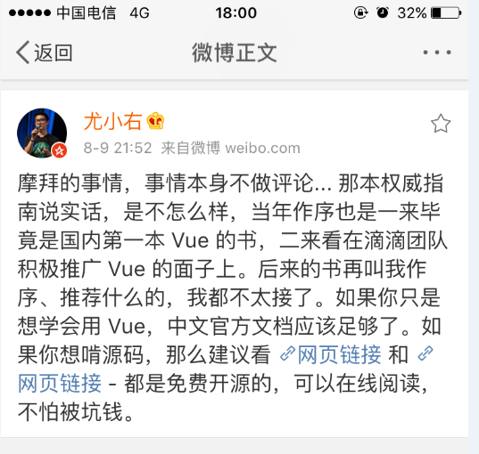

