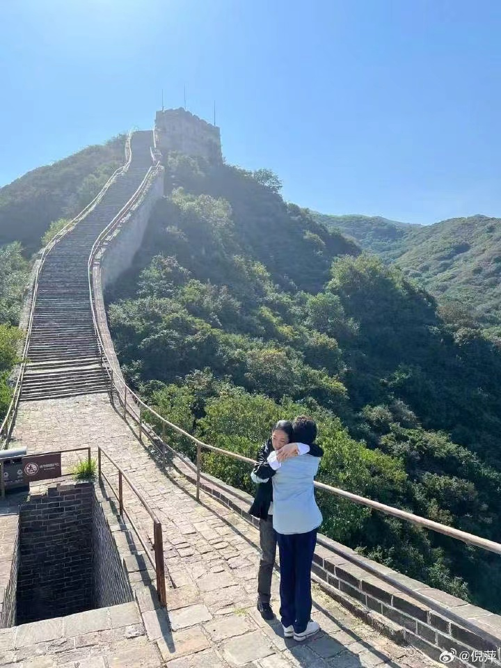

# 《给敬大姐的一封信》 

<iframe frameborder="no" border="0" marginwidth="0" marginheight="0" src="//music.163.com/outchain/player?type=2&id=1922701695&auto=0&height=66" oncontextmenu="return false"></iframe>

亲爱的敬大姐：

你还是走了……

你我都不会想到，我们之间最后的告别，会来得这样猝不及防，这封信，也许你永远收不到，但我一定要写，你懂我。

1991年1月7日，是我们第一次见面的日子。那个画面，我一辈子都忘不了。你从老台的方楼台阶上，笑盈盈地跑下来和我打招呼，亲切地对我说：“你是倪萍吧？我们部同事说，文艺部来了个新主持人，长得跟我可像了！我看看，嗯，真有点像！我叫敬一丹，经济部的，就在你楼下，以后有什么事，可以找我！”

那时的我，只是个刚进台的新人，根本不敢相信，这位家喻户晓、端庄从容的主持人，会主动过来和我打招呼。敬大姐，你的这份热情，温暖得我想哭。

很多年以后，我还跟你开玩笑，说那时的我，就像一个在凛冽寒风里伫立了很久、满心茫然的孩子，在我被冻得不知所措的时候，你一把把我拉进了一个暖和的屋子，轻轻地对我说：“进来吧，靠近炉子烤烤火。”

那时候我真觉得心里太冷了，刚进台才一个多月，我孤身一人，谁也不认识，前路一片迷茫。这么大的央视舞台，我能站得住吗？就在我被寒风紧紧裹挟的时候，是你，敬大姐主动向我走来，递给了我一份温暖，我心底悄悄生出了一份自信。敬大姐，从那天开始，你就成了我的榜样。

往后这些年，我一直学着你的样子。遇见年轻的主持人，我也由衷地夸奖他们、鼓励他们。我不愿再看见哪个年轻人独自站在寒风里彷徨，我要把当年你给我的那份温暖，原原本本传递给年轻的孩子们。

还记得1994年在上海，我们一起拿到了金话筒奖，那是我们第一次相拥。你在我耳边轻声夸我：“你的主持特别真诚，特别好！”

我心里满是滚烫的幸福，幸福得我又想哭。以前我一直叫你敬老师，从那一刻起，我鼓起勇气，喊你敬大姐。这一声大姐，一叫就是几十年。

敬大姐，你始终是我前行路上坚定的榜样。你的每档节目我都认真看，默默学习你身上最珍贵的品质——待人做事的真诚、镜头面前的真实、言语表达的朴实，还有举手投足间自然从容的气度。

这些年，我们聊得最多的，就是你和岩松主持的《感动中国》，每次聊，你都极力夸赞岩松，我也很喜欢岩松，你们俩真诚自持、收放自如的状态，正是我心中向往的主持人模样。

我曾经问过你，你和岩松在《感动中国》里，用冷静清晰的语言，传递出直击人心的磅礴力量，明明饱含深情，却始终克制有度，这样极致的情感把控，究竟是怎么做到的？

你笑了。你说在看资料做准备工作的时，你们就已经被打动过无数次。但所有的感动到了镜头前都要压在心底，不能轻易宣泄，只有这样，才能达到传递的准确性。这份准确，就是不淹没人物本身的光芒，只为托举故事背后的公共价值，这也是一个新闻主持人需要坚守的职业尺度。

我也笑了。我说：“那我完了，我就是不会克制，还容易泛滥。”

那天中午，我们一起去台里食堂吃饭，你随口说起：“这么多年了，我还是最爱吃馒头。”我悄悄记住了这句话。那一顿饭的畅聊，我还记住了你言语之间所流淌的对普通人的温柔体恤，对弱势群体的深切关注和对世间山河的共情与悲悯。

敬大姐，你始终是我仰望和追随的榜样。

好多年前，小倩给我看了一段记者采访你的视频，你说：“这么多年的春节晚会，倪萍一出场，你就会觉得，这就是咱们中国人过年最想看见的样子：漂亮、亲切，质朴又大气，看着心里舒服……”

敬大姐，你夸了我好多好多，我都记在心里了。我知道自己远没有你说的那么好，这是你对我的偏爱和袒护。

《美丽的大脚》上映以后，你又给我发来短信，说：“你的选择对了。你完成了从演员到主持人，再回归演员这样一次转换。这不是回到原点，而是螺旋式的上升。”

敬大姐，我无比珍惜你说的话。同行之间能够高看对方、由衷欣赏、真心夸赞彼此，从来都不是人人能做到的。敬大姐，你内心清澈宽广、豁达通透，从你身上，我读懂了什么是格局，什么是善良，什么是做人的力量。

我一直想为你画一幅向日葵，温暖明亮、永远向着太阳生长，愿意把阳光般的暖意带给每一个需要的人，就如同你的模样。我画了撕，撕了又画……总想着画得再好一些，然后郑重地送给你，可如今，一切都来不及了。

敬大姐，我跟自己说，我要继续像你一样，做那温暖的光，悄悄照亮需要温暖的人，替你把这份善意，一直传递下去。

还记得我们最后一次见面吗？那是前年中秋节前一天，杨澜提议说，金话筒三十年了，咱们“五朵金花”聚聚吧。

那天我去得特别早，没想到鞠萍比我还早，她已经张罗好了一切。我们每个人都准备了礼物，我画了五幅画，仔细装裱好了带去。记得吧，鞠萍还说：“让敬大姐先挑。”

那天吃了什么我全忘了，只记得我们一直在说、一直在笑。敬大姐，你那天笑得格外明媚灿烂，眼里闪烁着动人的光，我至今都忘不了。

昨天，我翻到咱们那个群，看到聚会第二天下午，你发了一张图，图上写着：人有悲欢离合。那时只当是寻常的中秋感慨，如今再看，心里巨浪翻涌……

平凡的日子就这么一天天匆忙地往前走，每次和你联系，你都说太喜欢我送的那幅画了，言语间满是欢喜。对我来说，这真的是小事，可你一直记在心上、反复感念。

因为记住了你爱吃馒头，每到过年，我都会拜托老家的二舅妈用老面引子、大柴火锅给你蒸一锅山东大馒头。有一年春节，你说要去三亚陪老妈，还带上了我送的大馒头。你特意拍了照片发给我，照片上的馒头一片一片切得很整齐。你说：“这样放进烤箱里，烤出来可太好吃了。”我把照片和你说的话都转发给了远在荣成的二舅妈，让她也分享这份欢喜。

敬大姐，你就是这样的人，再小的事也放在心上。你细心顾及身边每个人的情绪，别人给予你的点滴善意，你都认真回应。永远先替别人想的背后，是你刻进骨子里的善良，是你最本真的底色。

还记得吗？徐俐刚退休那阵，你跟我说：“徐俐进入新媒体做谈话节目直播，咱俩都去吧，给她鼓鼓劲、撑撑场子！”我笑了，敬大姐也会说这样的话——撑场子。我跟着你去了。

那天近千万网友“围观”，看着徐俐从容自信的样子，我俩打心底为她高兴。直播一结束，你摘下话筒就匆匆走了，我追到门口说一起吃个饭吧，你说“我爱人在医院”，然后又趴在我耳朵上说了一些话……

我愣在原地，久久回不过神。望着你匆匆离开的背影，再回想刚才直播时你从容沉稳的模样，我心里一阵刺痛。敬大姐，我再一次读懂了你。你一生都坚守着自己的职业信仰：身为媒体人，个人再大的事，在工作面前都是小事，工作再小的事，也都是大事。

敬大姐，敬畏职业。

我，敬畏敬大姐。

四年前，你叫我一起去爬长城，拍你的《节气·长城》，那天我都妒嫉你了。你像个年轻人一样，脚步轻快地走在队伍最前面，偶尔还要跑跳两下。我跟在后面气喘吁吁地喊你：“敬大姐，等等我这个老太太！”

一旁的尔晴笑着接话：“有时候我都追不上我妈！”我也太喜欢尔晴了，她也有向日葵般的热烈蓬勃，随口说出的话，都透着善解人意的温暖，她太像你了！

我跟尔晴说：“你妈妈真厉害，南极北极都去过了！”

你跑过来跟我说：“倪萍，你也一定要去一次，什么时候想去，我都陪你一起。”这句承诺，再也没有机会兑现了。

那天，我俩在长城上不知道怎么了，简直疯了，一向低调的你，跟着我一块儿吹起了牛。我俩吹我们是第一届金话筒得主、第二届金话筒得主、第三届金话筒得主，第四届我们约定都不参加了……我们俩笑得都喘不动气了！后来小倩回忆那天，说长城上的我们俩光芒四射、神采飞扬，脸上都红扑扑的。

他们拍下了咱俩紧紧相拥的照片，但谁也不知道，咱俩那是在说不想让别人听到的悄悄话，关于退休、关于取舍、关于往后的岁岁年年……

敬大姐，我心里攒了太多太多想对你说的话，满满的都是思念与不舍。晚上收工回来写到现在，天都快亮了，我的心却越来越疼。今天还要去墩德布拉克拍摄，可我怎么迈得开腿啊？

从13号到今天，我内心太撕裂了，我的心在别人看不见的地方流血，老天怎么就这么折磨我啊？！我无数次问自己，为什么偏偏是这个时候，我远在三千公里外的阿勒泰？为什么偏偏在开拍第一天，就传来你离开的噩耗？

我想着快快拍完吧，好歹能赶回北京见你最后一面。直到尔晴在群里发布了告别仪式的消息，我彻底崩溃了。天哪，敬大姐，天下怎么会有这样锥心的遗憾啊？我不想拍了，我拍不动了，我要赶回去见你最后一面！

我去找导演商量，请求让我提前回北京。导演组马上就做预案，制片主任把票也改了，大家都在努力，想把后面两天的拍摄压缩到一天。可我要提前走，就意味着全组一百多号人都得跟着我连轴转赶工，意味着原本可以白天赶的路，只能放到夜里。这次拍摄围绕着331公路，光车上行程就一千多公里，点位之间动不动就要开车好几个小时。夜间转场更是困难重重：中巴、大巴晚上十点之后强制限速，凌晨两点之后必须停运，大部队就得趴在路上等，到早上五点才能继续发车。制片、摄影、录音等工种的孩子们只能在车上凑合睡，设备没法充电、拍好的素材也拷贝不了……路上的困难尚且如此，内容上的困难更是一言难尽。

职业生涯五十年，我从来没有临阵退缩过，更别说半路撂挑子了。敬大姐，我最应该回去为你送行的，可我内心的撕裂、矛盾与煎熬，你肯定懂啊！

亲爱的敬大姐，我流着无尽的泪水，跟你说一声对不起，三千公里山海相隔，我终究无法赶回去送你最后一程。稍稍宽慰我的，是我脑海里永远留存着你温暖灿烂的笑容。我舍不得，也无法接受你静静安睡在花丛里的模样。

这两天我不知道哭了多少回，只有收工回来，我才敢哭出声来。敬大姐，我内心的撕裂和万般无奈，你一定都懂……

倪萍

2026.9.17凌晨

