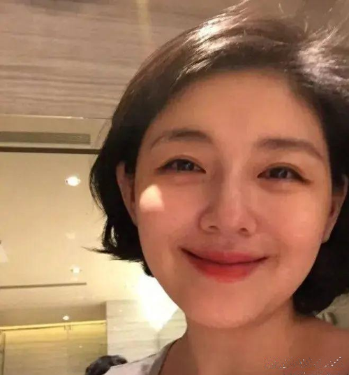

# 大S

> 2025年2月3日，中国台湾著名女演员、歌手、主持人徐熙媛（大S）因流感并发肺炎在日本去世，享年48岁。

<video controls="controls" preload="auto">
    <source src="./assets/a-s.mp4" type="video/mp4" />
Your browser does not support the video tag.
</video>

# R.I.P.

