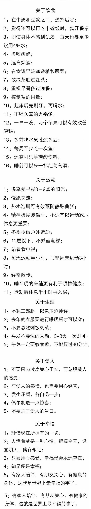

# 前言

::: tip
如何看待关注点分离？

一些有着传统 Web 开发背景的用户可能会因为 SFC 将不同的关注点集合在一处而有所顾虑，觉得 HTML/CSS/JS 应当是分离开的！

要回答这个问题，我们必须对这一点达成共识：前端开发的关注点不是完全基于文件类型分离的。前端工程化的最终目的都是为了能够更好地维护代码。关注点分离不应该是教条式地将其视为文件类型的区别和分离，仅仅这样并不够帮我们在日益复杂的前端应用的背景下提高开发效率。
在现代的 UI 开发中，我们发现与其将代码库划分为三个巨大的层，相互交织在一起，不如将它们划分为松散耦合的组件，再按需组合起来。在一个组件中，其模板、逻辑和样式本就是有内在联系的、是耦合的，将它们放在一起，实际上使组件更有内聚性和可维护性。
即使你不喜欢单文件组件这样的形式而仍然选择拆分单独的 JavaScript 和 CSS 文件，也没关系，你还是可以通过资源导入功能获得热更新和预编译等功能的支持。
:::

