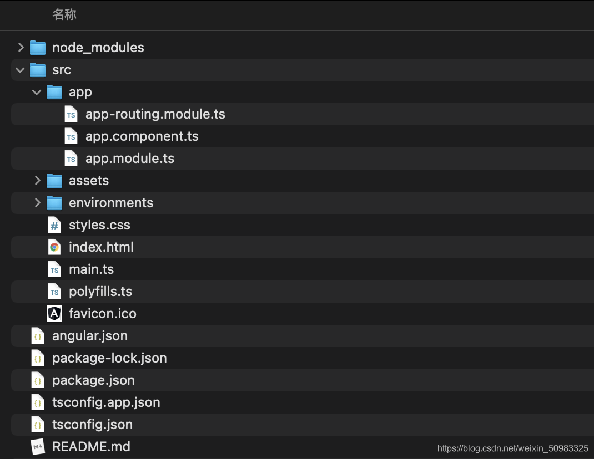
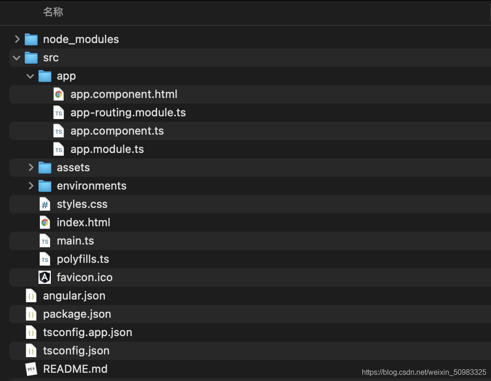
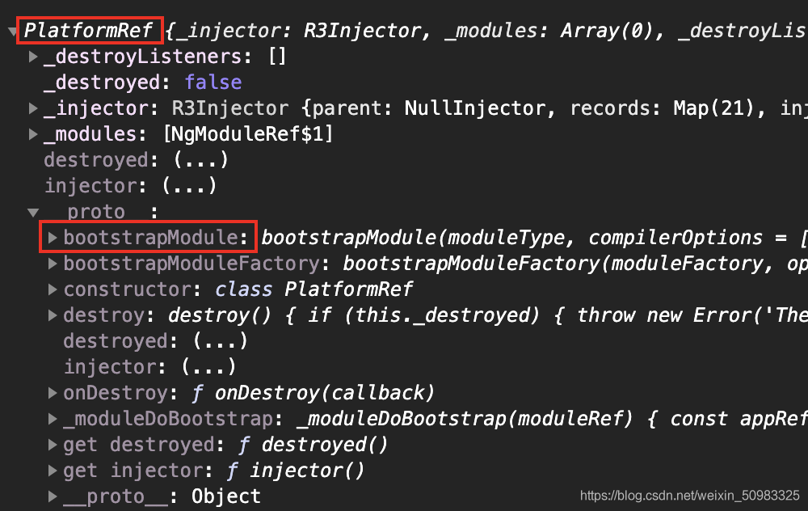
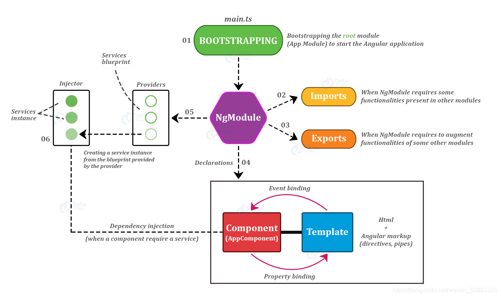
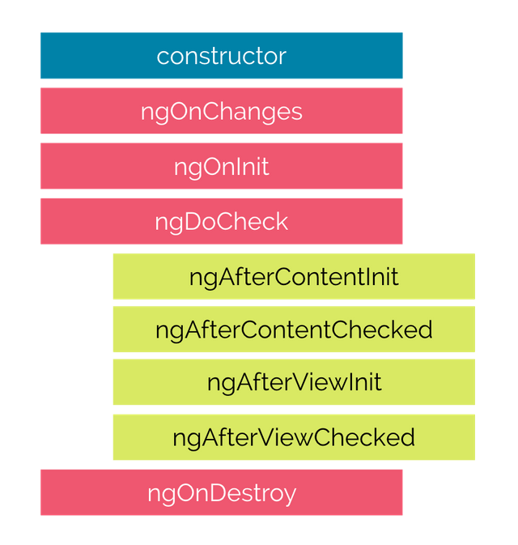
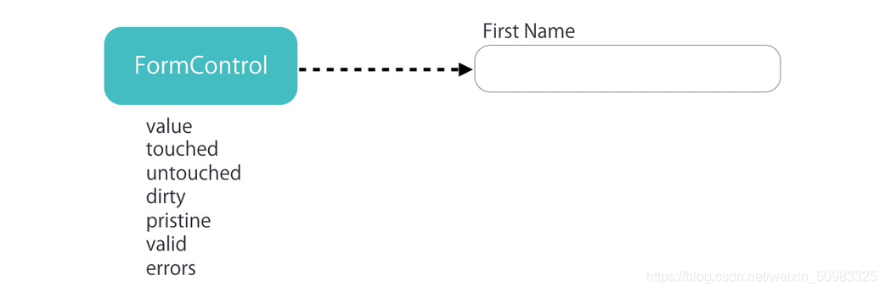
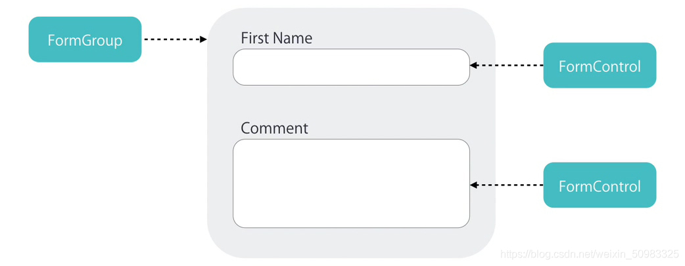

# Angular 入门笔记（超棒）

## 一、概述 & 前言 & 背景知识
1、以前叫 `angular.js`，现在叫 `angular`；最早开始于 2009 年，由谷歌出品，是现在的三大框架之一；

- 一个基于组件的框架，用于构建可伸缩的 Web 应用
- 一组完美集成的库，涵盖各种功能，包括路由、表单管理、客户端-服务器通信等
- 一套开发工具，可帮助你开发、构建、测试和更新代码

 【Angular 本身对于状态的管理也是相当到位的，即使不使用 redux，也可以做到跨组件共享数据，而且实现起来是非常容易的。】
 【在 Angular 框架中，它还深度继承了 Rxjs，使得它处理异步编程的能力变得非常强大】

2、创建项目
```bash
npm init @angular project-name
cd project-name
npm start
```

## 二、架构预览


### 2.1、模块
Angular 应用是由一个个模块组成的，此模块指的不是ESModule，而是 NgModule 即 Angular 模块。
NgModule 是一组相关功能的集合，专注于某个应用领域，可以将组件和一组相关代码关联起来，是应用组织代码结构的一种方式。
在 Angular 应用中至少要有一个根模块，用于启动应用程序。
NgModule 可以从其它 NgModule 中导入功能，前提是目标 NgModule 导出了该功能。
NgModule 是由 NgModule 装饰器函数装饰的类。
```js
import { BrowserModule } from '@angular/platform-browser';
import { NgModule } from '@angular/core';

@NgModule({
  imports: [
    BrowserModule
  ]
})
export class AppModule { }
```

### 2.2、组件
组件用来描述用户界面，它由三部分组成：**组件类**、**组件模板**、**组件样式**，它们可以被集成在组件类文件中，也可以是三个不同的文件。
组件类用来编写和组件直接相关的界面逻辑，在组件类中要关联该组件的组件模板和组件样式。
组件模板用来编写组件的 HTML 结构，通过**指令**或**数据绑定标记**将应用中数据和 DOM 进行关联。
组件样式用来编写组件的组件的外观，组件样式可以采用 CSS、LESS、SCSS、Stylus
在 Angular 应用中至少要有一个根组件，用于应用程序的启动。
组件类是由 Component 装饰器函数装饰的类。
```js
import { Component } from "@angular/core"

@Component({
  selector: "app-root",
  templateUrl: "./app.component.html",
  styleUrls: ["./app.component.css"]
})
export class AppComponent {
  title = "angular-test"
}
```
NgModule 为组件提供了编译的上下文环境。
```js
import { NgModule } from '@angular/core';
import { AppComponent } from './app.component';

@NgModule({
  declarations: [
    AppComponent
  ],
  bootstrap: [AppComponent]
})
export class AppModule { }
```

> 关于 Component 有一个重要的点需要说明：组件必须是要属于一个 NgModule 的，也即是说 NgModule 为组件提供了编译的上下文环境，这也是 Angular 强制规定的，是 Angular应用 组织文件的一种方式。

### 2.3、服务
服务用于放置和特定组件无关并希望**跨组件共享的数据或逻辑**。
服务出现的目的在于**解耦组件类中的代码**，使组件类中的代码干净整洁。
服务是由 Injectable 装饰器装饰的类。
```js
import { Injectable } from '@angular/core';

@Injectable({})
export class AppService { }
```
在使用服务时不需要在组件类中通过 new 的方式创建服务实例对象获取服务中提供的方法，<b style="color: red">以下写法错误，切记切记！！！</b>
```js
import { AppService } from "./AppService"

export class AppComponent {
  let appService = new AppService()
}
```
<i style="color: blue;">可以想到的是：如果 AppService 的参数发生变化，那么使用到这个服务的所有地方，都需要进行修改，这不是我们想看到的结果。Angular 中的依赖注入系统可以帮助我们改善这个局面。</i>


服务的实例对象由 Angular 框架中内置的**依赖注入系统**创建和维护。服务是依赖需要被注入到组件中。

在组件中需要通过 `constructor` 构造函数的参数来获取服务的实例对象。

涉及参数就需要考虑参数的顺序问题，因为在 Angular 应用中会有很多服务，一个组件又不可能会使用到所有服务，如果组件要使用到最后一个服务实例对象，难道要将前面的所有参数都写上吗 ? 这显然不合理。

在组件中获取服务实例对象要结合 TypeScript 类型，写法如下。
```ts
import { AppService } from "./AppService"

export class AppComponent {
  constructor (
    private appService: AppService
  ) {}
}
```
<i style="color: blue;">为什么在形参前面加上 private 修饰符呢？appService 只能在组件类当中使用，不能在组件模板中使用。</i>

Angular 会根据你指定的服务的类型来传递你想要使用的服务实例对象，这样就解决了参数的顺序问题。
在 Angular 中**服务被设计为单例模式**，这也正是为什么服务可以被用来在组件之间共享数据和逻辑的原因。

### 2.4、总结

## 三、快速开始
### 3.1、创建应用
<b style="color: red;">第一种方式</b>
```bash
npm init @angular project-name
cd project-name
npm start
```

<b style="color: red;">第二种方式</b>
1. 使用 angular 脚手架（angular-cli）：`npm install @angular/cli -g`
2. 创建应用：`ng new angular-test --minimal --inlineTemplate false`

  1. --skipGit=true
  2. --minimal=true
  3. --skip-install
  4. --style=css
  5. --routing=false
  6. --inlineTemplate
  7. --inlineStyle
  8. --prefix （修改app前缀）


<i style="color: red;">（上图是不加 --minimal，它包含了和单元测试相关的文件）</i>

<i style="color: red;">（上图是加了 --minimal，它不包含单元测试相关的文件）</i>

<i style="color: red;">（上图是加了 --inlineTemplate false，将组件模板单独拎出来）</i>

3. 运行应用：`ng serve`

  1. --open=true 应用构建完成后在浏览器中运行
  2. --hmr=true 开启热更新
  3. hmrWarning=false 禁用热更新警告
  4. --port 更改应用运行端口

4. 访问应用：`localhost:4200`

### 3.2、默认代码解析
#### 3.2.1、main.ts
```js
// enableProdMode 方法调用后将会开启生产模式
import { enableProdMode } from "@angular/core"
// Angular 应用程序的启动在不同的平台上是不一样的
// 在浏览器中启动时需要用到 platformBrowserDynamic 方法, 该方法返回平台实例对象
import { platformBrowserDynamic } from "@angular/platform-browser-dynamic"
// 引入根模块 用于启动应用程序
import { AppModule } from "./app/app.module"
// 引入环境变量对象 { production: false }
import { environment } from "./environments/environment"

// 如果当前为生产环境
if (environment.production) {
  // 开启生产模式
  enableProdMode()
}
// 启动应用程序
platformBrowserDynamic()
  .bootstrapModule(AppModule)
  .catch(err => console.error(err))
```



#### 3.2.2、environment.ts
```js
// 在执行 `ng build --prod` 时, environment.prod.ts 文件会替换 environment.ts 文件
// 该项配置可以在 angular.json 文件中找到, projects -> angular-test -> architect -> configurations -> production -> fileReplacements

export const environment = {
  production: false
}
````

#### 3.2.3、environment.prod.ts
```js
export const environment = {
  production: true
}
```

#### 3.2.4、app.module.ts
```js
// BrowserModule 提供了启动和运行浏览器应用所必需的服务
// CommonModule 提供各种服务和指令, 例如 ngIf 和 ngFor, 与平台无关
// BrowserModule 导入了 CommonModule, 又重新导出了 CommonModule, 使其所有指令都可用于导入 BrowserModule 的任何模块 
import { BrowserModule } from "@angular/platform-browser"
// NgModule: Angular 模块装饰器
import { NgModule } from "@angular/core"
// 根组件
import { AppComponent } from "./app.component"
// 调用 NgModule 装饰器, 告诉 Angular 当前类表示的是 Angular 模块
@NgModule({
  // 声明当前模块拥有哪些组件
  declarations: [AppComponent],
  // 声明当前模块依赖了哪些其他模块
  imports: [BrowserModule],
  // 声明服务的作用域, 数组中接收服务类, 表示该服务只能在当前模块的组件中使用
  providers: [],
  // 可引导组件, Angular 会在引导过程中把它加载到 DOM 中
  bootstrap: [AppComponent]
})
export class AppModule {}
```

#### 3.2.5、app.component.ts
```js
import { Component } from "@angular/core"

@Component({
  // 指定组件的使用方式, 当前为标记形式
  // app-home   =>  <app-home></app-home>
  // [app-home] =>  <div app-home></div>
  // .app-home  =>  <div class="app-home"></div>
  selector: "app-root",
  // 关联组件模板文件
  // templateUrl:'组件模板文件路径'
  // template:`组件模板字符串`
  templateUrl: "./app.component.html",
  // 关联组件样式文件
  // styleUrls : ['组件样式文件路径']
  // styles : [`组件样式`]
  styleUrls: ["./app.component.css"]
})
export class AppComponent {}
```

#### 3.2.6、index.html
```html
<!doctype html>
<html lang="en">
<head>
  <meta charset="utf-8">
  <title>AngularTest</title>
  <base href="/">
  <meta name="viewport" content="width=device-width, initial-scale=1">
  <link rel="icon" type="image/x-icon" href="favicon.ico">
</head>
<body>
  <app-root></app-root>
</body>
</html>
```


### 3.3、共享模块
共享模块当中放置的是 Angular 应用中模块级别的需要共享的组件或逻辑。

1. 创建共享模块：`ng g m shared`
2. 创建共享组件： `ng g c shared/components/Layout`
3. 在共享模块中导出共享组件
```js
@NgModule({
  declarations: [LayoutComponent],
  exports: [LayoutComponent]
})
export class SharedModule {}
```
4. 在根模块中导入共享模块
```js
@NgModule({
  declarations: [AppComponent],
  imports: [SharedModule],
  bootstrap: [AppComponent]
})
export class AppModule {}
```
5. 在根组件中使用 Layout 组件
```js
@Component({
  selector: "app-root",
  template: `
    <div>App works</div>
    <app-layout></app-layout>
  `,
  styles: []
})
export class AppComponent { }
```

> 在A模块中引入另一个B模块，那么就可以直接使用B模块中的组件和内容了；这种方式就可以不用在A模块中依次去引入B模块中的那些组件了。

## 四、组件模板
### 4.1、数据绑定
数据绑定就是**将组件类中的数据显示在组件模板中**，当组件类中的数据发生变化时会自动被同步到组件模板中（数据驱动 DOM ）。

在 Angular 中使用插值表达式进行数据绑定，即双大括号语法 `{{`   `}}` ，也称大胡子语法。
```html
<h2>{{message}}</h2>
<h2>{{getInfo()}}</h2>
<h2>{{a == b ? '相等': '不等'}}</h2>
<h2>{{'Hello Angular'}}</h2>
<p [innerHTML]="htmlSnippet"></p> <!-- 对数据中的代码进行转义 -->
```
> <span style="color: blue;">在插值语法中，不能使用 if else 语法；如果要显示字符串，需要用引号来包裹内容，否则它会认为这里是变量，是动态值。</span>

### 4.2、属性绑定
#### 4.2.1、普通属性
属性绑定分为两种情况：绑定 DOM 对象属性和绑定 HTML 标记属性。
1. 使用 [属性名称] 为元素绑定 DOM 对象属性。
```html

```
2. 使用 [attr.属性名称] 为元素绑定 HTML 标记属性
```html
<td [attr.colspan]="colSpan"></td> 
```
在大多数情况下，DOM 对象属性和 HTML 标记属性是对应的关系，所以使用第一种情况。但是某些属性只有 HTML 标记存在，DOM 对象中不存在，此时需要使用第二种情况：前面加上`attr.`，比如 colspan 属性，在 DOM 对象中就没有，或者**自定义 HTML 属性也需要使用第二种情况**。

#### 4.2.2、class 属性
```html
<button class="btn btn-primary" [class.active]="isActive">按钮</button>
<div [ngClass]="{'active': true, 'error': true}"></div>
```

#### 4.2.3、style 属性
```html
<button [style.backgroundColor]="isActive ? 'blue': 'red'">按钮</button>
<button [ngStyle]="{'backgroundColor': 'red'}">按钮</button>
```

### 4.3、事件绑定
```html
<button (click)="onSave($event)">按钮</button>
<!-- 当按下回车键抬起的时候执行函数 -->
<input type="text" (keyup.enter)="onKeyUp()"/>
```
> <span style="color: blue;"> $event 是一个固定参数，这里必须这么写，但是这个参数的位置，是没有限制的，可以是第一个参数，也可以是第二个参数，或者其他位置。</span>
```ts
export class AppComponent {
  title = "test"
  onSave(event: Event) {
    // this 指向组件类的实例对象
    this.title // "test"
  }
}
```

### 4.4、获取原生 DOM 对象
#### 4.4.1、在组件模板中获取
```html
<input type="text" (keyup.enter)="onKeyUp(username.value)" #username/>
```
#### 4.4.2、在组件类中获取
使用 ViewChild 装饰器获取一个元素
```html
<p #paragraph>home works!</p>
```
```js
import { AfterViewInit, ElementRef, ViewChild } from "@angular/core"

export class HomeComponent implements AfterViewInit {
  @ViewChild("paragraph") paragraph: ElementRef<HTMLParagraphElement> | undefined
  ngAfterViewInit() {
    console.log(this.paragraph?.nativeElement)
  }
}
```
使用 ViewChildren 获取一组元素
```html
<ul>
  <li #items>a</li>
  <li #items>b</li>
  <li #items>c</li>
</ul>
```
```ts
import { AfterViewInit, QueryList, ViewChildren } from "@angular/core"

@Component({
  selector: "app-home",
  templateUrl: "./home.component.html",
  styles: []
})
export class HomeComponent implements AfterViewInit {
  @ViewChildren("items") items: QueryList<HTMLLIElement> | undefined
  ngAfterViewInit() {
    console.log(this.items?.toArray())
  }
}
```
> <span style="color: blue;">这里需要注意的是：使用 `toArray` 方法来解析 QueryList 对象。</span>

### 4.5、双向数据绑定
数据在**组件类**和**组件模板**中双向同步。
Angular 将双向数据绑定功能放在了 @angular/forms 模块中，所以要实现双向数据绑定需要依赖该模块。
```ts
import { FormsModule } from "@angular/forms"

@NgModule({
  imports: [FormsModule],
})
export class AppModule {}
```
```html
<input type="text" [(ngModel)]="username" />
<button (click)="change()">在组件类中更改 username</button>
<div>username: {{ username }}</div>
```
```ts
export class AppComponent {
  username: string = ""
  change() {
    this.username = "hello Angular"
  }
}
```

### 4.6、内容投影
> 什么是内容投影？在Vue中，它叫做组件插槽；在React中，它叫做children。
```html
<!-- app.component.html -->
<bootstrap-panel>
  <div class="heading">
    Heading
  </div>
  <div class="body">
    Body
  </div>
</bootstrap-panel>
```
```html
<!-- panel.component.html -->
<div class="panel panel-default">
  <div class="panel-heading">
    <ng-content select=".heading"></ng-content>
  </div>
  <div class="panel-body">
    <ng-content select=".body"></ng-content>
  </div>
</div>
```
如果只有一个 ng-content，不需要 select 属性。

ng-content 在浏览器中会被 `<div class=“heading”></div>` 替代，如果不想要这个额外的div，可以使用ng-container替代这个div。
```html
<!-- app.component.html -->
<bootstrap-panel>
  <ng-container class="heading">
    Heading
  </ng-container>
  <ng-container class="body">
    Body
  </ng-container>
</bootstrap-panel>
```

### 4.7、数据绑定的容错处理
```ts
// app.component.ts
export class AppComponent {
  task = {
    person: {
      name: '张三'
    }
  }
}
```
```html
<!-- 方式一 -->
<span *ngIf="task.person">{{ task.person.name }}</span>
<!-- 方式二 -->
<span>{{ task.person?.name }}</span>
```

### 4.8、全局样式
```js
/* 第一种方式 在 styles.css 文件中 */
@import "~bootstrap/dist/css/bootstrap.css";
/* ~ 相对node_modules文件夹 */
```
```html
<!-- 第二种方式 在 index.html 文件中  -->
<link href="https://cdn.jsdelivr.net/npm/bootstrap@3.3.7/dist/css/bootstrap.min.css" rel="stylesheet" />
```
```ts
// 第三种方式 在 angular.json 文件中
"styles": [
  "./node_modules/bootstrap/dist/css/bootstrap.min.css",
  "src/styles.css"
]
```

## 五、指令 Directive
指令是 Angular 提供的**操作 DOM 的途径**。指令分为**属性指令**和**结构指令**。

属性指令：修改现有元素的外观或行为，使用 `[ ]` 包裹。

结构指令：增加、删除 DOM 节点以修改布局，使用 `*` 作为指令前缀。

### 5.1、`*ngIf`
#### 5.1.1、`*ngIf`
根据条件渲染 DOM 节点或移除 DOM 节点。它返回的结果是一个布尔值。
```html
<div *ngIf="data.length == 0">没有更多数据</div>
```
```html
<div *ngIf="data.length > 0; then dataList else noData"></div>
<ng-template #dataList>课程列表</ng-template>
<ng-template #noData>没有更多数据</ng-template>
```

#### 5.1.2、`[hidden]` （属性指令）
根据条件显示 DOM 节点或隐藏 DOM 节点 (display)。
```html
<div [hidden]="data.length == 0">课程列表</div>
<div [hidden]="data.length > 0">没有更多数据</div>
```

> <span style="color: blue;">`*ngIf` 和 `hidden` 指令很像，但还是有区别的；`*ngIf` 是渲染DOM节点或者移除DOM节点，也就是说 `*ngIf` 它有可能不渲染DOM节点，而 `hidden` 这个指令呢，无论如何，它是渲染这个DOM节点的，那么这个DOM节点的显示与隐藏呢，它是使用样式的方式(display)来控制的的。</span>

#### 5.1.3、`*ngFor` （结构指令）
遍历数据生成HTML结构
```ts
interface List {
  id: number
  name: string
  age: number
}

list: List[] = [
  { id: 1, name: "张三", age: 20 },
  { id: 2, name: "李四", age: 30 }
]
```
```html
<li
  *ngFor="
    let item of list;
    let i = index;
    let isEven = even;
    let isOdd = odd;
    let isFirst = first;
    let isLast = last;
  "
>
</li>
```
> isEven：是否是基数行；isOdd：是否是偶数行。isFirst：是否是第一项；isLast：是否是最后一项。

```html
<li *ngFor="let item of list; trackBy: identify"></li>
```
```ts
// 使用这种方式，Angular 将使用 trackByFn 函数返回的唯一标识符来跟踪每个项目的变化，而不是使用对象引用。这可以提高性能，并减少不必要的 DOM 更新。
identify(index, item){
  return item.id; 
}
```
> <span style="color: red;">trackBy 是一个可选的函数，用于提供一个唯一标识符来跟踪循环中的每个项目。使用 trackBy 函数有助于优化 Angular 的变更检测机制。当数组或集合发生变化时，Angular 会通过比较新旧值来确定哪些项目已经被添加、删除或移动。如果没有提供 trackBy 函数，Angular 默认会使用对象引用来进行比较，这可能导致不必要的 DOM 更新。</span>


### 5.2、自定义指令
> 如何通过自定义指令来操作DOM

先来看一个需求：为元素设置默认背景颜色，鼠标移入时的背景颜色以及移出时的背景颜色。
```html
<div [appHover]="{ bgColor: 'skyblue' }">Hello Angular</div>
```

```ts
import { AfterViewInit, Directive, ElementRef, HostListener, Input } from "@angular/core"

// 接收参的数类型
interface Options {
  bgColor?: string
}

@Directive({
  selector: "[appHover]"
})
export class HoverDirective implements AfterViewInit {
  // 接收参数
  @Input("appHover") appHover: Options = {}
  // 要操作的 DOM 节点
  element: HTMLElement
  // 获取要操作的 DOM 节点
  constructor(private elementRef: ElementRef) {
    this.element = this.elementRef.nativeElement
  }
  // 组件模板初始完成后设置元素的背景颜色
  ngAfterViewInit() {
    this.element.style.backgroundColor = this.appHover.bgColor || "skyblue"
  }
  // 为元素添加鼠标移入事件
  @HostListener("mouseenter") enter() {
    this.element.style.backgroundColor = "pink"
  }
  // 为元素添加鼠标移出事件
  @HostListener("mouseleave") leave() {
    this.element.style.backgroundColor = "skyblue"
  }
}
```

> <span style="color: red;">在模板中使用 appHover 指令，默认状态是不加中括号的，当你需要传入动态数据的时候，那么你就需要加；`@Directive({})` 中的 selector 定义的是指令的名称，class 类中的 `@Input('appHover')` 是接受指令的参数。</span>

> <span style="color: red;">像这样的间谍指令可以深入了解你无法直接修改的 DOM 对象。你无法触及内置 `<div>` 的实现，也无法修改第三方组件。但你有了一个选项来用指令监视这些元素。 这个指令可以定义 `ngOnInit()` 和 `ngOnDestroy()` 钩子，它通过一个注入进来的 LoggerService 把消息记录到父组件中去。</span>


## 六、管道 Pipe
管道的作用是用来处理组件模板当中数据的格式（格式化组件模板数据）。

### 6.1、内置管道
1. date 日期格式化
2. currency 货币格式化
3. uppercase 转大写
4. lowercase 转小写
5. json 格式化 json 数据

```js
{{ date | date: "yyyy-MM-dd" }}
```
```html
{{ object | json}}
<pre>{{ object | json}}</pre>
```
> 内置管道不止这些，还有其他的。可以在官网查看，使用方式都是一样的。

### 6.2、自定义管道
先来看一个需求：指定字符串不能超过规定的长度，如果超过了，就把多余的截取掉，并再后面加上...
```ts
// summary.pipe.ts
import { Pipe, PipeTransform } from '@angular/core';

@Pipe({
   name: 'summary' 
});
export class SummaryPipe implements PipeTransform {
  transform (value: string, limit?: number) {
    if (!value) return null;
    let actualLimit = (limit) ? limit : 50;
    return value.substr(0, actualLimit) + '...';
  }
}
```

```ts
// app.module.ts
import { SummaryPipe } from './summary.pipe'
@NgModule({
  declarations: [
    SummaryPipe
  ] 
})
```

```html
<div>{{ paragraph | summary: 100 }}</div>

// 管道如果要传多个参数的话，使用冒号
<div>{{ paragraph | summary: 100:200 }}</div>
```

## 七、组件通讯
### 7.1、向组件内部传递数据
```html
<app-favorite [isFavorite]="true"></app-favorite>
```
```js
// favorite.component.ts
import { Input } from '@angular/core';
export class FavoriteComponent {
  @Input() isFavorite: boolean = false;
}
```
注意：在属性的外面加 `[ ]` 表示绑定动态值，在组件内接收后是布尔类型，不加 `[ ]` 表示绑定普通值，在组件内接收后是字符串类型。

```html
<app-favorite [is-Favorite]="true"></app-favorite>
```

```ts
import { Input } from '@angular/core';

export class FavoriteComponent {
  @Input("is-Favorite") isFavorite: boolean = false
}
```

> `@Input()` 括号中接收的参数，就是你传入进来的参数名。

### 7.2、组件向外部传递数据
现在有一个需求：在子组件中通过点击按钮将数据传递给父组件
```html
<!-- 子组件模板 -->
<button (click)="onClick()">click</button>
```

```ts
// 子组件类
import { EventEmitter, Output } from "@angular/core"

export class FavoriteComponent {
  @Output() change = new EventEmitter()
  onClick() {
    this.change.emit({ name: "张三" })
  }
}
```

```html
<!-- 父组件模板 -->
<app-favorite (change)="onChange($event)"></app-favorite>
```

```ts
// 父组件类
export class AppComponent {
  onChange(event: { name: string }) {
    console.log(event)
  }
}
```

## 八、组件生命周期


### 8.1、挂载阶段
挂载阶段的生命周期函数只在挂载阶段执行一次，数据更新时不再执行。
1. constructor

Angular 在实例化组件类时执行, 可以用来接收 Angular 注入的服务实例对象。（我们建议也只在 constructor 中做这个操作，不建议做别的操作）
```ts
export class ChildComponent {
  constructor (private test: TestService) {
    console.log(this.test) // "test"
  }
}
```

2. ngOnInit

在首次接收到输入属性值后执行，在此处可以执行请求操作。
```html
<app-child name="张三"></app-child>
```

```ts
export class ChildComponent implements OnInit {
  @Input("name") name: string = ""
  ngOnInit() {
    console.log(this.name) // "张三"
  }
}
```

3. ngAfterContentInit

当内容投影初始渲染完成后调用。
```html
<app-child>
  <div #box>Hello Angular</div>
</app-child>
```

```ts
export class ChildComponent implements AfterContentInit {
  @ContentChild("box") box: ElementRef<HTMLDivElement> | undefined

  ngAfterContentInit() {
    console.log(this.box) // <div>Hello Angular</div>
  }
}
```

4. ngAfterViewInit

当组件视图渲染完成后调用。
```html
<!-- app-child 组件模板 -->
<p #p>app-child works</p>
```
```ts
export class ChildComponent implements AfterViewInit {
  @ViewChild("p") p: ElementRef<HTMLParagraphElement> | undefined
  ngAfterViewInit () {
    console.log(this.p) // <p>app-child works</p>
  }
}
```

### 8.2、更新阶段
1. ngOnChanges

    1. 当输入属性值发生变化时执行，初始设置时也会执行一次，顺序优于 ngOnInit。
    2. 不论多少输入属性同时变化，钩子函数只会执行一次，变化的值会同时存储在参数中。
    3. 参数类型为 SimpleChanges，子属性类型为 SimpleChange。
    4. 对于基本数据类型来说，只要值发生变化就可以被检测到。
    5. 对于引用数据类型来说，可以检测从一个对象变成另一个对象，但是检测不到同一个对象中属性值的变化，但是不影响组件模板更新数据。


**基本数据类型值变化**
```html
<app-child [name]="name" [age]="age"></app-child>
<button (click)="change()">change</button>
```

```ts
export class AppComponent {
  name: string = "张三";
  age: number = 20
  change() {
    this.name = "李四"
    this.age = 30
  }
}
```

```ts
export class ChildComponent implements OnChanges {
  @Input("name") name: string = ""
  @Input("age") age: number = 0

  ngOnChanges(changes: SimpleChanges) {
    console.log("基本数据类型值变化可以被检测到")
  }
}
```

**引用数据类型变化**
```html
<app-child [person]="person"></app-child>
<button (click)="change()">change</button>
```
```js
export class AppComponent {
  person = { name: "张三", age: 20 }
  change() {
    this.person = { name: "李四", age: 30 }
  }
}
```
```js
export class ChildComponent implements OnChanges {
  @Input("person") person = { name: "", age: 0 }

  ngOnChanges(changes: SimpleChanges) {
    console.log("对于引用数据类型, 只能检测到引用地址发生变化, 对象属性变化不能被检测到")
  }
}
```

2. ngDoCheck：主要用于调试，只要输入属性发生变化，不论是基本数据类型还是引用数据类型还是引用数据类型中的属性变化，都会执行。

3. ngAfterContentChecked：内容投影更新完成后执行。

4. ngAfterViewChecked：组件视图更新完成后执行。

### 8.3、卸载阶段
1. ngOnDestroy

当组件被销毁之前调用, 用于清理操作。
```ts
export class HomeComponent implements OnDestroy {
  ngOnDestroy() {
    console.log("组件被卸载")
  }
}
```

## 九、依赖注入
### 9.1、概述
依赖注入 ( Dependency Injection ) 简称DI，是面向对象编程中的一种设计原则，用来减少代码之间的**耦合度**。
```ts
class MailService {
  constructor(APIKEY) {}
}

class EmailSender {
  mailService: MailService
  constructor() {
    this.mailService = new MailService("APIKEY1234567890")
  }

  sendMail(mail) {
    this.mailService.sendMail(mail)
  }
}

const emailSender = new EmailSender()
emailSender.sendMail(mail)
```

EmailSender 类运行时要使用 MailService 类，EmailSender 类依赖 MailService 类，MailService 类是 EmailSender 类的依赖项。

以上写法的耦合度太高，代码并不健壮。如果 MailService 类改变了参数的传递方式，在 EmailSender 类中的写法也要跟着改变。
```ts
class EmailSender {
  mailService: MailService
  constructor(mailService: MailService) {
    this.mailService = mailService
  }
}
const mailService = new MailService("APIKEY1234567890")
const emailSender = new EmailSender(mailService)
```
在实例化 EmailSender 类时将它的依赖项通过 constructor 构造函数参数的形式注入到类的内部，这种写法就是依赖注入。

通过依赖注入降了代码之间的耦合度，增加了代码的可维护性。MailService 类中代码的更改再也不会影响 EmailSender 类。

### 9.2、DI 框架
Angular 有一套自己的 DI 框架，它将实现依赖注入的过程隐藏了，对于开发者来说只需使用很简单的代码就可以使用复杂的依赖注入功能。

在 Angular 的 DI 框架中有四个核心概念：

1. Dependency：组件要依赖的实例对象，服务实例对象。
2. Token：获取服务实例对象的标识。
3. Injector：注入器，负责创建维护服务类的实例对象并向组件中注入服务实例对象。
4. Provider：配置注入器的对象，指定创建服务实例对象的服务类和获取实例对象的标识。

#### 9.2.1、注入器 Injectors
注入器负责创建服务类实例对象，并将服务类实例对象注入到需要的组件中。

1. 创建注入器
```ts
import { ReflectiveInjector } from "@angular/core"
// 服务类
class MailService {}
// 创建注入器并传入服务类
const injector = ReflectiveInjector.resolveAndCreate([MailService])
```
2. 获取注入器中的服务类实例对象
```ts
const mailService = injector.get(MailService)
```
3. 服务实例对象为单例模式，注入器在创建服务实例后会对其进行缓存
```ts
const mailService1 = injector.get(MailService)
const mailService2 = injector.get(MailService)

console.log(mailService1 === mailService2) // true
```
4. 不同的注入器返回不同的服务实例对象
```ts
const injector = ReflectiveInjector.resolveAndCreate([MailService])
const childInjector = injector.resolveAndCreateChild([MailService])

const mailService1 = injector.get(MailService)
const mailService2 = childInjector.get(MailService)

console.log(mailService1 === mailService2) // false
```
5. 服务实例对象的查找原则：服务实例的查找类似函数作用域链，当前级别可以找到就使用当前级别，当前级别找不到去父级中查找
```ts
const injector = ReflectiveInjector.resolveAndCreate([MailService])
const childInjector = injector.resolveAndCreateChild([])

const mailService1 = injector.get(MailService)
const mailService2 = childInjector.get(MailService)

console.log(mailService1 === mailService2) // true
```

#### 9.2.2、提供者 Provider
1. 配置注入器的对象，指定了创建实例对象的服务类和访问服务实例对象的标识。
```ts
const injector = ReflectiveInjector.resolveAndCreate([
  { provide: MailService, useClass: MailService }
])
// useClass: 使用哪个类来实例对象
// provide: 我要通过什么标识来获取这个实例对象（也就是token）
// 因为provide与useClass相同，所以可以简写为 MailService
```
2. 访问依赖对象的标识也可以是字符串类型（provide也可以是字符串形式）
```ts
const injector = ReflectiveInjector.resolveAndCreate([
  { provide: "mail", useClass: MailService }
])
const mailService = injector.get("mail")
```
3. useValue（使用注入器来存储数据，保存数据）
```ts
const injector = ReflectiveInjector.resolveAndCreate([
  {
    provide: "Config",
    useValue: Object.freeze({
      APIKEY: "API1234567890",
      APISCRET: "500-400-300"
    })
  }
])
const Config = injector.get("Config")
// Object.freeze: 外部可以获取，但不能修改
```
将实例对象和外部的引用建立了松耦合关系，外部通过标识获取实例对象，只要标识保持不变，内部代码怎么变都不会影响到外部。

## 十、服务 Service
### 10.1、创建服务
<i style="color: blue;">服务实际上就是一个类，在这个类当中可以有一些共享的属性和方法，那么这些共享的属性和方法，我们通常是在组件类当中去使用的，在组件类当中我们要使用服务类当中的属性或者方法，我们需要得到服务类的实例对象，但是在组件类当中，我们并不需要通过 new 关键字来实例化这个服务类，在 Angular 这个框架当中，它有自己的依赖注入系统，我们可以让 Angular 的依赖注入系统帮我们去实例化这个服务类，让 Angular 的依赖注入系统帮我们把这个服务类的实例对象注入到组件类当中。</i>
```ts
import { Injectable } from '@angular/core';

@Injectable({
  providedIn: 'root'
})
export class TestService {
  test: string = 'test service'
}
```
```ts
export class AppComponent {
  constructor (private testService: TestService) {
    console.log(this.testService.test)
  }
}
```

### 10.2、服务的作用域
使用服务可以轻松实现跨模块、跨组件共享数据，这取决于服务的作用域。服务的作用域指的就是服务能够起作用的范围，而服务的作用域，又取决于这个服务它所放入的注入器，在 Angular 中，它有三种级别的注入器。

1. 在**根**注入器中注册服务，所有模块使用同一个服务实例对象。
```ts
import { Injectable } from '@angular/core';

@Injectable({
  providedIn: 'root'
})

export class CarListService {}
```

2. 在**模块**级别注册服务，该模块中的所有组件使用同一个服务实例对象。

第一种方式，在定义服务的时候，就定义服务注入的模块：
```ts
import { Injectable } from '@angular/core';
import { CarModule } from './car.module';

@Injectable({
  providedIn: CarModule,
})

export class CarListService {}
```
第二种方式：
```ts
import { CarListService } from './car-list.service';

@NgModule({
  providers: [CarListService],
})
export class CarModule {}
```
3. 在**组件**级别注册服务，该组件及其子组件使用同一个服务实例对象。
```ts
import { Component } from '@angular/core';
import { CarListService } from '../car-list.service.ts'

@Component({
  selector:    'app-car-list',
  templateUrl: './car-list.component.html',
  providers:  [ CarListService ]
})
```

## 十一、表单
在 Angular 中，表单有两种类型：分别为**模板驱动**和**模型驱动**。

### 11.1、模板驱动
#### 11.1.1、概述
表单的控制逻辑写在组件模板中，适合简单的表单类型。

#### 11.1.2、快速上手
1. 引入依赖模块 FormsModule
```ts
import { FormsModule } from "@angular/forms"

@NgModule({
  imports: [FormsModule],
})
export class AppModule {}
```

2. 将 DOM 表单转换为 ngForm
```html
<form #f="ngForm" (submit)="onSubmit(f)"></form>
```
<i style="color: blue;">模板变量的名字是自定义的，这里写的是： `#f`；并将模板变量赋值为：ngForm，这个是固定的。</i>

3. 声明表单字段为 ngModel
```html
<form #f="ngForm" (submit)="onSubmit(f)">
  <input type="text" name="username" ngModel />
  <button>提交</button>
</form>
```

4. 获取表单字段值
```ts
import { NgForm } from "@angular/forms"

export class AppComponent {
  onSubmit(form: NgForm) {
    console.log(form.value)
  }
}
```

5. 表单分组
```html
<form #f="ngForm" (submit)="onSubmit(f)">
  <div ngModelGroup="user">
    <!-- 取值：f.value.user.username -->
    <input type="text" name="username" ngModel />
  </div>
  <div ngModelGroup="contact">
    <!-- 取值：f.value.contact.phone -->
    <input type="text" name="phone" ngModel />
  </div>
  <button>提交</button>
</form>
```
<i style="color: blue;">如果不想在 input 外面多一层 div，可以把 div 替换为 ng-container。</i>

#### 11.1.3、表单验证
- required 必填字段
- minlength 字段最小长度
- maxlength 字段最大长度
- pattern 验证正则 例如：pattern="\d" 匹配一个数值
```html
<form #f="ngForm" (submit)="onSubmit(f)">
  <input type="text" name="username" ngModel required pattern="\d" />
  <button>提交</button>
</form>
```

```ts
export class AppComponent {
  onSubmit(form: NgForm) {
    // 查看表单整体是否验证通过(验证通过valid是true，验证没通过valid是false)
    console.log(form.valid)
    // invalid与valid正好相反
    console.log(form.invalid)
  }
}
```

```html
<!-- 表单整体未通过验证时禁用提交表单;invalid与valid正好相反 -->
<button type="submit" [disabled]="f.invalid">提交</button>
```

在组件模板中显示**表单项**未通过时的错误信息。
> <i style="blue">给表单项 input 添加一个模板变量 username；touched表示用户有没有让这个表单项获取过焦点，表示用户有没有操作过这个表单项；</i>
```html
<form #f="ngForm" (submit)="onSubmit(f)">
  <input #username="ngModel" />
  <div *ngIf="username.touched && !username.valid && username.errors">
    <div *ngIf="username.errors.required">请填写用户名</div>
    <div *ngIf="username.errors.pattern">不符合正则规则</div>
  </div>
</form>
```
指定表单项未通过验证时的样式。
```css
input.ng-touched.ng-invalid {
  border: 2px solid red;
}
```

### 11.2、模型驱动
#### 11.2.1、概述
**模型驱动表单**的控制逻辑写在组件类中，对验证逻辑拥有更多的控制权，适合复杂的表单的类型。

在模型驱动表单中，表单字段需要是 FormControl 类的实例，实例对象可以验证表单字段中的值，值是否被修改过等等


一组表单字段构成整个表单，整个表单需要是 FormGroup 类的实例，它可以对表单进行整体验证。


1. FormControl：表单组中的一个表单项
2. FormGroup：表单组，表单至少是一个 FormGroup
3. FormArray：用于复杂表单，可以动态添加表单项或表单组，在表单验证时，FormArray 中有一项没通过，整体没通过。

#### 11.2.2、快速上手
1. 引入 ReactiveFormsModule
```ts
import { ReactiveFormsModule } from "@angular/forms"

@NgModule({
  imports: [ReactiveFormsModule]
})
export class AppModule {}
```

2. 在组件类中创建 FormGroup 表单控制对象
```ts
import { FormControl, FormGroup } from "@angular/forms"

export class AppComponent {
  contactForm: FormGroup = new FormGroup({
    name: new FormControl(),
    phone: new FormControl()
  })
}
```

3. 关联组件模板中的表单
```html
<form [formGroup]="contactForm" (submit)="onSubmit()">
  <input type="text" formControlName="name" />
  <input type="text" formControlName="phone" />
  <button>提交</button>
</form>
```

4. 获取表单值
```ts
export class AppComponent {
  onSubmit() {
    console.log(this.contactForm.value)
  }
}
```

5. 设置表单默认值
```ts
contactForm: FormGroup = new FormGroup({
  name: new FormControl("默认值"),
  phone: new FormControl(15888888888)
})
```

6. 表单分组
```ts
contactForm: FormGroup = new FormGroup({
  fullName: new FormGroup({
    firstName: new FormControl(),
    lastName: new FormControl()
  }),
  phone: new FormControl()
})
```
```html
<form [formGroup]="contactForm" (submit)="onSubmit()">
  <div formGroupName="fullName">
    <input type="text" formControlName="firstName" />
    <input type="text" formControlName="lastName" />
  </div>
  <input type="text" formControlName="phone" />
  <button>提交</button>
</form>
```
```ts
onSubmit() {
  console.log(this.contactForm.value.fullName.firstName)
  console.log(this.contactForm.get(["fullName", "firstName"])?.value)
}
```

#### 11.2.3、FormArray
需求：在页面中默认显示一组联系方式，通过点击按钮可以添加更多联系方式组。
```ts
import { Component, OnInit } from "@angular/core"
import { FormArray, FormControl, FormGroup } from "@angular/forms"
@Component({
  selector: "app-root",
  templateUrl: "./app.component.html",
  styles: []
})
export class AppComponent implements OnInit {
  // 表单
  contactForm: FormGroup = new FormGroup({
    contacts: new FormArray([])
  })

  get contacts() {
    return this.contactForm.get("contacts") as FormArray
  }

  // 添加联系方式
  addContact() {
    // 联系方式
    const myContact: FormGroup = new FormGroup({
      name: new FormControl(),
      address: new FormControl(),
      phone: new FormControl()
    })
    // 向联系方式数组中添加联系方式
    this.contacts.push(myContact)
  }

  // 删除联系方式
  removeContact(i: number) {
    this.contacts.removeAt(i)
  }

  ngOnInit() {
    // 添加默认的联系方式
    this.addContact()
  }

  onSubmit() {
    console.log(this.contactForm.value)
  }
}
```

```html
<form [formGroup]="contactForm" (submit)="onSubmit()">
  <div formArrayName="contacts">
    <div
      *ngFor="let contact of contacts.controls; let i = index"
      [formGroupName]="i"
    >
      <input type="text" formControlName="name" />
      <input type="text" formControlName="address" />
      <input type="text" formControlName="phone" />
      <button (click)="removeContact(i)">删除联系方式</button>
    </div>
  </div>
  <button (click)="addContact()">添加联系方式</button>
  <button>提交</button>
</form>
```

#### 11.2.4、内置表单验证器
1. 使用内置验证器提供的验证规则验证表单字段
```ts
import { FormControl, FormGroup, Validators } from "@angular/forms"

contactForm: FormGroup = new FormGroup({
  name: new FormControl("输入框默认值", [
    Validators.required,
    Validators.minLength(2)
  ])
})
```

2. 获取整体表单是否验证通过
```ts
onSubmit() {
  console.log(this.contactForm.valid)
}
```

```html
<!-- 表单整体未验证通过时禁用表单按钮 -->
<button [disabled]="contactForm.invalid">提交</button>
```

3. 在组件模板中显示为验证通过时的错误信息
```ts
get name() {
  return this.contactForm.get("name")!
}
```
```html
<form [formGroup]="contactForm" (submit)="onSubmit()">
  <input type="text" formControlName="name" />
  <div *ngIf="name.touched && name.invalid && name.errors">
    <div *ngIf="name.errors.required">请填写姓名</div>
    <div *ngIf="name.errors.maxlength">
      姓名长度不能大于
      {{ name.errors.maxlength.requiredLength }} 实际填写长度为
      {{ name.errors.maxlength.actualLength }}
    </div>
  </div>
</form>
```

#### 11.2.5、自定义同步表单验证器

1. 自定义验证器的类型是 TypeScript 类
2. 类中包含具体的验证方法，验证方法必须为静态方法
3. 验证方法有一个参数 control，类型为 AbstractControl。其实就是 FormControl 类的实例对象的类型
4. 如果验证成功，返回 null
5. 如果验证失败，返回对象，对象中的属性即为验证标识，值为 true，标识该项验证失败
6. 验证方法的返回值为 ValidationErrors | null

```ts
import { AbstractControl, ValidationErrors } from "@angular/forms"

export class NameValidators {
  // 字段值中不能包含空格
  static cannotContainSpace(control: AbstractControl): ValidationErrors | null {
    // 验证未通过
    if (/\s/.test(control.value)) return { cannotContainSpace: true }
    // 验证通过
    return null
  }
}
```
```ts
import { NameValidators } from "./Name.validators"

contactForm: FormGroup = new FormGroup({
  name: new FormControl("", [
    Validators.required,
    NameValidators.cannotContainSpace
  ])
})
```
```html
<div *ngIf="name.touched && name.invalid && name.errors">
  <div *ngIf="name.errors.cannotContainSpace">姓名中不能包含空格</div>
</div>
```

#### 11.2.6、自定义异步表单验证器
有一个需求：验证输入框的内容是否是唯一的，需要像服务端发送请求来验证，这个过程是异步的。
```ts
import { AbstractControl, ValidationErrors } from "@angular/forms"
import { Observable } from "rxjs"

export class NameValidators {
  static shouldBeUnique(control: AbstractControl): Promise<ValidationErrors | null> {
    return new Promise(resolve => {
      if (control.value == "admin") {
         resolve({ shouldBeUnique: true })
       } else {
         resolve(null)
       }
    })
  }
}
```

```ts
contactForm: FormGroup = new FormGroup({
    name: new FormControl(
      "",
      [
        Validators.required
      ],
      NameValidators.shouldBeUnique
    )
  })
```
> 异步验证规则需要写在 formControl 的第三个参数，第二个参数是同步验证规则。

```html
<div *ngIf="name.touched && name.invalid && name.errors">
  <div *ngIf="name.errors.shouldBeUnique">用户名重复</div>
</div>
<div *ngIf="name.pending">正在检测姓名是否重复</div>
```
> 异步验证器有一个耗时等待的过程，有一个 pending 属性可以用来判断当前是否处在异步验证的过程中（结果还没返回）

#### 11.2.7、FormBuilder
是创建模型表单的快捷方式。

1. this.fb.control：表单项
2. this.fb.group：表单组，表单至少是一个 FormGroup
3. this.fb.array：用于复杂表单，可以动态添加表单项或表单组，在表单验证时，FormArray 中有一项没通过，整体没通过。

```ts
import { FormBuilder, FormGroup, Validators } from "@angular/forms"

export class AppComponent {
  contactForm: FormGroup
  constructor(private fb: FormBuilder) {
    this.contactForm = this.fb.group({
      fullName: this.fb.group({
        firstName: ["😝", [Validators.required]],
        lastName: [""]
      }),
      phone: []
    })
  }
}
```

#### 11.2.8、练习
1. 获取一组复选框中选中的值
```html
<form [formGroup]="form" (submit)="onSubmit()">
  <label *ngFor="let item of Data">
    <input type="checkbox" [value]="item.value" (change)="onChange($event)" />
    {{ item.name }}
  </label>
  <button>提交</button>
</form>
```

```ts
import { Component } from "@angular/core"
import { FormArray, FormBuilder, FormGroup } from "@angular/forms"
interface Data {
  name: string
  value: string
}
@Component({
  selector: "app-checkbox",
  templateUrl: "./checkbox.component.html",
  styles: []
})
export class CheckboxComponent {
  Data: Array<Data> = [
    { name: "Pear", value: "pear" },
    { name: "Plum", value: "plum" },
    { name: "Kiwi", value: "kiwi" },
    { name: "Apple", value: "apple" },
    { name: "Lime", value: "lime" }
  ]
  form: FormGroup

  constructor(private fb: FormBuilder) {
    this.form = this.fb.group({
      checkArray: this.fb.array([])
    })
  }

  onChange(event: Event) {
    const target = event.target as HTMLInputElement
    const checked = target.checked
    const value = target.value
    const checkArray = this.form.get("checkArray") as FormArray

    if (checked) {
      checkArray.push(this.fb.control(value))
    } else {
      const index = checkArray.controls.findIndex(
        control => control.value === value
      )
      checkArray.removeAt(index)
    }
  }

  onSubmit() {
    console.log(this.form.value)
  }
}
```

2. 获取单选框中选中的值
```ts
export class AppComponent {
  form: FormGroup

  constructor(public fb: FormBuilder) {
    this.form = this.fb.group({ gender: "" })
  }

  onSubmit() {
    console.log(this.form.value)
  }
}
```
```html
<form [formGroup]="form" (submit)="onSubmit()">
  <input type="radio" value="male" formControlName="gender" /> Male
  <input type="radio" value="female" formControlName="gender" /> Female
  <button type="submit">Submit</button>
</form>
```

#### 11.2.9、其他
1. patchValue：设置表单控件的值（可以设置全部，也可以设置其中某一个，其他不受影响）
```ts
form: FormGroup = new FormGroup({
  firstName: new FormControl(),
  lastName: new FormControl()
})
onPatchValue() {
  this.form.patchValue({
    firstName: 'test'
  })
}
```
2. setValue：设置表单控件的值 (设置全部，不能排除任何一个)
```ts
onSetValue() {
  this.form.patchValue({
    firstName: 'test',
    lastName: 'testlastname'
  })
}
```
3. valueChanges：当表单控件的值发生变化时被触发的事件
```ts
this.form.get('lastName')?.valueChanges.subscribe(value => {
  console.log(value) // 打印lastName最新的值
})
```
4. reset：表单内容置空
```ts
onReset() {
  this.form.reset()
}
```

## 十二、路由
### 12.1、概述
在 Angular 中，路由是以模块为单位的，每个模块都可以有自己的路由。

### 12.2、快速上手
1. 创建页面组件、Layout 组件以及 Navigation 组件，供路由使用
    1. 创建首页页面组件 `ng g c pages/home`
    2. 创建关于我们页面组件 `ng g c pages/about`
    3. 创建布局组件 `ng g c pages/layout`
    4. 创建导航组件 `ng g c pages/navigation`

2. 创建路由规则
```ts
// app.module.ts
import { Routes } from "@angular/router"

// 路由规则
const routes: Routes = [ // 数组里面每一个对象都是一条路由规则
  {
    path: "home",
    component: HomeComponent
  },
  {
    path: "about",
    component: AboutComponent
  }
]
```

3. 引入路由模块并启动
```ts
// app.module.ts
import { RouterModule, Routes } from "@angular/router"

@NgModule({
  // forRoot是用来启动路由的，第一个参数是路由规则，第二个参数是路由的配置。
  imports: [RouterModule.forRoot(routes, { useHash: true })]
})
export class AppModule {}
```

4. 添加路由插座
```html
<!-- 路由插座即占位组件 匹配到的路由组件将会显示在这个地方 -->
<router-outlet></router-outlet>
```

5. 在导航组件中定义链接
```html
<a routerLink="/home">首页</a>
<a routerLink="/about">关于我们</a>
```

### 12.3、匹配规则
#### 12.3.1、重定向
```ts
const routes: Routes = [
  {
    path: "home", // 配置路由的时候不要加斜杠，使用路由的时候要加斜杠。
    component: HomeComponent
  },
  {
    path: "about",
    component: AboutComponent
  },
  {
    path: "",
    // 重定向
    redirectTo: "home",
    // 完全匹配
    pathMatch: "full" // 可选值：prefix、full
  }
]
```

#### 12.3.2、404 页面
```ts
const routes: Routes = [
  {
    path: "home",
    component: HomeComponent
  },
  {
    path: "",
    // 重定向
    redirectTo: "home",
    // 完全匹配
    pathMatch: "full" // 可选值：prefix、full
  },
  {
    path: "**",
    component: NotFoundComponent
  }
]
```
<i style="color: blue">默认从上往下匹配，`**`表示匹配任何路由，当从上往下匹配的时候，如果什么都没匹配到，那就匹配`**`</i>

### 12.4、路由传参
#### 12.4.1、查询参数
```html
<a routerLink="/about" [queryParams]="{ name: 'kitty' }">关于我们</a>
```

```ts
import { ActivatedRoute } from "@angular/router"

export class AboutComponent implements OnInit {
  constructor(private route: ActivatedRoute) {}

  ngOnInit(): void {
    this.route.queryParamMap.subscribe(query => {
      query.get("name")
    })
  }
}
```

#### 12.4.2、动态参数
```ts
const routes: Routes = [
  {
    path: "home",
    component: HomeComponent
  },
  {
    path: "about/:name",
    component: AboutComponent
  }
]
```

```html
<a [routerLink]="['/about', 'zhangsan']">关于我们</a>
```

```ts
import { ActivatedRoute } from "@angular/router"

export class AboutComponent implements OnInit {
  constructor(private route: ActivatedRoute) {}

  ngOnInit(): void {
    this.route.paramMap.subscribe(params => {
      params.get("name")
    })
  }
}
```

### 12.5、路由嵌套
路由嵌套指的是如何定义子级路由。
```ts
const routes: Routes = [
  {
    path: "about",
    component: AboutComponent,
    children: [
      {
        path: "introduce",
        component: IntroduceComponent
      },
      {
        path: "history",
        component: HistoryComponent
      }
    ]
  }
]
```

```html
<!-- about.component.html -->
<app-layout>
  <p>about works!</p>
  <a routerLink="/about/introduce">公司简介</a>
  <a routerLink="/about/history">发展历史</a>
  <div>
    <router-outlet></router-outlet>
  </div>
</app-layout>
```

### 12.6、命名插座
将子级路由组件显示到不同的路由插座中。
```js
{
  path: "about",
  component: AboutComponent,
  children: [
    {
      path: "introduce",
      component: IntroduceComponent,
      outlet: "left"
    },
    {
      path: "history",
      component: HistoryComponent,
      outlet: "right"
    }
  ]
}
```

```html
<!-- about.component.html -->
<app-layout>
  <p>about works!</p>
  <router-outlet name="left"></router-outlet>
  <router-outlet name="right"></router-outlet>
</app-layout>
```

```html
<a
  [routerLink]="[
    '/about',
    {
      outlets: {
        left: ['introduce'],
        right: ['history']
      }
    }
  ]"
  >关于我们
</a>
```

### 12.7、导航路由
使用 js 的方式来实现页面之间的跳转
```html
<!-- app.component.html -->
 <button (click)="jump()">跳转到发展历史</button>
```

```ts
// app.component.ts
import { Router } from "@angular/router"

export class HomeComponent {
  constructor(private router: Router) {}
  jump() {
    this.router.navigate(["/about/history"], {
      queryParams: {
        name: "Kitty"
      }
    })
  }
}
```

```ts
// 动态参数
this.router.navigate([`/about/${id}`]) // 地址栏：/about/id
// or
this.router.navigate(['/about', '王五']) // 地址栏：/about/王五
// or
this.router.navigate(['/about', '王五'], { // 地址栏：/about/王五?name=abc
  queryParams: {
    name: 'abc'
  }
})
```

### 12.8、路由模块
将根模块中的路由配置抽象成一个单独的路由模块(也就是把原来写在`app.module.ts`中的`routes`拿出来，单独写到一个文件中)，称之为根路由模块，然后在根模块中引入根路由模块。
```ts
import { NgModule } from "@angular/core"
import { Routes } from "@angular/router"
import { HomeComponent } from "./pages/home/home.component"
import { NotFoundComponent } from "./pages/not-found/not-found.component"

const routes: Routes = [
  {
    path: "",
    component: HomeComponent
  },
  {
    path: "**",
    component: NotFoundComponent
  }
]

@NgModule({
  declarations: [],
  imports: [RouterModule.forRoot(routes, { useHash: true })],
  // 导出 Angular 路由功能模块，因为在根模块的根组件中使用了 RouterModule 模块中提供的路由插座组件
  exports: [RouterModule]
})
export class AppRoutingModule {}
```

```ts
import { BrowserModule } from "@angular/platform-browser"
import { NgModule } from "@angular/core"
import { AppComponent } from "./app.component"
import { AppRoutingModule } from "./app-routing.module"
import { HomeComponent } from "./pages/home/home.component"
import { NotFoundComponent } from "./pages/not-found/not-found.component"

@NgModule({
  declarations: [AppComponent，HomeComponent, NotFoundComponent],
  imports: [BrowserModule, AppRoutingModule],
  providers: [],
  bootstrap: [AppComponent]
})
export class AppModule {}
```


### 12.9、路由懒加载
> Angular 框架所实现的应用都是单页面应用，单页面应用  一个明显的问题就是：如果你的应用体积比较庞大的话，那么最后打包的文件的体积比较庞大，如果最后打包的文件的体积比较庞大的话，就会导致用户首次加载这个应用等待的时间比较长。

<i style="color: blue;">解决这个问题的方案之一就是使用路由懒加载：用户在首次加载这个应用的时候，他只去请求根模块，其他的模块，等到用户访问的时候再去加载，这就是懒加载。</i>

路由懒加载是以模块为单位的。如何实现路由懒加载呢？如下：

1. 创建用户模块 `ng g m user --routing=true` 一并创建该模块的路由模块（`--routing=true`）

2. 创建登录页面组件 `ng g c user/pages/login`

3. 创建注册页面组件 `ng g c user/pages/register`

4. 配置用户模块的路由规则

```ts
// 这是一个模块路由文件
import { NgModule } from "@angular/core"
import { Routes, RouterModule } from "@angular/router"
import { LoginComponent } from "./pages/login/login.component"
import { RegisterComponent } from "./pages/register/register.component"

const routes: Routes = [
  {
    path: "login",
    component: LoginComponent
  },
  {
    path: "register",
    component: RegisterComponent
  }
]

@NgModule({
  imports: [RouterModule.forChild(routes)], // 如果你是根模块要启动路由要调用forRoot这个方法；如果你是非根模块，那就要调用forChild来启动路由
  exports: [RouterModule]
})
export class UserRoutingModule {}
```

5. 将用户路由模块（也就是上面的`UserroutingModule`）关联到主路由模块
```ts
// app-routing.module.ts
const routes: Routes = [
  ...
  {
    path: "user",
    loadChildren: () => import("./user/user.module").then(m => m.UserModule) // m是模块的集合对象
  },
  ...
]
```

6. 在导航组件中添加访问链接
```html
<a routerLink="/user/login">登录</a>
<a routerLink="/user/register">注册</a>
// 访问user/login或user/register的时候才会去请求文件user.module.js文件
```

### 12.10、路由守卫
路由守卫会告诉路由是否允许导航到请求的路由。

<i style="color: blue;">路由守卫是用来保护路由组件的，当你去访问某一个路由组件的时候，可以先去经过这个路由守卫，如果路由守卫允许你去访问， 你才可以访问，如果路由守卫不允许你访问，那么你就不能够访问。</i>

路由守方法可以返回 boolean 或 `Observable <boolean>` 或 `Promise <boolean>`，它们在将来的某个时间点解析为布尔值。

#### 12.10.1、CanActivate
检查用户是否可以访问某一个路由。

CanActivate 为接口，路由守卫类要实现该接口，该接口规定类中需要有 canActivate 方法，方法决定是否允许访问目标路由。

路由可以应用多个守卫，所有守卫方法都允许，路由才被允许访问，有一个守卫方法不允许，则路由不允许被访问。

创建路由守卫：`ng g guard guards/auth`

```ts
import { Injectable } from "@angular/core"
import { CanActivate, ActivatedRouteSnapshot, RouterStateSnapshot, UrlTree, Router } from "@angular/router"
import { Observable } from "rxjs"

@Injectable({
  providedIn: "root"
})
export class AuthGuard implements CanActivate {
  constructor(private router: Router) {}
  // route: 待激活路由快照；state: 路由状态快照
  canActivate(route: ActivatedRouteSnapshot, state: RouterStateSnapshot): boolean | UrlTree { // 跳转页面就需要返回一个UrlTree类型
    // 用于实现跳转
    return this.router.createUrlTree(["/user/login"])
    // 禁止访问目标路由
    return false
    // 允许访问目标路由
    return true
  }
}
```

```js
// 使用canActivate路由守卫，这是一个数组，可以放置多个路由守卫，只有所有的路由守卫都返回true，你才能够访问。
{
  path: "about",
  component: AboutComponent,
  canActivate: [AuthGuard]
}
```

#### 12.10.2、CanActivateChild
检查用户是否方可访问某个子路由。

创建路由守卫：`ng g guard guards/admin` 
*注意：使用命令行创建路由守卫，选择 `CanActivateChild`，需要将箭头移动到这个选项并且敲击空格确认选择。*
```ts
import { Injectable } from "@angular/core"
import { CanActivateChild, ActivatedRouteSnapshot, RouterStateSnapshot, UrlTree } from "@angular/router"
import { Observable } from "rxjs"

@Injectable({
  providedIn: "root"
})
export class AdminGuard implements CanActivateChild {
  canActivateChild(): boolean | UrlTree {
    return false
  }
}
```

```ts
{
  path: "about",
  component: AboutComponent,
  canActivateChild: [AdminGuard], // 这个时候就访问不了about/introduce
  children: [
    {
      path: "introduce",
      component: IntroduceComponent
    }
  ]
}
```

#### 12.10.3、CanDeactivate
检查用户是否可以退出路由。比如用户在表单中输入的内容没有保存，用户又要离开路由，此时可以调用该守卫提示用户。
```ts
import { Injectable } from "@angular/core"
import {
  CanDeactivate,
  ActivatedRouteSnapshot,
  RouterStateSnapshot,
  UrlTree
} from "@angular/router"
import { Observable } from "rxjs"

export interface CanComponentLeave {
  canLeave: () => boolean
}

@Injectable({
  providedIn: "root"
})
export class UnsaveGuard implements CanDeactivate<CanComponentLeave> {
  canDeactivate(component: CanComponentLeave): boolean {
    if (component.canLeave()) {
      return true
    }
    return false
  }
}
```


```ts

{
  path: "",
  component: HomeComponent,
  canDeactivate: [UnsaveGuard]
}

```

```ts
import { CanComponentLeave } from "src/app/guards/unsave.guard"

export class HomeComponent implements CanComponentLeave {
  myForm: FormGroup = new FormGroup({
    username: new FormControl()
  })
  canLeave(): boolean {
    if (this.myForm.dirty) {
      if (window.confirm("有数据未保存, 确定要离开吗")) { // window原生弹出框，用户选择确定，那就是要离开。
        return true
      } else {
        return false
      }
    }
    return true
  }
}
```

#### 12.10.4、Resolve
允许在进入路由之前先获取数据，待数据获取完成之后再进入路由。

<i style="color: blue;">这个路由守卫可以解决的一个问题是：在网速比较慢的情况下，用户直接进入到这个路由，看到的是一个空的路由组件，给用户的一个错觉就是这个页面出bug了，这样就不太好了，我们可以使用 `Resolve` 这个路由守卫来解决这个问题。</i>

`ng g resolver <name>`


```ts
import { Injectable } from "@angular/core"
import { Resolve } from "@angular/router"

type returnType = Promise<{ name: string }>

@Injectable({
  providedIn: "root"
})
export class ResolveGuard implements Resolve<returnType> {
  resolve(): returnType {
    return new Promise(function (resolve) {
      setTimeout(() => {
        resolve({ name: "张三" })
      }, 2000)
    })
  }
}
```

```js
{
  path: "",
  component: HomeComponent,
  resolve: {
    // 自定义属性，属性值就是这个路由守卫类的名字
    user: ResolveGuard
    // 这个可以添加n多个自定义属性
    ...
  }
}
```

```ts
export class HomeComponent {
  constructor(private route: ActivatedRoute) {}
  ngOnInit(): void {
    console.log(this.route.snapshot.data.user) // 取值
  }
}
```


