# Angular 高阶内容笔记（超棒）

## 十三、RxJS
### 13.1、概述

#### 13.1.1、什么是 RxJS？
RxJS 是一个用于处理异步编程的 JavaScript 库，目标是使编写异步和基于回调的代码更容易。

#### 13.1.2、为什么要学习 RxJS？
就像 Angular 深度集成 TypeScript 一样，Angular 也深度集成了 RxJS。

服务、表单、事件、全局状态管理、异步请求 …

#### 13.1.3、快速入门
1. 可观察对象 ( Observable ) ：类比 Promise 对象，内部可以用于执行异步代码，通过调用内部提供的方法将异步代码执行的结果传递到可观察对象外部。
2. 观察者 ( Observer )：类比 then 方法中的回调函数，用于接收可观察对象中传递出来数据。
3. 订阅 ( subscribe )：类比 then 方法，通过订阅将可观察对象和观察者连接起来，当可观察对象发出数据时，订阅者可以接收到数据。

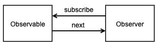
```ts
// 初体验（这段代码没看太明白，看视频的时候要学习）
import { Observable } from "rxjs"
  
const observable = new Observable(function (observer) {
  setTimeout(function () {
    observer.next({
      name: "张三"
    })
  }, 2000)
})

const observer = {
  next: function (value) {
    console.log(value)
  }
}

observable.subscribe(observer)
```

### 13.2、可观察对象
#### 13.2.1、Observable
1. 在 Observable 对象内部可以多次调用 next 方法向外发送数据。
```ts
const observable = new Observable(function (observer) {
  let index = 0
  setInterval(function () {
    observer.next(index++)
  }, 1000)
})

const observer = {
  next: function (value) {
    console.log(value)
  }
}

observable.subscribe(observer)
```

2. 当所有数据发送完成以后，可以调用 complete 方法终止数据发送。
```ts
const observable = new Observable(function (observer) {
  let index = 0
  let timer = setInterval(function () {
    observer.next(index++)
    if (index === 3) {
      observer.complete()
      clearInterval(timer)
    }
  }, 1000)
})

const observer = {
  next: function (value) {
    console.log(value)
  },
  complete: function () {
    console.log("数据发送完成")
  }
}

observable.subscribe(observer)
```

3. 当 Observable 内部逻辑发生错误时，可以调用 error 方法将失败信息发送给订阅者，Observable 终止。
```ts
import { Observable } from "rxjs"

const observable = new Observable(function (observer) {
  let index = 0
  let timer = setInterval(function () {
    observer.next(index++)
    if (index === 3) {
      observer.error("发生错误")
      clearInterval(timer)
    }
  }, 1000)
})

const observer = {
  next: function (value) {
    console.log(value)
  },
  error: function (error) {
    console.log(error)
  }
}

observable.subscribe(observer)
```

4. 可观察对象是惰性的，只有被订阅后才会执行
```ts
const observable = new Observable(function () {
  console.log("Hello RxJS")
})
// observable.subscribe()
```

5. 可观察对象可以有 n 多订阅者，每次被订阅时都会得到执行
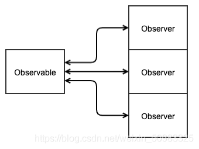

```ts
const observable = new Observable(function () {
  console.log("Hello RxJS")
})

observable.subscribe()
observable.subscribe()
observable.subscribe()
observable.subscribe()
observable.subscribe()
```

6. 取消订阅
```ts
import { interval } from "rxjs"

const obs = interval(1000)
const subscription = obs.subscribe(console.log)

setTimeout(function () {
  subscription.unsubscribe()
}, 2000)
```

#### 13.2.2、Subject
1. 用于创建空的可观察对象，在订阅后不会立即执行，next 方法可以在可观察对象外部调用
```ts
import { Subject } from "rxjs"

const demoSubject = new Subject()

demoSubject.subscribe({next: function (value) {console.log(value)}})
demoSubject.subscribe({next: function (value) {console.log(value)}})

setTimeout(function () {
  demoSubject.next("hahaha")
}, 3000)
```

#### 13.2.3、BehaviorSubject
拥有 Subject 全部功能，但是在创建 Obervable 对象时可以传入默认值，观察者订阅后可以直接拿到默认值。
```ts
import { BehaviorSubject } from "rxjs"

const demoBehavior = new BehaviorSubject("默认值")
demoBehavior.subscribe({next: function (value) {console.log(value)}})
demoBehavior.next("Hello")
```

#### 13.2.4、ReplaySubject
功能类似 Subject，但有新订阅者时两者处理方式不同，Subject 不会广播历史结果，而 ReplaySubject 会广播所有历史结果。
```ts
import { ReplaySubject } from "rxjs"

const rSubject = new ReplaySubject()

rSubject.subscribe(value => {
  console.log(value)
})

rSubject.next("Hello 1")
rSubject.next("Hello 2")

setTimeout(function () {
  rSubject.subscribe({next: function (value) {console.log(value)}})
}, 3000)
```

### 13.3、辅助方法

#### 13.3.1、range
`range(start, length)`，调用方法后返回 observable 对象，被订阅后会发出指定范围的数值。
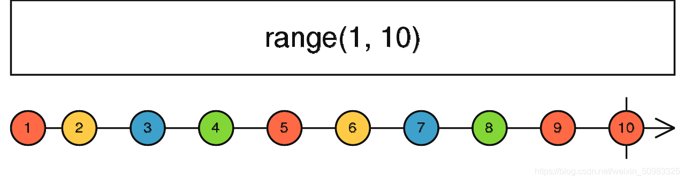
```ts
import { range } from "rxjs"
range(0, 5).subscribe(n => console.log(n))
// 0
// 1
// 2
// 3
// 4
```
方法内部并不是一次发出 length 个数值，而是发送了 length 次，每次发送一个数值，就是说内部调用了 length 次 next 方法。

#### 13.3.2、of
将参数列表作为数据流返回。

#### 13.3.3、from
将 Array，Promise, Iterator 转换为 observable 对象。
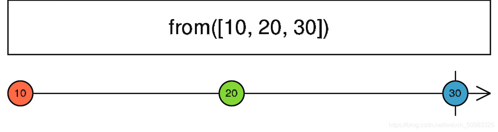
```ts
from(["a", "b", "c"]).subscribe(v => console.log(v))
// a
// b
// c
```
```ts
import { from } from "rxjs"

function p() {
  return new Promise(function (resolve) {
    resolve([100, 200])
  })
}

from(p()).subscribe(v => console.log(v))
// [100, 200]
```

#### 13.3.4、interval、timer
**Interval：** 每隔一段时间发出一个数值，数值递增
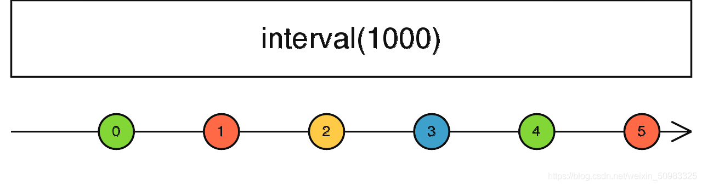
```ts
import { interval } from "rxjs"
interval(1000).subscribe(n => console.log(n))
```

**timer：** 间隔时间过去以后发出数值，行为终止，或间隔时间发出数值后，继续按第二个参数的时间间隔继续发出值
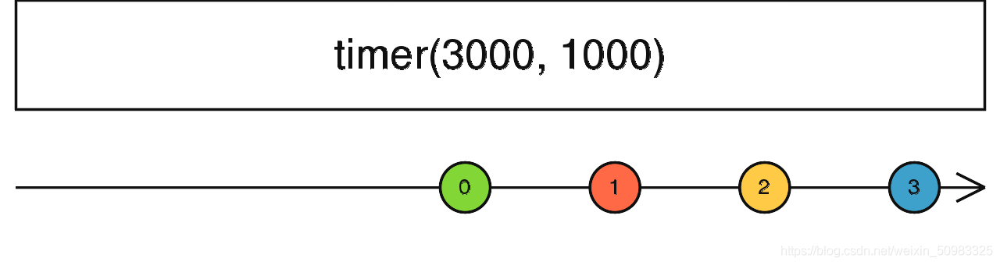
```ts
import { timer } from "rxjs"

timer(2000).subscribe(n => console.log(n))
timer(0, 1000).subscribe(n => console.log(n))
```

#### 13.3.5、concat
合并数据流，先让第一个数据流发出值，结束后再让第二个数据流发出值，进行整体合并。
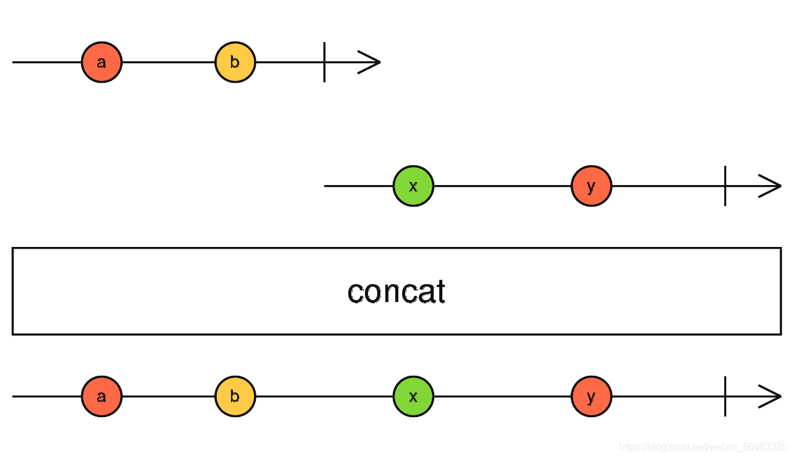
```ts
import { concat, range } from "rxjs"

concat(range(1, 5), range(6, 5)).subscribe(console.log)
```

#### 13.3.6、merge
合并数据流，多个参数一起发出数据流，按照时间线进行交叉合并。
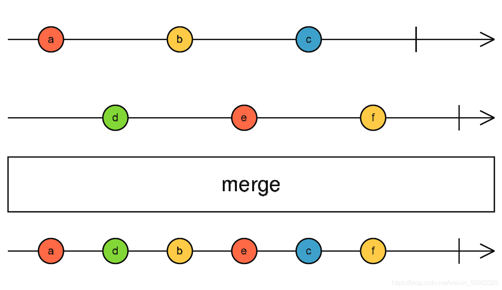
```ts
import { merge, fromEvent, interval } from "rxjs"

const clicks = fromEvent(document, "click")
const timer = interval(1000)

merge(clicks, timer).subscribe(console.log)
```

#### 13.3.7、combineLatest
将两个 Obserable 中最新发出的数据流进行组合成新的数据流，以数组的形式发出。和当前最新的进行组合。
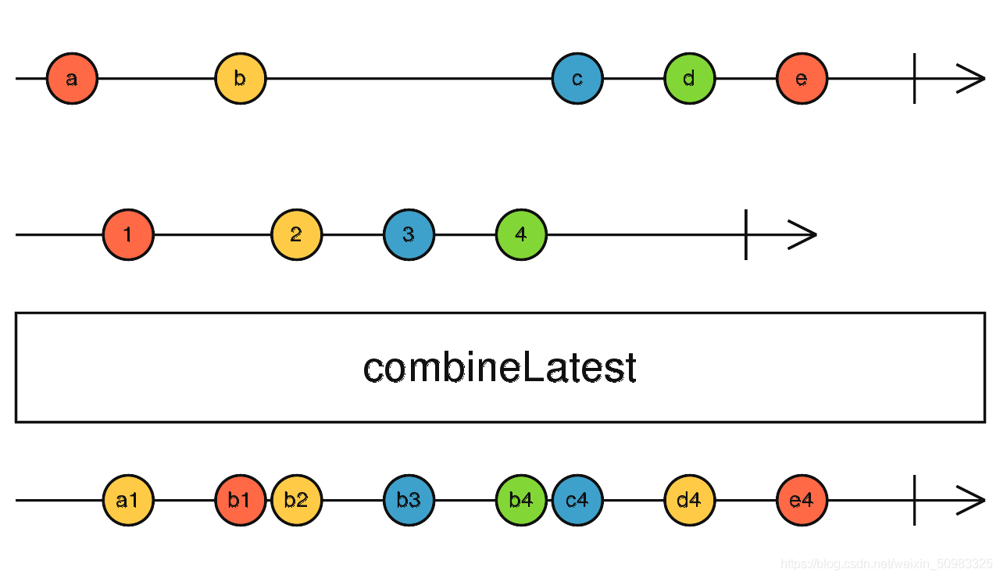
```ts
import { combineLatest, timer } from "rxjs"

const firstTimer = timer(0, 1000) // emit 0, 1, 2... after every second, starting from now
const secondTimer = timer(500, 1000) // emit 0, 1, 2... after every second, starting 0,5s from now
combineLatest(firstTimer, secondTimer).subscribe(console.log)

// [0, 0] after 0.5s
// [1, 0] after 1s
// [1, 1] after 1.5s
// [2, 1] after 2s
```

#### 13.3.8、zip
将多个 Observable 中的数据流进行组合。和将来最新的进行组合。
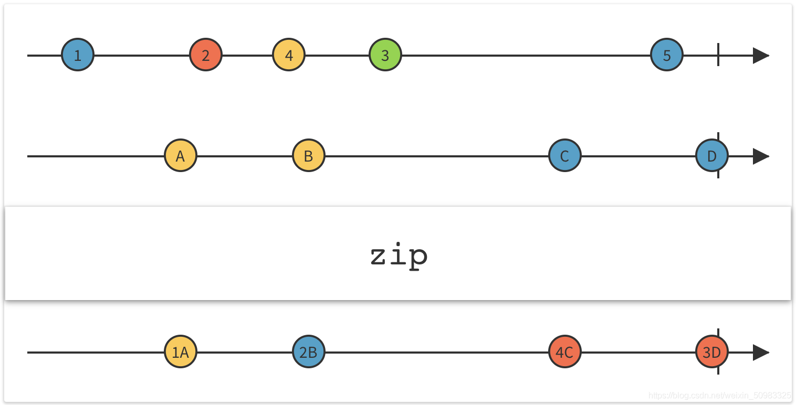
```ts
import { zip, of } from "rxjs"
import { map } from "rxjs/operators"

let age = of(27, 25, 29)
let name = of("Foo", "Bar", "Beer")
let isDev = of(true, true, false)

zip(name, age, isDev)
  .pipe(map(([name, age, isDev]) => ({ name, age, isDev })))
  .subscribe(console.log)

// { name: 'Foo', age: 27, isDev: true }
// { name: 'Bar', age: 25, isDev: true }
// { name: 'Beer', age: 29, isDev: false }
```

#### 13.3.9、forkJoin
forkJoin 是 Rx 版本的 Promise.all()，即表示等到所有的 Observable 都完成后，才一次性返回值。
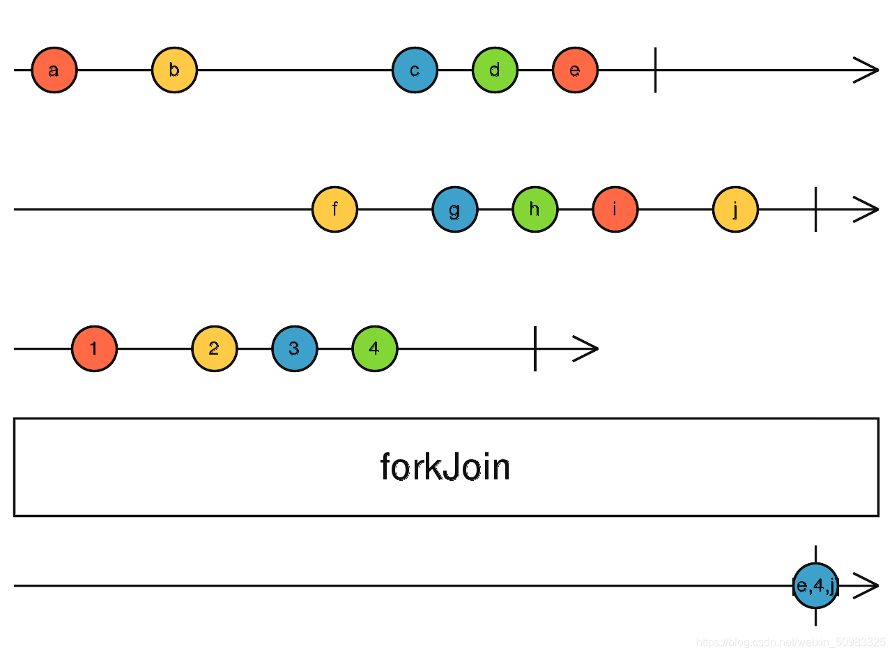
```ts
import axios from "axios"
import { forkJoin, from } from "rxjs"

axios.interceptors.response.use(response => response.data)

forkJoin({
  goods: from(axios.get("http://localhost:3005/goods")),
  category: from(axios.get("http://localhost:3005/category"))
}).subscribe(console.log)
```

#### 13.3.10、throwError
返回可观察对象并向订阅者抛出错误。
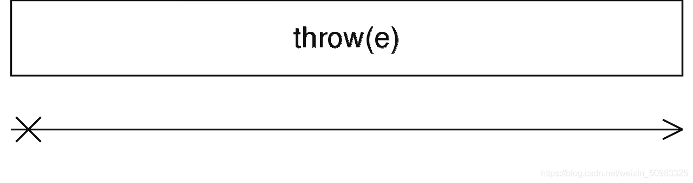
```ts
import { throwError } from "rxjs"

throwError("发生了未知错误").subscribe({ error: console.log })
```

#### 13.3.11、retry
如果 Observable 对象抛出错误，则该辅助方法会重新订阅 Observable 以获取数据流，参数为重新订阅次数。
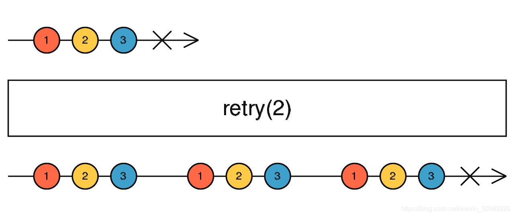
```ts
import { interval, of, throwError } from "rxjs"
import { mergeMap, retry } from "rxjs/operators"

interval(1000)
  .pipe(
    mergeMap(val => {
      if (val > 2) {
        return throwError("Error!")
      }
      return of(val)
    }),
    retry(2)
  )
  .subscribe({
    next: console.log,
    error: console.log
  })
```

#### 13.3.12、race
接收并同时执行多个可观察对象，只将最快发出的数据流传递给订阅者。
```ts
import { race, timer } from "rxjs"
import { mapTo } from "rxjs/operators"

const obs1 = timer(1000).pipe(mapTo("fast one"))
const obs2 = timer(3000).pipe(mapTo("medium one"))
const obs3 = timer(5000).pipe(mapTo("slow one"))

race(obs3, obs1, obs2).subscribe(console.log)
```

#### 13.3.13、fromEvent
将事件转换为 Observable。
```ts
import { fromEvent } from "rxjs"

const btn = document.getElementById("btn")
// 可以将 Observer 简写成一个函数，表示 next
fromEvent(btn, "click").subscribe(e => console.log(e))
```

### 13.4、操作符
1. 数据流：从可观察对象内部输出的数据就是数据流，可观察对象内部可以向外部源源不断的输出数据。
2. 操作符：用于操作数据流，可以对象数据流进行转换，过滤等等操作。

#### 13.4.1、map、mapTo
**map：** 对数据流进行转换，基于原有值进行转换。
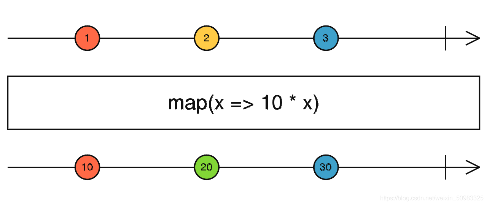
```ts
import { interval } from "rxjs"
import { map } from "rxjs/operators"

interval(1000)
  .pipe(map(n => n * 2))
  .subscribe(n => console.log(n))
```
**mapTo：** 对数据流进行转换，不关心原有值，可以直接传入要转换后的值。
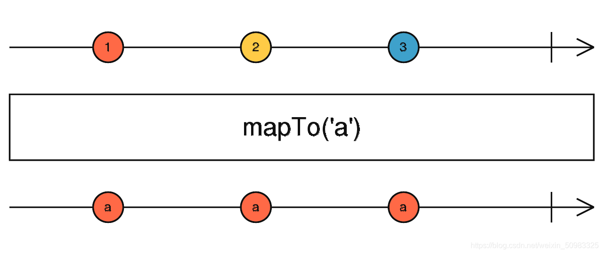
```ts
import { interval } from "rxjs"
import { mapTo } from "rxjs/operators"

interval(1000)
  .pipe(mapTo({ msg: "接收到了数据流" }))
  .subscribe(msg => console.log(msg))
```

#### 13.4.2、filter
对数据流进行过滤。
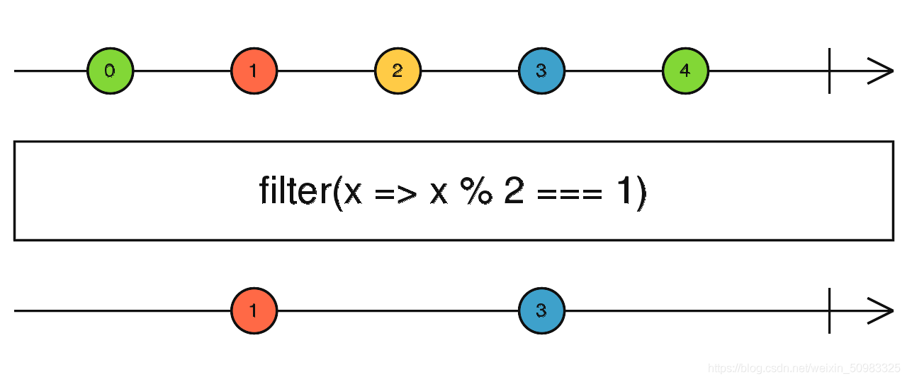
```ts
import { range } from "rxjs"
import { filter } from "rxjs/operators"

range(1, 10)
  .pipe(filter(n => n % 2 === 0))
  .subscribe(even => console.log(even))
```

#### 13.4.3、pluck
获取数据流对象中的属性值。
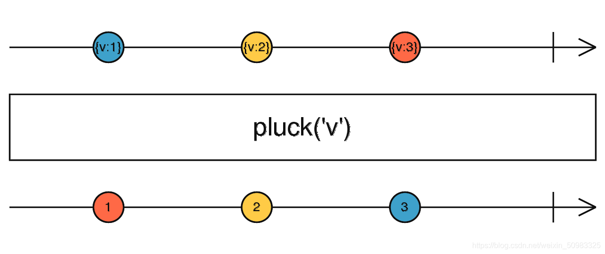
```ts
import { interval } from "rxjs"
import { pluck, mapTo } from "rxjs/operators"

interval(1000)
  .pipe(
    mapTo({ name: "张三", a: { b: "c" } }), 
    pluck("a", "b")
  )
  .subscribe(n => console.log(n))
```

#### 13.4.4、first
获取数据流中的第一个值或者查找数据流中第一个符合条件的值，类似数组中的 find 方法。获取到值以后终止行为。
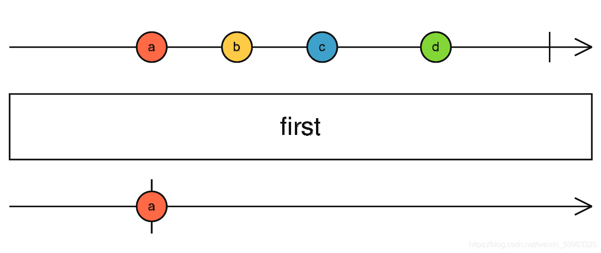
```ts
import { interval } from "rxjs"
import { first } from "rxjs/operators"

interval(1000)
  .pipe(first())
  .subscribe(n => console.log(n))

interval(1000)
  .pipe(first(n => n === 3))
  .subscribe(n => console.log(n))
```

#### 13.4.5、startWith
创建一个新的 observable 对象并将参数值发送出去，然后再发送源 observable 对象发出的值。

在异步编程中提供默认值的时候非常有用。
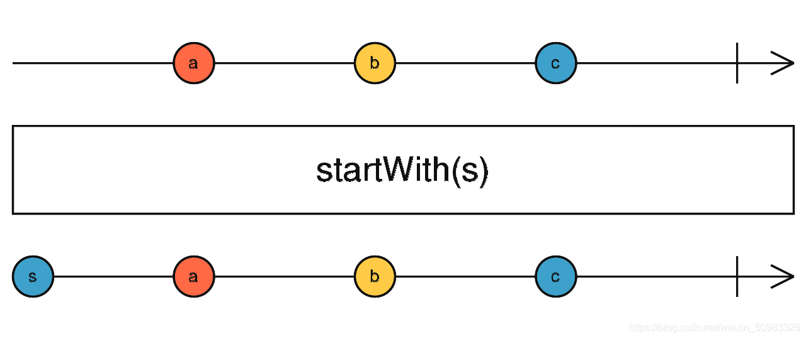
```ts
import { interval } from "rxjs"
import { map, startWith } from "rxjs/operators"

interval(1000)
  .pipe(
    map(n => n + 100),
    startWith(505)
  )
  .subscribe(n => console.log(n))
// 505
// 100
// 101
// 102
// ...
```

#### 13.4.6、every
查看数据流中的每个值是否都符合条件，返回布尔值。类似数组中的 every 方法。
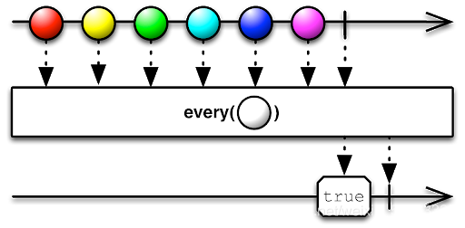
```ts
import { range } from "rxjs"
import { every, map } from "rxjs/operators"

range(1, 9)
  .pipe(
    map(n => n * 2),
    every(n => n % 2 === 0)
  )
  .subscribe(b => console.log(b))
```

#### 13.4.7、delay、delayWhen
**delay：** 对上一环节的操作整体进行延迟，只执行一次。
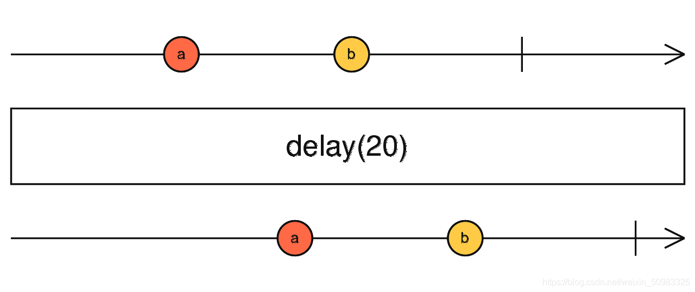
```ts
import { from } from "rxjs"
import { delay, map, tap } from "rxjs/operators"

from([1, 2, 3])
  .pipe(
    delay(1000),
    tap(n => console.log("已经延迟 1s", n)),
    map(n => n * 2),
    delay(1000),
    tap(() => console.log("又延迟了 1s"))
  )
  .subscribe(console.log)

// tap 操作符不会对数据流造成影响, 它被用来执行简单的副作用, 比如输出, 但是复杂的副作用不要在这执行, 比如 Ajax
```

**delayWhen：** 对上一环节的操作进行延迟，上一环节发出多少数据流，传入的回调函数就会执行多次。
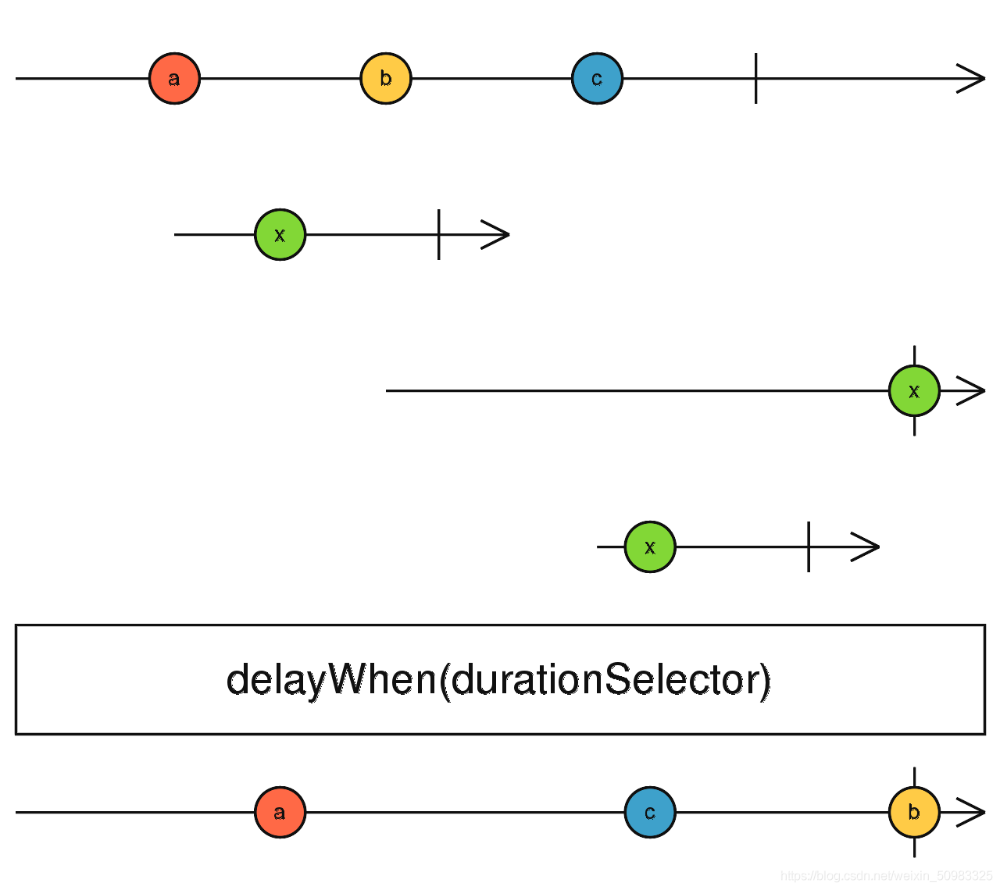
```ts
import { range, timer } from "rxjs"
import { delayWhen } from "rxjs/operators"

range(1, 10)
  .pipe(
    delayWhen(n => {
      console.log(n)
      return timer(n * 1000)
    })
  )
  .subscribe(console.log)
```

#### 13.4.8、take、takeWhile、takeUtil
**take：** 获取数据流中的前几个
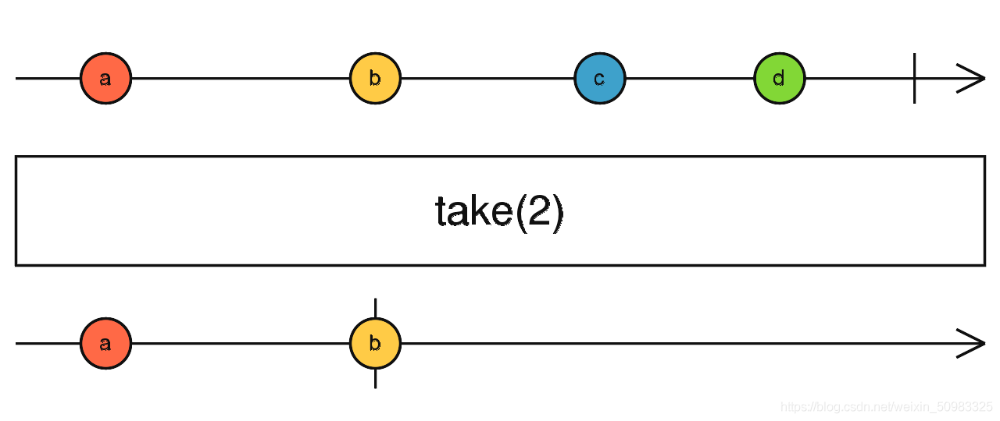
```ts
import { range } from "rxjs"
import { take } from "rxjs/operators"

range(1, 10).pipe(take(5)).subscribe(console.log)
```

**takeWhile：** 根据条件从数据源前面开始获取。
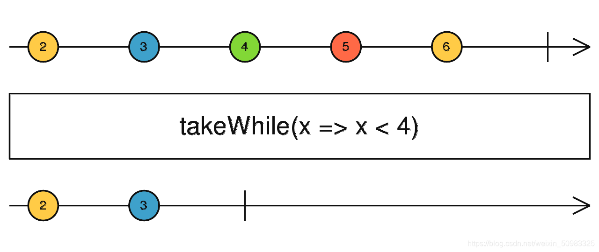
```ts
import { range } from "rxjs"
import { takeWhile } from "rxjs/operators"

range(1, 10)
  .pipe(takeWhile(n => n < 8))
  .subscribe(console.log)
```

**takeUntil：** 接收可观察对象，当可观察对象发出值时，终止主数据源。
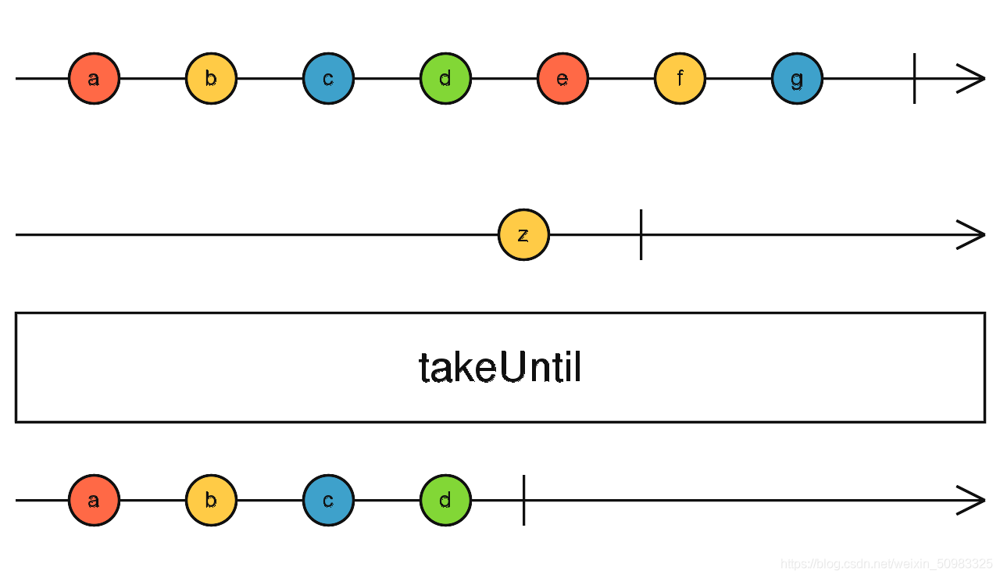
```ts
import { interval, timer } from "rxjs"
import { takeUntil } from "rxjs/operators"

interval(100)
  .pipe(takeUntil(timer(2000)))
  .subscribe(console.log)
// 结果少两个数据流的原因：第一次和最后一次，都需要延迟 100 毫秒。
```

#### 13.4.9、skip、skipWhile、skipUntil
**skip：** 跳过前几个数据流。
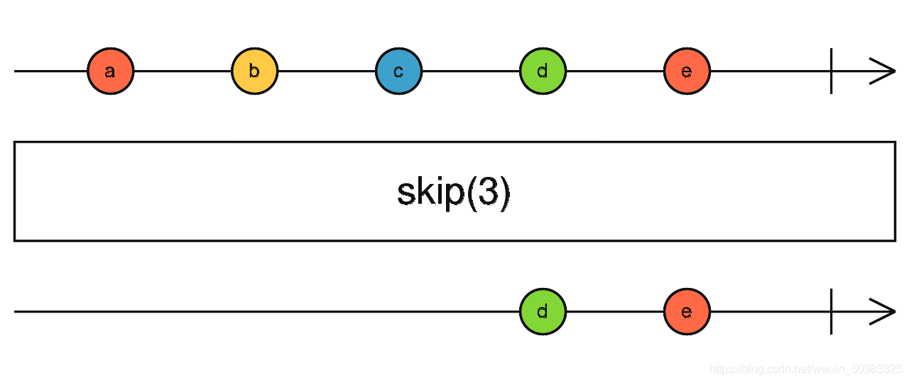
```ts
import { range } from "rxjs"
import { skip } from "rxjs/operators"

range(1, 10).pipe(skip(5)).subscribe(console.log)
```

**skipWhile：** 根据条件进行数据流的跳过。
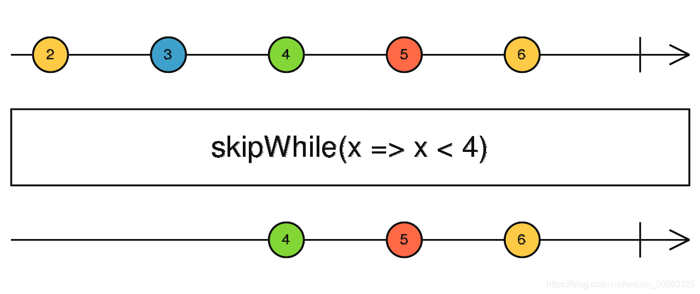
```ts
import { range } from "rxjs"
import { skipWhile } from "rxjs/operators"

range(1, 10)
  .pipe(skipWhile(n => n < 5))
  .subscribe(console.log)
```

**skipUntil：** 跳过数据源中前多少时间发出的数据流，发送从这个时间以后数据源中发送的数据流。
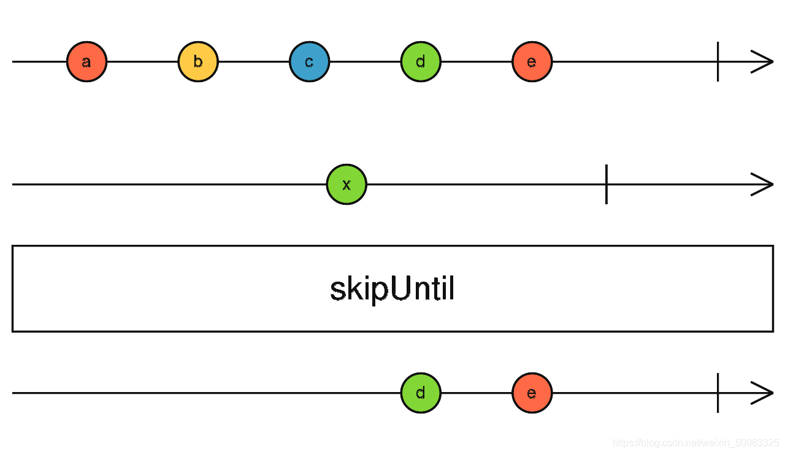
```ts
import { timer, interval } from "rxjs"
import { skipUntil } from "rxjs/operators"

interval(100)
  .pipe(skipUntil(timer(2000)))
  .subscribe(console.log)
```

#### 13.4.10、last
获取数据流中的最后一个。
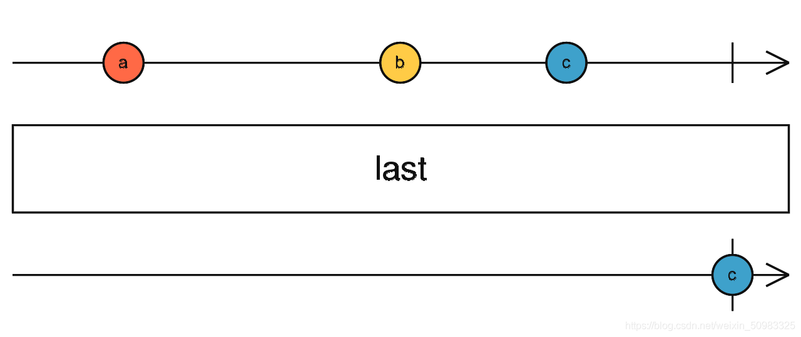
```ts
import { range } from "rxjs"
import { last } from "rxjs/operators"

range(1, 10).pipe(last()).subscribe(console.log)
```
如果数据源不变成完成状态，则没有最后一个。
```ts
import { interval } from "rxjs"
import { last, take } from "rxjs/operators"

interval(1000).pipe(take(5), last()).subscribe(console.log)
```


#### 13.4.11、concatAll、concatMap
**concatAll：** 有时 Observable 发出的又是一个 Obervable，concatAll 的作用就是将新的可观察对象和数据源进行合并。

Observable => [1, 2, 3]

Observable => [Observable, Observable]
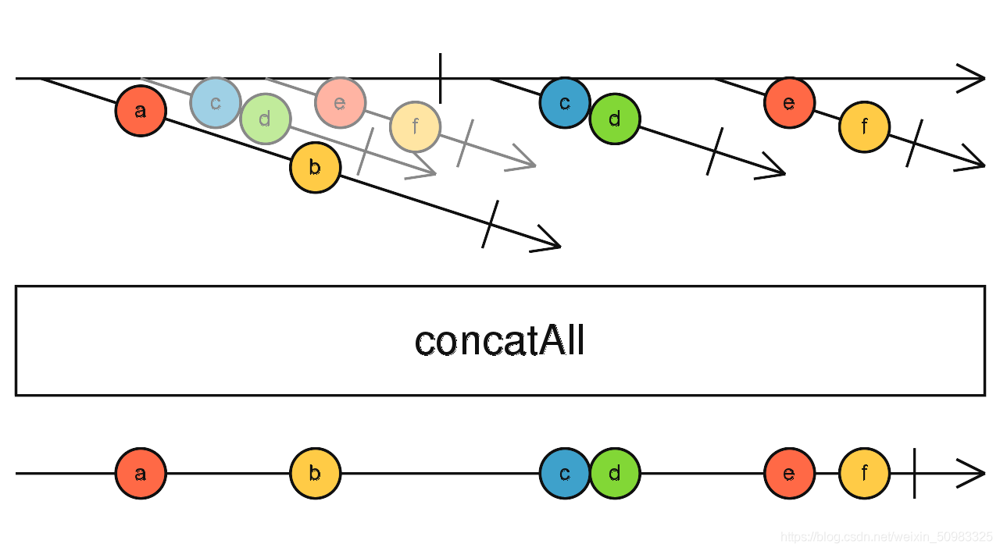
```ts
import { fromEvent, interval } from "rxjs"
import { map, take, concatAll } from "rxjs/operators"

fromEvent(document, "click")
  .pipe(
    map(event => interval(1000).pipe(take(2))),
    concatAll()
  )
  .subscribe(console.log)
```
```ts
import { map, concatAll } from "rxjs/operators"
import { of, interval } from "rxjs"

interval(1000)
  .pipe(
    map(val => of(val + 10)),
    concatAll()
  )
  .subscribe(console.log)
```
**concatMap：** 合并可观察对象并处理其发出的数据流。
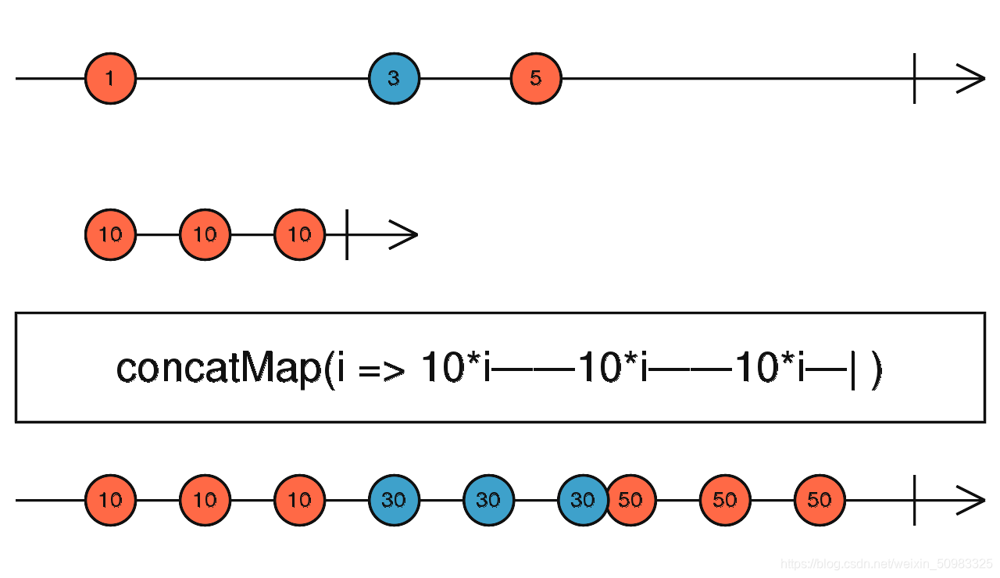

#### 13.4.13、reduce、scan
**reduce:** 类似 JavaScript 数组中的 reduce，对数数据进行累计操作。reduce 会等待数据源中的数据流发送完成后再执行，执行时 reduce 内部遍历每一个数据流进行累计操作，操作完成得到结果将结果作为数据流发出。
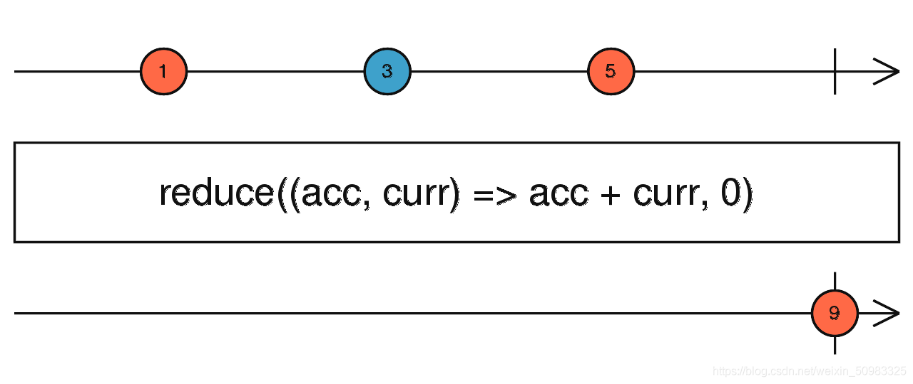
```ts
import { interval } from "rxjs"
import { take, reduce } from "rxjs/operators"

interval(500)
  .pipe(
    take(5),
    reduce((acc, value) => acc += value, 0)
  )
  .subscribe(v => console.log())
```

#### 13.4.14、mergeAll、mergeMap
**mergeAll：** 交叉合并可观察对象。
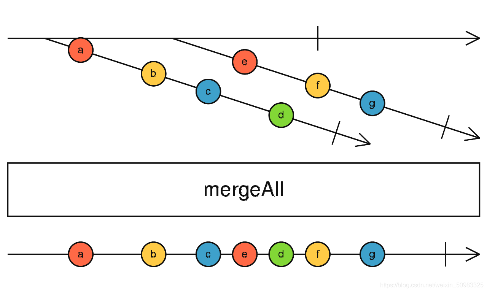
```ts
import { fromEvent, interval } from "rxjs"
import { map, mergeAll } from "rxjs/operators"

fromEvent(document, "click")
  .pipe(
    map(() => interval(1000)),
    mergeAll()
  )
  .subscribe(console.log)
```
**mergeMap：** 交叉合并可观察对象以后对可观察对象发出的数据流进行转换。
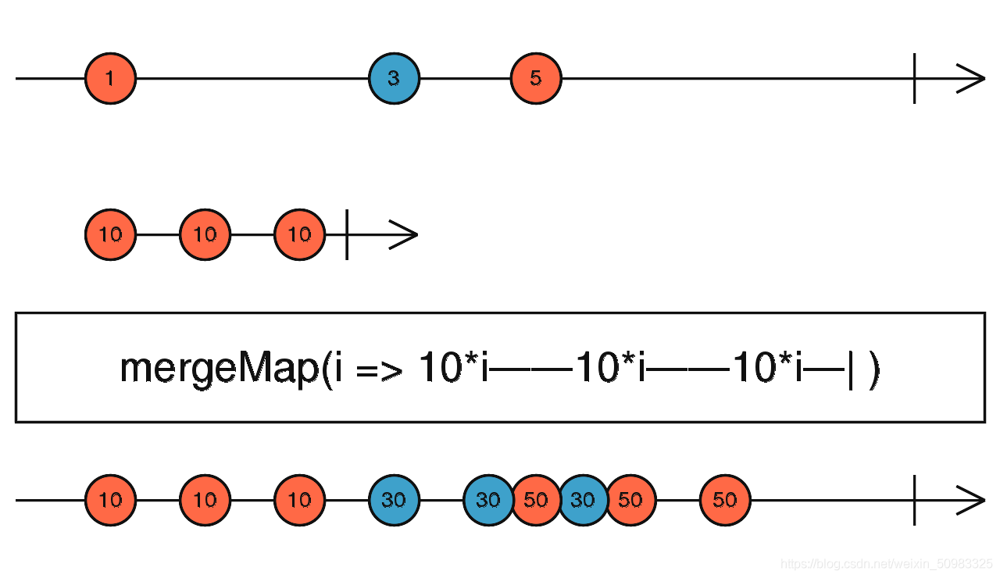
```ts
import { of, interval } from "rxjs"
import { mergeMap, map } from "rxjs/operators"

of("a", "b", "c")
  .pipe(mergeMap(x => interval(1000).pipe(map(i => x + i))))
  .subscribe(x => console.log(x))
```

#### 13.4.15、throttleTime
节流，可观察对象高频次向外部发出数据流，通过 throttleTime 限制在规定时间内每次只向订阅者传递一次数据流。
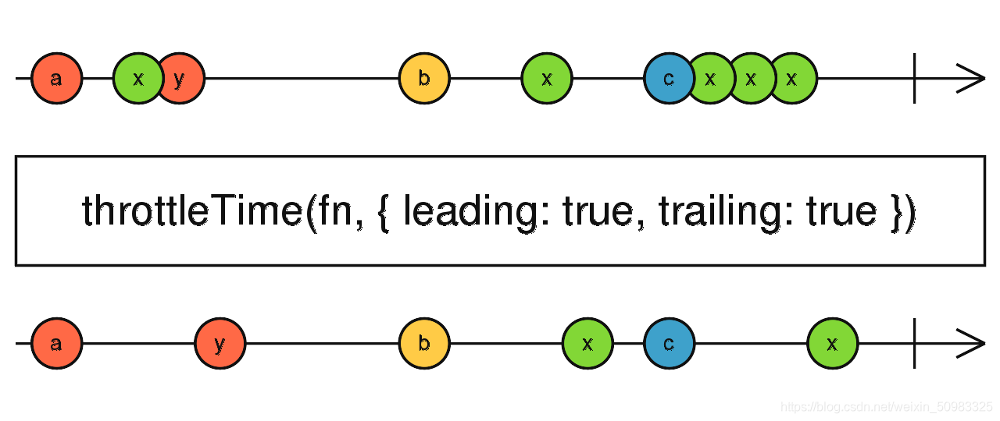
```ts
import { fromEvent } from "rxjs"
import { throttleTime } from "rxjs/operators"

fromEvent(document, "click")
  .pipe(throttleTime(2000))
  .subscribe(x => console.log(x))
```

#### 13.4.16、debounceTime
防抖，触发高频事件，只响应最后一次。
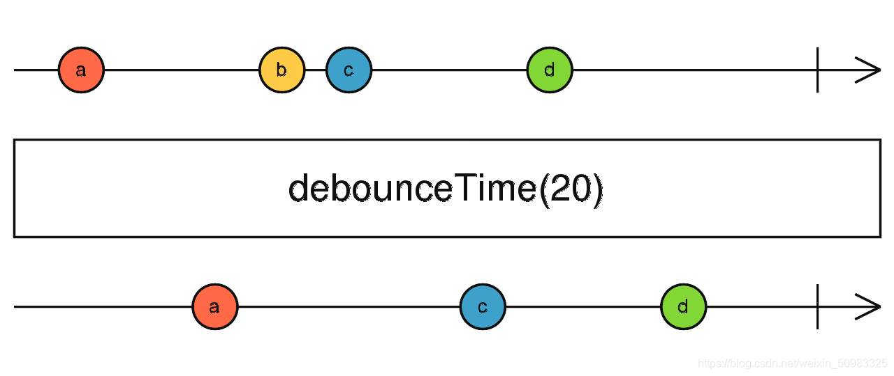
```ts
import { fromEvent } from "rxjs"
import { debounceTime } from "rxjs/operators"

fromEvent(document, "click")
  .pipe(debounceTime(1000))
  .subscribe(x => console.log(x))
```

#### 13.4.17、distinctUntilChanged
检测数据源当前发出的数据流是否和上次发出的相同，如相同，跳过，不相同，发出。
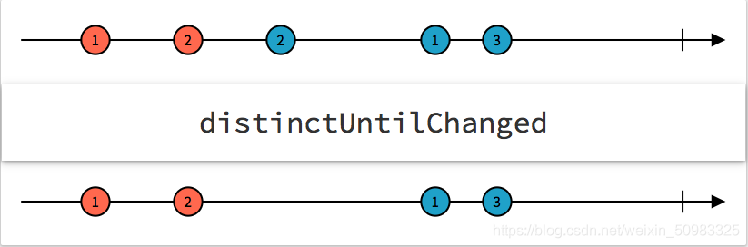
```ts
import { of } from "rxjs"
import { distinctUntilChanged } from "rxjs/operators"

of(1, 1, 2, 2, 2, 1, 1, 2, 3, 3, 4)
  .pipe(distinctUntilChanged())
  .subscribe(x => console.log(x)) // 1, 2, 1, 2, 3, 4
```

#### 13.4.18、groupBy
对数据流进行分组。
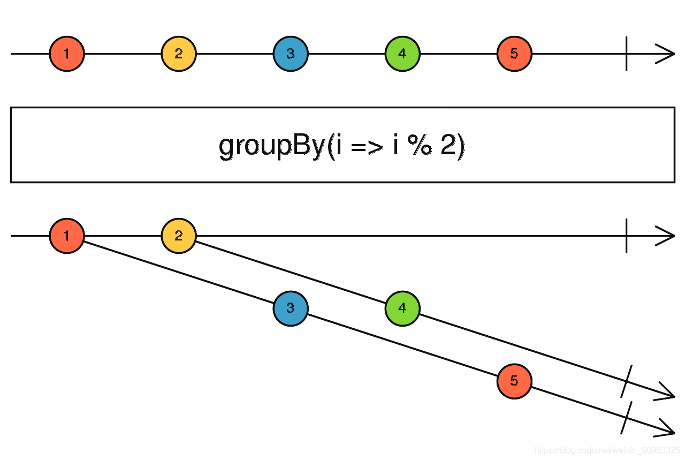
```ts
import { of } from "rxjs"
import { mergeMap, groupBy, toArray } from "rxjs/operators"

of(
  { name: "Sue", age: 25 },
  { name: "Joe", age: 30 },
  { name: "Frank", age: 25 },
  { name: "Sarah", age: 35 }
)
  .pipe(
    groupBy(person => person.age),
    mergeMap(group => group.pipe(toArray()))
  )
  .subscribe(console.log)

// [{name: "Sue", age: 25}, { name: "Frank", age: 25 }]
// [{ name: "Joe", age: 30 }]
// [{ name: "Sarah", age: 35 }]
```

#### 13.4.19、withLatestFrom
主数据源发出的数据流总是和支数据源中的最新数据流进行结合，返回数组。
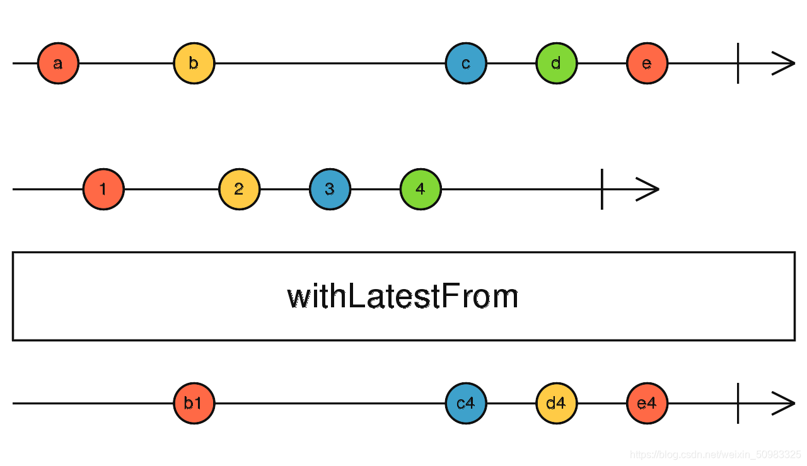
```ts
import { fromEvent, interval } from "rxjs"
import { withLatestFrom } from "rxjs/operators"

const clicks = fromEvent(document, "click")
const timer = interval(1000)
clicks.pipe(withLatestFrom(timer)).subscribe(console.log)
```

#### 13.4.20、switchMap
切换可观察对象。
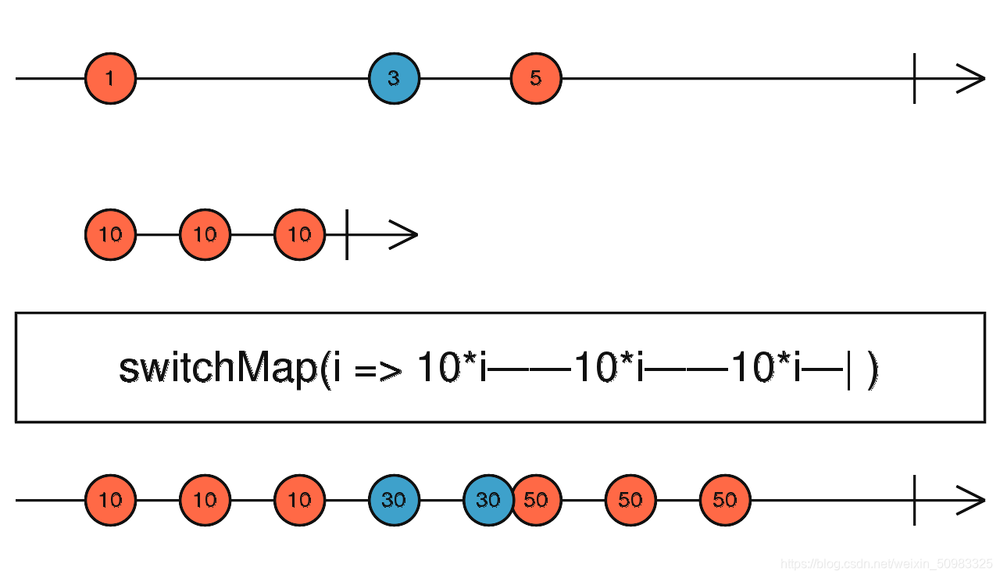
```ts
import { fromEvent, interval } from "rxjs"
import { switchMap } from "rxjs/operators"

fromEvent(document, "click")
  .pipe(switchMap(ev => interval(1000)))
  .subscribe(x => console.log(x))
```

### 13.5、练习
#### 13.5.1、元素拖拽
```html
<style>
  #box {
    width: 200px;
    height: 200px;
    background: skyblue;
    position: absolute;
    left: 0;
    top: 0;
  }
</style>
<div id="box"></div>
```

```ts
// 原生 JavaScript
box.onmousedown = function (event) {
  let distanceX = event.clientX - event.target.offsetLeft
  let distanceY = event.clientY - event.target.offsetTop
  document.onmousemove = function (event) {
    let positionX = event.clientX - distanceX
    let positionY = event.clientY - distanceY
    box.style.left = positionX + "px"
    box.style.top = positionY + "px"
  }
  box.onmouseup = function () {
    document.onmousemove = null
  }
}
```

```ts
// RxJS
import { fromEvent } from "rxjs"
import { map, switchMap, takeUntil } from "rxjs/operators"

const box = document.getElementById("box")

fromEvent(box, "mousedown")
  .pipe(
    map(event => ({
      distanceX: event.clientX - event.target.offsetLeft,
      distanceY: event.clientY - event.target.offsetTop
    })),
    switchMap(({ distanceX, distanceY }) =>
      fromEvent(document, "mousemove").pipe(
        map(event => ({
          positionX: event.clientX - distanceX,
          positionY: event.clientY - distanceY
        })),
        takeUntil(fromEvent(document, "mouseup"))
      )
    )
  )
  .subscribe(({ positionX, positionY }) => {
    box.style.left = positionX + "px"
    box.style.top = positionY + "px"
  })
```

#### 13.5.2、搜索
```html
<input id="search" type="text" placeholder="请输入搜索内容..." />
```

```ts
import { fromEvent, from, throwError } from "rxjs"
import { debounceTime, distinctUntilChanged, map, switchMap, catchError } from "rxjs/operators"
import axios from "axios"

const search = document.getElementById("search")

fromEvent(search, "keyup")
  .pipe(
    debounceTime(700),
    map(event => event.target.value),
    distinctUntilChanged(),
    switchMap(keyword =>
      from(
        axios.get(`https://j1sonplaceholder.typicode.com/posts?q=${keyword}`)
      ).pipe(
        map(response => response.data),
        catchError(error => throwError(`发生了错误: ${error.message}`))
      )
    )
  )
  .subscribe({
    next: value => {
      console.log(value)
    },
    error: error => {
      console.log(error)
    }
  })
```

#### 13.5.3、串联请求
先获取token，再根据token获取用户信息
```html
<button id="btn">获取用户信息</button>
```

```ts
import axios from "axios"
import { from, fromEvent } from "rxjs"
import { pluck, concatMap } from "rxjs/operators"

const button = document.getElementById("btn")

fromEvent(button, "click")
  .pipe(
    concatMap(event =>
      from(axios.get("http://localhost:3005/token")).pipe(
        pluck("data", "token")
      )
    ),
    concatMap(token =>
      from(axios.get("http://localhost:3005/userInfo")).pipe(pluck("data"))
    )
  )
  .subscribe(console.log)
```

## 十四、HttpClientModule
该模块用于发送 Http 请求，用于发送请求的方法都返回 Observable 对象。

### 14.1、快速开始
1. 引入 HttpClientModule 模块
```ts
// app.module.ts
import { httpClientModule } from '@angular/common/http';
imports: [
  httpClientModule
]
```

2. 注入 HttpClient 服务实例对象，用于发送请求
```ts
// app.component.ts
import { HttpClient } from '@angular/common/http';

export class AppComponent {
  constructor(private http: HttpClient) {}
}
```

3. 发送请求
```ts
import { HttpClient } from "@angular/common/http"

export class AppComponent implements OnInit {
  constructor(private http: HttpClient) {}
  ngOnInit() {
    this.getUsers().subscribe(console.log)
  }
  getUsers() {
    return this.http.get("https://jsonplaceholder.typicode.com/users")
  }
}
```

### 14.2、请求方法
```ts
this.http.get(url [, options]);
this.http.post(url, data [, options]);
this.http.delete(url [, options]);
this.http.put(url, data [, options]);
```
```ts
this.http.get<Post[]>('/getAllPosts')
  .subscribe(response => console.log(response))
```

### 14.3、请求参数
1. HttpParams 类
```ts
export declare class HttpParams {
  constructor(options?: HttpParamsOptions);
  has(param: string): boolean;
  get(param: string): string | null;
  getAll(param: string): string[] | null;
  keys(): string[];
  append(param: string, value: string): HttpParams;
  set(param: string, value: string): HttpParams;
  delete(param: string, value?: string): HttpParams;
  toString(): string;
}
```

2. HttpParamsOptions 接口
```ts
declare interface HttpParamsOptions {
    fromString?: string;
    fromObject?: {
        [param: string]: string | ReadonlyArray<string>;
    };
    encoder?: HttpParameterCodec;
}
```

3. 使用示例
```ts
import { HttpParams } from '@angular/common/http';

let params = new HttpParams({ fromObject: {name: "zhangsan", age: "20"}})
params = params.append("sex", "male")
let params = new HttpParams({ fromString: "name=zhangsan&age=20"})
```

### 14.4、请求头
请求头字段的创建需要使用 HttpHeaders 类，在类实例对象下面有各种操作请求头的方法。
```ts
export declare class HttpHeaders {
    constructor(headers?: string | {
        [name: string]: string | string[];
    });
    has(name: string): boolean;
    get(name: string): string | null;
    keys(): string[];
    getAll(name: string): string[] | null;
    append(name: string, value: string | string[]): HttpHeaders;
    set(name: string, value: string | string[]): HttpHeaders;
    delete(name: string, value?: string | string[]): HttpHeaders;
}
```
```ts
let headers = new HttpHeaders({ test: "Hello" })
```


### 14.5、响应内容
```ts
declare type HttpObserve = 'body' | 'response';
// response 读取完整响应体
// body 读取服务器端返回的数据
```
```ts
this.http.get(
  "https://jsonplaceholder.typicode.com/users", 
  { observe: "body" }
).subscribe(console.log)
```

### 14.6、拦截器
拦截器是 Angular 应用中全局捕获和修改 HTTP 请求和响应的方式。（Token、Error）

拦截器将只拦截使用 HttpClientModule 模块发出的请求。

`ng g interceptor <name>`
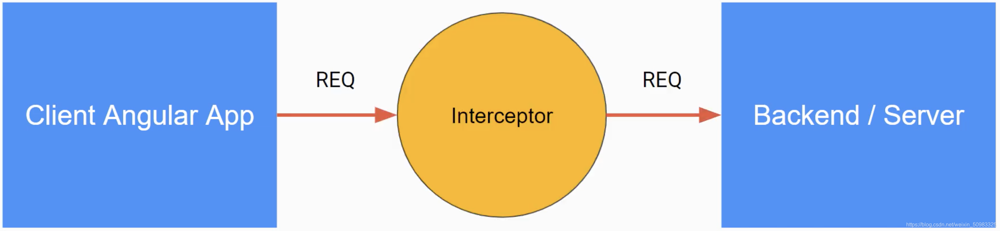
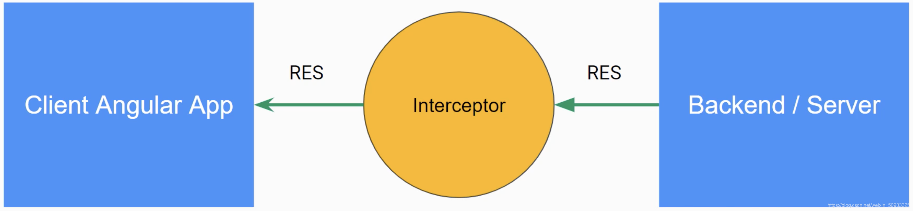

#### 14.6.1、请求拦截
```ts
@Injectable()
export class AuthInterceptor implements HttpInterceptor {
  constructor() {}
  // 拦截方法
  intercept(
    // unknown 指定请求体 (body) 的类型
    request: HttpRequest<unknown>,
    next: HttpHandler
     // unknown 指定响应内容 (body) 的类型
  ): Observable<HttpEvent<unknown>> {
    // 克隆并修改请求头
    const req = request.clone({
      setHeaders: {
        Authorization: "Bearer xxxxxxx"
      }
    })
    // 通过回调函数将修改后的请求头回传给应用
    return next.handle(req)
  }
}
```

#### 14.6.2、响应拦截
```ts
@Injectable()
export class AuthInterceptor implements HttpInterceptor {
  constructor() {}
  // 拦截方法
  intercept(
    request: HttpRequest<unknown>,
    next: HttpHandler
  ): Observable<any> {
    return next.handle(request).pipe(
      retry(2),
      catchError((error: HttpErrorResponse) => throwError(error))
    )
  }
}
```

#### 14.6.3、拦截注入
```ts
import { AuthInterceptor } from "./auth.interceptor"
import { HTTP_INTERCEPTORS } from "@angular/common/http"

@NgModule({
  providers: [
    {
      provide: HTTP_INTERCEPTORS,
      useClass: AuthInterceptor,
      multi: true
    }
  ]
})
```

### 14.7、Angular Proxy
1. 在项目的根目录下创建 proxy.conf.json 文件并加入如下代码
```ts
{
  "/api/*": {
    "target": "http://localhost:3070",
    "secure": false,
    "changeOrigin": true
  }
}
```

- 1. `/api/*`：在应用中发出的以 `/api` 开头的请求走此代理
- 2. target：服务器端 URL
- 3. secure：如果服务器端 URL 的协议是 https，此项需要为 true
- 4. changeOrigin：如果服务器端不是 localhost， 此项需要为 true

2. 指定 proxy 配置文件 (方式一)
```ts
"scripts": {
  "start": "ng serve --proxy-config proxy.conf.json",
}
```

3. 指定 proxy 配置文件 (方式二)
```ts
"serve": {
  "options": {
    "proxyConfig": "proxy.conf.json"
  },
```

## 十五、NgRx
### 15.1、概述
NgRx 是 Angular 应用中实现全局状态管理的 Redux 架构解决方案。

<p style="color: green;">作者著：还没用到，先暂停更新</p>

## 十六、动画
### 16.1、状态
#### 16.6.1、什么是状态
状态表示的是要进行运动的元素在运动的不同时期所呈现的样式。

<p style="color: green;">作者著：还没用到，先暂停更新</p>
