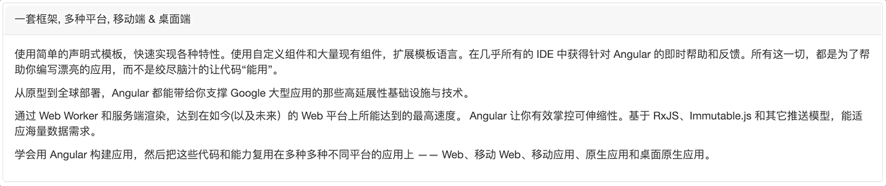

# Angular 高阶内容笔记（超棒）

## 十三、RxJS
### 13.1、概述

::: tip 官方文档
[RxJS官方文档](https://rxjs.dev/api)
:::


#### 13.1.1、什么是 RxJS？
RxJS 是一个用于处理异步编程的 JavaScript 库，目标是使编写异步和基于回调的代码更容易。

#### 13.1.2、为什么要学习 RxJS？
就像 Angular 深度集成 TypeScript 一样，Angular 也深度集成了 RxJS。

服务、表单、事件、全局状态管理、异步请求 …

#### 13.1.3、快速入门
1. 可观察对象 ( Observable ) ：类比 Promise 对象，内部可以用于执行异步代码，通过调用内部提供的方法将异步代码执行的结果传递到可观察对象外部。
2. 观察者 ( Observer )：类比 then 方法中的回调函数，用于接收可观察对象中传递出来数据。
3. 订阅 ( subscribe )：类比 then 方法，通过订阅将可观察对象和观察者连接起来，当可观察对象发出数据时，订阅者可以接收到数据。


```ts
// 初体验（这段代码没看太明白，看视频的时候要学习）
import { Observable } from "rxjs"
  
const observable = new Observable(function (observer) {
  setTimeout(function () {
    observer.next({
      name: "张三"
    })
  }, 2000)
})

const observer = {
  next: function (value) {
    console.log(value)
  }
}

observable.subscribe(observer)
```

### 13.2、可观察对象
#### 13.2.1、Observable
1. 在 Observable 对象内部可以多次调用 next 方法向外发送数据。
```ts
const observable = new Observable(function (observer) {
  let index = 0
  setInterval(function () {
    observer.next(index++)
  }, 1000)
})

const observer = {
  next: function (value) {
    console.log(value)
  }
}

observable.subscribe(observer)
```

2. 当所有数据发送完成以后，可以调用 complete 方法终止数据发送。
```ts
const observable = new Observable(function (observer) {
  let index = 0
  let timer = setInterval(function () {
    observer.next(index++)
    if (index === 3) {
      observer.complete()
      clearInterval(timer)
    }
  }, 1000)
})

const observer = {
  next: function (value) {
    console.log(value)
  },
  complete: function () {
    console.log("数据发送完成")
  }
}

observable.subscribe(observer)
```

3. 当 Observable 内部逻辑发生错误时，可以调用 error 方法将失败信息发送给订阅者，Observable 终止。
```ts
import { Observable } from "rxjs"

const observable = new Observable(function (observer) {
  let index = 0
  let timer = setInterval(function () {
    observer.next(index++)
    if (index === 3) {
      observer.error("发生错误")
      clearInterval(timer)
    }
  }, 1000)
})

const observer = {
  next: function (value) {
    console.log(value)
  },
  error: function (error) {
    console.log(error)
  }
}

observable.subscribe(observer)
```

4. 可观察对象是惰性的，只有被订阅后才会执行
```ts
const observable = new Observable(function () {
  console.log("Hello RxJS")
})
// observable.subscribe()
```

5. 可观察对象可以有 n 多订阅者，每次被订阅时都会得到执行


```ts
const observable = new Observable(function () {
  console.log("Hello RxJS")
})

observable.subscribe()
observable.subscribe()
observable.subscribe()
observable.subscribe()
observable.subscribe()
```

6. 取消订阅
```ts
import { interval } from "rxjs"

const obs = interval(1000)
const subscription = obs.subscribe(console.log)

setTimeout(function () {
  subscription.unsubscribe()
}, 2000)
```

#### 13.2.2、Subject
1. 用于创建空的可观察对象，在订阅后不会立即执行，next 方法可以在可观察对象外部调用
```ts
import { Subject } from "rxjs"

const demoSubject = new Subject()

demoSubject.subscribe({next: function (value) {console.log(value)}})
demoSubject.subscribe({next: function (value) {console.log(value)}})

setTimeout(function () {
  demoSubject.next("hahaha")
}, 3000)
```

#### 13.2.3、BehaviorSubject
拥有 Subject 全部功能，但是在创建 Obervable 对象时可以传入默认值，观察者订阅后可以直接拿到默认值。
```ts
import { BehaviorSubject } from "rxjs"

const demoBehavior = new BehaviorSubject("默认值")
demoBehavior.subscribe({next: function (value) {console.log(value)}})
demoBehavior.next("Hello")
```

#### 13.2.4、ReplaySubject
功能类似 Subject，但有新订阅者时两者处理方式不同，Subject 不会广播历史结果，而 ReplaySubject 会广播所有历史结果。
```ts
import { ReplaySubject } from "rxjs"

const rSubject = new ReplaySubject()

rSubject.subscribe(value => {
  console.log(value)
})

rSubject.next("Hello 1")
rSubject.next("Hello 2")

setTimeout(function () {
  rSubject.subscribe({next: function (value) {console.log(value)}})
}, 3000)
```

### 13.3、辅助方法

#### 13.3.1、range
`range(start, length)`，调用方法后返回 observable 对象，被订阅后会发出指定范围的数值。

```ts
import { range } from "rxjs"
range(0, 5).subscribe(n => console.log(n))
// 0
// 1
// 2
// 3
// 4
```
方法内部并不是一次发出 length 个数值，而是发送了 length 次，每次发送一个数值，就是说内部调用了 length 次 next 方法。

#### 13.3.2、of
将参数列表作为数据流返回。

#### 13.3.3、from
将 Array，Promise, Iterator 转换为 observable 对象。

```ts
from(["a", "b", "c"]).subscribe(v => console.log(v))
// a
// b
// c
```
```ts
import { from } from "rxjs"

function p() {
  return new Promise(function (resolve) {
    resolve([100, 200])
  })
}

from(p()).subscribe(v => console.log(v))
// [100, 200]
```

#### 13.3.4、interval、timer
**Interval：** 每隔一段时间发出一个数值，数值递增

```ts
import { interval } from "rxjs"
interval(1000).subscribe(n => console.log(n))
```

**timer：** 间隔时间过去以后发出数值，行为终止，或间隔时间发出数值后，继续按第二个参数的时间间隔继续发出值

```ts
import { timer } from "rxjs"

timer(2000).subscribe(n => console.log(n))
timer(0, 1000).subscribe(n => console.log(n))
```

#### 13.3.5、concat
合并数据流，先让第一个数据流发出值，结束后再让第二个数据流发出值，进行整体合并。

```ts
import { concat, range } from "rxjs"

concat(range(1, 5), range(6, 5)).subscribe(console.log)
```

#### 13.3.6、merge
合并数据流，多个参数一起发出数据流，按照时间线进行交叉合并。

```ts
import { merge, fromEvent, interval } from "rxjs"

const clicks = fromEvent(document, "click")
const timer = interval(1000)

merge(clicks, timer).subscribe(console.log)
```

#### 13.3.7、combineLatest
将两个 Obserable 中最新发出的数据流进行组合成新的数据流，以数组的形式发出。和当前最新的进行组合。

```ts
import { combineLatest, timer } from "rxjs"

const firstTimer = timer(0, 1000) // emit 0, 1, 2... after every second, starting from now
const secondTimer = timer(500, 1000) // emit 0, 1, 2... after every second, starting 0,5s from now
combineLatest(firstTimer, secondTimer).subscribe(console.log)

// [0, 0] after 0.5s
// [1, 0] after 1s
// [1, 1] after 1.5s
// [2, 1] after 2s
```

#### 13.3.8、zip
将多个 Observable 中的数据流进行组合。和将来最新的进行组合。

```ts
import { zip, of } from "rxjs"
import { map } from "rxjs/operators"

let age = of(27, 25, 29)
let name = of("Foo", "Bar", "Beer")
let isDev = of(true, true, false)

zip(name, age, isDev)
  .pipe(map(([name, age, isDev]) => ({ name, age, isDev })))
  .subscribe(console.log)

// { name: 'Foo', age: 27, isDev: true }
// { name: 'Bar', age: 25, isDev: true }
// { name: 'Beer', age: 29, isDev: false }
```

#### 13.3.9、forkJoin
forkJoin 是 Rx 版本的 Promise.all()，即表示等到所有的 Observable 都完成后，才一次性返回值。

```ts
import axios from "axios"
import { forkJoin, from } from "rxjs"

axios.interceptors.response.use(response => response.data)

forkJoin({
  goods: from(axios.get("http://localhost:3005/goods")),
  category: from(axios.get("http://localhost:3005/category"))
}).subscribe(console.log)
```

#### 13.3.10、throwError
返回可观察对象并向订阅者抛出错误。

```ts
import { throwError } from "rxjs"

throwError("发生了未知错误").subscribe({ error: console.log })
```

#### 13.3.11、retry
如果 Observable 对象抛出错误，则该辅助方法会重新订阅 Observable 以获取数据流，参数为重新订阅次数。

```ts
import { interval, of, throwError } from "rxjs"
import { mergeMap, retry } from "rxjs/operators"

interval(1000)
  .pipe(
    mergeMap(val => {
      if (val > 2) {
        return throwError("Error!")
      }
      return of(val)
    }),
    retry(2)
  )
  .subscribe({
    next: console.log,
    error: console.log
  })
```

#### 13.3.12、race
接收并同时执行多个可观察对象，只将最快发出的数据流传递给订阅者。
```ts
import { race, timer } from "rxjs"
import { mapTo } from "rxjs/operators"

const obs1 = timer(1000).pipe(mapTo("fast one"))
const obs2 = timer(3000).pipe(mapTo("medium one"))
const obs3 = timer(5000).pipe(mapTo("slow one"))

race(obs3, obs1, obs2).subscribe(console.log)
```

#### 13.3.13、fromEvent
将事件转换为 Observable。
```ts
import { fromEvent } from "rxjs"

const btn = document.getElementById("btn")
// 可以将 Observer 简写成一个函数，表示 next
fromEvent(btn, "click").subscribe(e => console.log(e))
```

### 13.4、操作符
1. 数据流：从可观察对象内部输出的数据就是数据流，可观察对象内部可以向外部源源不断的输出数据。
2. 操作符：用于操作数据流，可以对象数据流进行转换，过滤等等操作。

#### 13.4.1、map、mapTo
**map：** 对数据流进行转换，基于原有值进行转换。

```ts
import { interval } from "rxjs"
import { map } from "rxjs/operators"

interval(1000)
  .pipe(map(n => n * 2))
  .subscribe(n => console.log(n))
```
**mapTo：** 对数据流进行转换，不关心原有值，可以直接传入要转换后的值。

```ts
import { interval } from "rxjs"
import { mapTo } from "rxjs/operators"

interval(1000)
  .pipe(mapTo({ msg: "接收到了数据流" }))
  .subscribe(msg => console.log(msg))
```

#### 13.4.2、filter
对数据流进行过滤。

```ts
import { range } from "rxjs"
import { filter } from "rxjs/operators"

range(1, 10)
  .pipe(filter(n => n % 2 === 0))
  .subscribe(even => console.log(even))
```

#### 13.4.3、pluck
获取数据流对象中的属性值。

```ts
import { interval } from "rxjs"
import { pluck, mapTo } from "rxjs/operators"

interval(1000)
  .pipe(
    mapTo({ name: "张三", a: { b: "c" } }), 
    pluck("a", "b")
  )
  .subscribe(n => console.log(n))
```

#### 13.4.4、first
获取数据流中的第一个值或者查找数据流中第一个符合条件的值，类似数组中的 find 方法。获取到值以后终止行为。

```ts
import { interval } from "rxjs"
import { first } from "rxjs/operators"

interval(1000)
  .pipe(first())
  .subscribe(n => console.log(n))

interval(1000)
  .pipe(first(n => n === 3))
  .subscribe(n => console.log(n))
```

#### 13.4.5、startWith
创建一个新的 observable 对象并将参数值发送出去，然后再发送源 observable 对象发出的值。

在异步编程中提供默认值的时候非常有用。

```ts
import { interval } from "rxjs"
import { map, startWith } from "rxjs/operators"

interval(1000)
  .pipe(
    map(n => n + 100),
    startWith(505)
  )
  .subscribe(n => console.log(n))
// 505
// 100
// 101
// 102
// ...
```

#### 13.4.6、every
查看数据流中的每个值是否都符合条件，返回布尔值。类似数组中的 every 方法。

```ts
import { range } from "rxjs"
import { every, map } from "rxjs/operators"

range(1, 9)
  .pipe(
    map(n => n * 2),
    every(n => n % 2 === 0)
  )
  .subscribe(b => console.log(b))
```

#### 13.4.7、delay、delayWhen
**delay：** 对上一环节的操作整体进行延迟，只执行一次。

```ts
import { from } from "rxjs"
import { delay, map, tap } from "rxjs/operators"

from([1, 2, 3])
  .pipe(
    delay(1000),
    tap(n => console.log("已经延迟 1s", n)),
    map(n => n * 2),
    delay(1000),
    tap(() => console.log("又延迟了 1s"))
  )
  .subscribe(console.log)

// tap 操作符不会对数据流造成影响, 它被用来执行简单的副作用, 比如输出, 但是复杂的副作用不要在这执行, 比如 Ajax
```

**delayWhen：** 对上一环节的操作进行延迟，上一环节发出多少数据流，传入的回调函数就会执行多次。

```ts
import { range, timer } from "rxjs"
import { delayWhen } from "rxjs/operators"

range(1, 10)
  .pipe(
    delayWhen(n => {
      console.log(n)
      return timer(n * 1000)
    })
  )
  .subscribe(console.log)
```

#### 13.4.8、take、takeWhile、takeUtil
**take：** 获取数据流中的前几个

```ts
import { range } from "rxjs"
import { take } from "rxjs/operators"

range(1, 10).pipe(take(5)).subscribe(console.log)
```

**takeWhile：** 根据条件从数据源前面开始获取。

```ts
import { range } from "rxjs"
import { takeWhile } from "rxjs/operators"

range(1, 10)
  .pipe(takeWhile(n => n < 8))
  .subscribe(console.log)
```

**takeUntil：** 接收可观察对象，当可观察对象发出值时，终止主数据源。

```ts
import { interval, timer } from "rxjs"
import { takeUntil } from "rxjs/operators"

interval(100)
  .pipe(takeUntil(timer(2000)))
  .subscribe(console.log)
// 结果少两个数据流的原因：第一次和最后一次，都需要延迟 100 毫秒。
```

#### 13.4.9、skip、skipWhile、skipUntil
**skip：** 跳过前几个数据流。

```ts
import { range } from "rxjs"
import { skip } from "rxjs/operators"

range(1, 10).pipe(skip(5)).subscribe(console.log)
```

**skipWhile：** 根据条件进行数据流的跳过。

```ts
import { range } from "rxjs"
import { skipWhile } from "rxjs/operators"

range(1, 10)
  .pipe(skipWhile(n => n < 5))
  .subscribe(console.log)
```

**skipUntil：** 跳过数据源中前多少时间发出的数据流，发送从这个时间以后数据源中发送的数据流。

```ts
import { timer, interval } from "rxjs"
import { skipUntil } from "rxjs/operators"

interval(100)
  .pipe(skipUntil(timer(2000)))
  .subscribe(console.log)
```

#### 13.4.10、last
获取数据流中的最后一个。

```ts
import { range } from "rxjs"
import { last } from "rxjs/operators"

range(1, 10).pipe(last()).subscribe(console.log)
```
如果数据源不变成完成状态，则没有最后一个。
```ts
import { interval } from "rxjs"
import { last, take } from "rxjs/operators"

interval(1000).pipe(take(5), last()).subscribe(console.log)
```


#### 13.4.11、concatAll、concatMap
**concatAll：** 有时 Observable 发出的又是一个 Obervable，concatAll 的作用就是将新的可观察对象和数据源进行合并。

Observable => [1, 2, 3]

Observable => [Observable, Observable]

```ts
import { fromEvent, interval } from "rxjs"
import { map, take, concatAll } from "rxjs/operators"

fromEvent(document, "click")
  .pipe(
    map(event => interval(1000).pipe(take(2))),
    concatAll()
  )
  .subscribe(console.log)
```
```ts
import { map, concatAll } from "rxjs/operators"
import { of, interval } from "rxjs"

interval(1000)
  .pipe(
    map(val => of(val + 10)),
    concatAll()
  )
  .subscribe(console.log)
```
**concatMap：** 合并可观察对象并处理其发出的数据流。


#### 13.4.13、reduce、scan
**reduce:** 类似 JavaScript 数组中的 reduce，对数数据进行累计操作。reduce 会等待数据源中的数据流发送完成后再执行，执行时 reduce 内部遍历每一个数据流进行累计操作，操作完成得到结果将结果作为数据流发出。

```ts
import { interval } from "rxjs"
import { take, reduce } from "rxjs/operators"

interval(500)
  .pipe(
    take(5),
    reduce((acc, value) => acc += value, 0)
  )
  .subscribe(v => console.log())
```

#### 13.4.14、mergeAll、mergeMap
**mergeAll：** 交叉合并可观察对象。

```ts
import { fromEvent, interval } from "rxjs"
import { map, mergeAll } from "rxjs/operators"

fromEvent(document, "click")
  .pipe(
    map(() => interval(1000)),
    mergeAll()
  )
  .subscribe(console.log)
```
**mergeMap：** 交叉合并可观察对象以后对可观察对象发出的数据流进行转换。

```ts
import { of, interval } from "rxjs"
import { mergeMap, map } from "rxjs/operators"

of("a", "b", "c")
  .pipe(mergeMap(x => interval(1000).pipe(map(i => x + i))))
  .subscribe(x => console.log(x))
```

#### 13.4.15、throttleTime
节流，可观察对象高频次向外部发出数据流，通过 throttleTime 限制在规定时间内每次只向订阅者传递一次数据流。

```ts
import { fromEvent } from "rxjs"
import { throttleTime } from "rxjs/operators"

fromEvent(document, "click")
  .pipe(throttleTime(2000))
  .subscribe(x => console.log(x))
```

#### 13.4.16、debounceTime
防抖，触发高频事件，只响应最后一次。

```ts
import { fromEvent } from "rxjs"
import { debounceTime } from "rxjs/operators"

fromEvent(document, "click")
  .pipe(debounceTime(1000))
  .subscribe(x => console.log(x))
```

#### 13.4.17、distinctUntilChanged
检测数据源当前发出的数据流是否和上次发出的相同，如相同，跳过，不相同，发出。

```ts
import { of } from "rxjs"
import { distinctUntilChanged } from "rxjs/operators"

of(1, 1, 2, 2, 2, 1, 1, 2, 3, 3, 4)
  .pipe(distinctUntilChanged())
  .subscribe(x => console.log(x)) // 1, 2, 1, 2, 3, 4
```

#### 13.4.18、groupBy
对数据流进行分组。

```ts
import { of } from "rxjs"
import { mergeMap, groupBy, toArray } from "rxjs/operators"

of(
  { name: "Sue", age: 25 },
  { name: "Joe", age: 30 },
  { name: "Frank", age: 25 },
  { name: "Sarah", age: 35 }
)
  .pipe(
    groupBy(person => person.age),
    mergeMap(group => group.pipe(toArray()))
  )
  .subscribe(console.log)

// [{name: "Sue", age: 25}, { name: "Frank", age: 25 }]
// [{ name: "Joe", age: 30 }]
// [{ name: "Sarah", age: 35 }]
```

#### 13.4.19、withLatestFrom
主数据源发出的数据流总是和支数据源中的最新数据流进行结合，返回数组。

```ts
import { fromEvent, interval } from "rxjs"
import { withLatestFrom } from "rxjs/operators"

const clicks = fromEvent(document, "click")
const timer = interval(1000)
clicks.pipe(withLatestFrom(timer)).subscribe(console.log)
```

#### 13.4.20、switchMap
切换可观察对象。

```ts
import { fromEvent, interval } from "rxjs"
import { switchMap } from "rxjs/operators"

fromEvent(document, "click")
  .pipe(switchMap(ev => interval(1000)))
  .subscribe(x => console.log(x))
```

### 13.5、练习
#### 13.5.1、元素拖拽
```html
<style>
  #box {
    width: 200px;
    height: 200px;
    background: skyblue;
    position: absolute;
    left: 0;
    top: 0;
  }
</style>
<div id="box"></div>
```

```ts
// 原生 JavaScript
box.onmousedown = function (event) {
  let distanceX = event.clientX - event.target.offsetLeft
  let distanceY = event.clientY - event.target.offsetTop
  document.onmousemove = function (event) {
    let positionX = event.clientX - distanceX
    let positionY = event.clientY - distanceY
    box.style.left = positionX + "px"
    box.style.top = positionY + "px"
  }
  box.onmouseup = function () {
    document.onmousemove = null
  }
}
```

```ts
// RxJS
import { fromEvent } from "rxjs"
import { map, switchMap, takeUntil } from "rxjs/operators"

const box = document.getElementById("box")

fromEvent(box, "mousedown")
  .pipe(
    map(event => ({
      distanceX: event.clientX - event.target.offsetLeft,
      distanceY: event.clientY - event.target.offsetTop
    })),
    switchMap(({ distanceX, distanceY }) =>
      fromEvent(document, "mousemove").pipe(
        map(event => ({
          positionX: event.clientX - distanceX,
          positionY: event.clientY - distanceY
        })),
        takeUntil(fromEvent(document, "mouseup"))
      )
    )
  )
  .subscribe(({ positionX, positionY }) => {
    box.style.left = positionX + "px"
    box.style.top = positionY + "px"
  })
```

#### 13.5.2、搜索
```html
<input id="search" type="text" placeholder="请输入搜索内容..." />
```

```ts
import { fromEvent, from, throwError } from "rxjs"
import { debounceTime, distinctUntilChanged, map, switchMap, catchError } from "rxjs/operators"
import axios from "axios"

const search = document.getElementById("search")

fromEvent(search, "keyup")
  .pipe(
    debounceTime(700),
    map(event => event.target.value),
    distinctUntilChanged(),
    switchMap(keyword =>
      from(
        axios.get(`https://j1sonplaceholder.typicode.com/posts?q=${keyword}`)
      ).pipe(
        map(response => response.data),
        catchError(error => throwError(`发生了错误: ${error.message}`))
      )
    )
  )
  .subscribe({
    next: value => {
      console.log(value)
    },
    error: error => {
      console.log(error)
    }
  })
```

#### 13.5.3、串联请求
先获取token，再根据token获取用户信息
```html
<button id="btn">获取用户信息</button>
```

```ts
import axios from "axios"
import { from, fromEvent } from "rxjs"
import { pluck, concatMap } from "rxjs/operators"

const button = document.getElementById("btn")

fromEvent(button, "click")
  .pipe(
    concatMap(event =>
      from(axios.get("http://localhost:3005/token")).pipe(
        pluck("data", "token")
      )
    ),
    concatMap(token =>
      from(axios.get("http://localhost:3005/userInfo")).pipe(pluck("data"))
    )
  )
  .subscribe(console.log)
```

## 十四、HttpClientModule
该模块用于发送 Http 请求，用于发送请求的方法都返回 Observable 对象。

### 14.1、快速开始
1. 引入 HttpClientModule 模块
```ts
// app.module.ts
import { httpClientModule } from '@angular/common/http';
imports: [
  httpClientModule
]
```

2. 注入 HttpClient 服务实例对象，用于发送请求
```ts
// app.component.ts
import { HttpClient } from '@angular/common/http';

export class AppComponent {
  constructor(private http: HttpClient) {}
}
```

3. 发送请求
```ts
import { HttpClient } from "@angular/common/http"

export class AppComponent implements OnInit {
  constructor(private http: HttpClient) {}
  ngOnInit() {
    this.getUsers().subscribe(console.log)
  }
  getUsers() {
    return this.http.get("https://jsonplaceholder.typicode.com/users")
  }
}
```

### 14.2、请求方法
```ts
this.http.get(url [, options]);
this.http.post(url, data [, options]);
this.http.delete(url [, options]);
this.http.put(url, data [, options]);
```
```ts
this.http.get<Post[]>('/getAllPosts')
  .subscribe(response => console.log(response))
```

### 14.3、请求参数
1. HttpParams 类
```ts
export declare class HttpParams {
  constructor(options?: HttpParamsOptions);
  has(param: string): boolean;
  get(param: string): string | null;
  getAll(param: string): string[] | null;
  keys(): string[];
  append(param: string, value: string): HttpParams;
  set(param: string, value: string): HttpParams;
  delete(param: string, value?: string): HttpParams;
  toString(): string;
}
```

2. HttpParamsOptions 接口
```ts
declare interface HttpParamsOptions {
    fromString?: string;
    fromObject?: {
        [param: string]: string | ReadonlyArray<string>;
    };
    encoder?: HttpParameterCodec;
}
```

3. 使用示例
```ts
import { HttpParams } from '@angular/common/http';

let params = new HttpParams({ fromObject: {name: "zhangsan", age: "20"}})
params = params.append("sex", "male")
let params = new HttpParams({ fromString: "name=zhangsan&age=20"})
```

### 14.4、请求头
请求头字段的创建需要使用 HttpHeaders 类，在类实例对象下面有各种操作请求头的方法。
```ts
export declare class HttpHeaders {
    constructor(headers?: string | {
        [name: string]: string | string[];
    });
    has(name: string): boolean;
    get(name: string): string | null;
    keys(): string[];
    getAll(name: string): string[] | null;
    append(name: string, value: string | string[]): HttpHeaders;
    set(name: string, value: string | string[]): HttpHeaders;
    delete(name: string, value?: string | string[]): HttpHeaders;
}
```
```ts
let headers = new HttpHeaders({ test: "Hello" })
```


### 14.5、响应内容
```ts
declare type HttpObserve = 'body' | 'response';
// response 读取完整响应体
// body 读取服务器端返回的数据
```
```ts
this.http.get(
  "https://jsonplaceholder.typicode.com/users", 
  { observe: "body" }
).subscribe(console.log)
```

### 14.6、拦截器
拦截器是 Angular 应用中全局捕获和修改 HTTP 请求和响应的方式。（Token、Error）

拦截器将只拦截使用 HttpClientModule 模块发出的请求。

`ng g interceptor <name>`


#### 14.6.1、请求拦截
```ts
@Injectable()
export class AuthInterceptor implements HttpInterceptor {
  constructor() {}
  // 拦截方法
  intercept(
    // unknown 指定请求体 (body) 的类型
    request: HttpRequest<unknown>,
    next: HttpHandler
     // unknown 指定响应内容 (body) 的类型
  ): Observable<HttpEvent<unknown>> {
    // 克隆并修改请求头
    const req = request.clone({
      setHeaders: {
        Authorization: "Bearer xxxxxxx"
      }
    })
    // 通过回调函数将修改后的请求头回传给应用
    return next.handle(req)
  }
}
```

#### 14.6.2、响应拦截
```ts
@Injectable()
export class AuthInterceptor implements HttpInterceptor {
  constructor() {}
  // 拦截方法
  intercept(
    request: HttpRequest<unknown>,
    next: HttpHandler
  ): Observable<any> {
    return next.handle(request).pipe(
      retry(2),
      catchError((error: HttpErrorResponse) => throwError(error))
    )
  }
}
```

#### 14.6.3、拦截注入
```ts
import { AuthInterceptor } from "./auth.interceptor"
import { HTTP_INTERCEPTORS } from "@angular/common/http"

@NgModule({
  providers: [
    {
      provide: HTTP_INTERCEPTORS,
      useClass: AuthInterceptor,
      multi: true
    }
  ]
})
```

### 14.7、Angular Proxy
1. 在项目的根目录下创建 proxy.conf.json 文件并加入如下代码
```ts
{
  "/api/*": {
    "target": "http://localhost:3070",
    "secure": false,
    "changeOrigin": true
  }
}
```

- 1. `/api/*`：在应用中发出的以 `/api` 开头的请求走此代理
- 2. target：服务器端 URL
- 3. secure：如果服务器端 URL 的协议是 https，此项需要为 true
- 4. changeOrigin：如果服务器端不是 localhost， 此项需要为 true

2. 指定 proxy 配置文件 (方式一)
```ts
"scripts": {
  "start": "ng serve --proxy-config proxy.conf.json",
}
```

3. 指定 proxy 配置文件 (方式二)
```ts
"serve": {
  "options": {
    "proxyConfig": "proxy.conf.json"
  },
}
```

## 十五、NgRx
### 15.1、概述
NgRx 是 Angular 应用中实现全局状态管理的 Redux 架构解决方案。


1. @ngrx/store：全局状态管理模块
2. @ngrx/effects：处理副作用
3. @ngrx/store-devtools：浏览器调试工具，需要依赖 Redux Devtools Extension
4. @ngrx/schematics：命令行工具，快速生成 NgRx 文件
5. @ngrx/entity：提高开发者在 Reducer 中操作数据的效率
6. @ngrx/router-store：将路由状态同步到全局 Store

### 15.2、快速开始
1. 下载 NgRx
```bash
npm install @ngrx/store @ngrx/effects @ngrx/entity @ngrx/router-store @ngrx/store-devtools @ngrx/schematics
```

2. 配置 NgRx CLI

默认情况下，Angular 的 CLI 工具是没有 `NgRx` 相关的命令的。配置了 `NgRx CLI` 工具以后，`NgRx` 的相关命令就可以使用了。就可以使用命令来创建 Store、Action、Reducer 之类等等。配置方法如下：
```bash
ng config cli.defaultCollection @ngrx/schematics
```
// or 在配置文件中自己手动配置
```json
// angular.json
"cli": {
  "defaultCollection": "@ngrx/schematics"
}
```

3. 创建 Store
```bash
ng g store State --root --module app.module.ts --statePath store --stateInterface AppState
```

4. 创建 Action
```bash
ng g action store/actions/counter --skipTests
```
*`--skipTexts` 忽略测试文件（不创建测试文件）*

```ts
import { createAction } from "@ngrx/store"

export const increment = createAction("increment")
export const decrement = createAction("decrement")
```

5. 创建 Reducer
```
ng g reducer store/reducers/counter --skipTests --reducers=../index.ts
```

```ts
import { createReducer, on } from "@ngrx/store"
import { decrement, increment } from "../actions/counter.actions"

export const counterFeatureKey = "counter"

export interface State {
  count: number
}

export const initialState: State = {
  count: 0
}

export const reducer = createReducer(
  initialState,
  on(increment, state => ({ count: state.count + 1 })),
  on(decrement, state => ({ count: state.count - 1 }))
)
```

6. 创建 Selector
用来从 Store 中获取数据的。为了把复杂的获取数据的过程从组件代码当中抽离出来。组件就可以从 Selector 当中获取想要的数据。（简化组件获取数据的流程）
```bash
ng g selector store/selectors/counter --skipTests
```
```ts
// createFeatureSelector获取最外层的那个状态，createSelector是获取里层状态。
import { createFeatureSelector, createSelector } from "@ngrx/store"
import { counterFeatureKey, State } from "../reducers/counter.reducer"
import { AppState } from ".."

export const selectCounter = createFeatureSelector<AppState, State>(counterFeatureKey)
// 先获取到selectCounter，才能获取里面的count。
export const selectCount = createSelector(selectCounter, state => state.count)
```

7. 组件类触发 Action、获取状态
```ts
import { select, Store } from "@ngrx/store"
import { Observable } from "rxjs"
import { AppState } from "./store"
import { decrement, increment } from "./store/actions/counter.actions"
import { selectCount } from "./store/selectors/counter.selectors"

export class AppComponent {
  count: Observable<number>
  constructor(private store: Store<AppState>) {
    this.count = this.store.pipe(select(selectCount))
  }
  increment() {
    this.store.dispatch(increment())
  }
  decrement() {
    this.store.dispatch(decrement())
  }
}
```

8. 组件模板显示状态
```html
<button (click)="increment()">+</button>
<span>{{ count | async }}</span>
<button (click)="decrement()">-</button>
```
*`count` 是一个 Observable 类型数据， 通过 `async` 管道修饰符解析后才能读取 `count` 数据。*

### 15.3、Action Payload
> 如何在触发 action 的时候传递参数

1. 在组件中使用 dispatch 触发 Action 时传递参数，参数最终会被放置在 Action 对象中。
```ts
this.store.dispatch(increment({ count: 5 }))
```

2. 在创建 Action Creator 函数时，获取参数并指定参数类型。
```ts
import { createAction, props } from "@ngrx/store"
// 第二个参数是props方法的调用
export const increment = createAction("increment", props<{ count: number }>())
```

```ts
// 为什么props方法的调用要传入object类型，因为源码中是这样定义的：
export declare function props<P extends object>(): Props<P>;
```

3. 在 Reducer 中通过 Action 对象获取参数。
```ts
export const reducer = createReducer(
  initialState,
  on(increment, (state, action) => ({ count: state.count + action.count }))
)
```

### 15.4、MetaReducer
metaReducer 是 Action -> Reducer 之间的钩子，允许开发者对 Action 进行预处理 (在普通 Reducer 函数调用之前调用)。
> metaReducer是redux中，中间件的概念。当执行action的时候，会先执行metaReducer再执行reducer。
> 虽然metaReducer是钩子函数，但它的名字是随意的。 
```ts
function debug(reducer: ActionReducer<any>): ActionReducer<any> {
  return function (state, action) {
    return reducer(state, action)
  }
}

export const metaReducers: MetaReducer<AppState>[] = !environment.production
  ? [debug]
  : []
```
第二个使用示例：
```ts
function logger(reducer: ActionReducer<AppState>): ActionReducer<AppState> {
  return function (state, action) {
    let result = reducer(state, action) // reducer返回的值其实就是最新的内容
    console.log('上一次的状态: ', state)
    console.log('action: ', action)
    console.log('最新的状态: ', result)
    return result
  }
}

export const metaReducers: MetaReducer<AppState>[] = !environment.production
  ? [logger]
  : []
```


### 15.5、Effect（副作用）
需求：在页面中新增一个按钮，点击按钮后延迟一秒让数值增加。

1. 在组件模板中新增一个用于异步数值增加的按钮，按钮被点击后执行 increment_async 方法
```html
<button (click)="increment_async()">async</button>
```

2. 在组件类中新增 increment_async 方法，并在方法中触发执行异步操作的 Action
```ts
increment_async() {
  this.store.dispatch(increment_async())
}
```

3. 在 Action 文件中新增执行异步操作的 Action
```ts
export const increment_async = createAction("increment_async")
```

4. 创建 Effect，接收 Action 并执行副作用，继续触发 Action
```
ng g effect store/effects/counter --root --module app.module.ts --skipTests
```
Effect 功能由 @ngrx/effects 模块提供，所以在根模块中需要导入相关的模块依赖
```ts
import { Injectable } from "@angular/core"
import { Actions, createEffect, ofType } from "@ngrx/effects"
import { increment, increment_async } from "../actions/counter.actions"
import { mergeMap, map } from "rxjs/operators"
import { timer } from "rxjs"

// createEffect
// 用于创建 Effect, Effect 用于执行副作用.
// 调用方法时传递回调函数, 回调函数中返回 Observable 对象, 对象中要发出副作用执行完成后要触发的 Action 对象
// 回调函数的返回值在 createEffect 方法内部被继续返回, 最终返回值被存储在了 Effect 类的属性中
// NgRx 在实例化 Effect 类后, 会订阅 Effect 类属性, 当副作用执行完成后它会获取到要触发的 Action 对象并触发这个 Action

// Actions
// 当组件触发 Action 时, Effect 需要通过 Actions 服务接收 Action, 所以在 Effect 类中通过 constructor 构造函数参数的方式将 Actions 服务类的实例对象注入到 Effect 类中
// Actions 服务类的实例对象为 Observable 对象, 当有 Action 被触发时, Action 对象本身会作为数据流被发出

// ofType
// 对目标 Action 对象进行过滤，将你要操作的action过滤出来
// 参数为目标 Action 的 Action Creator 函数
// 如果未过滤出目标 Action 对象, 本次不会继续发送数据流
// 如果过滤出目标 Action 对象, 会将 Action 对象作为数据流继续发出

@Injectable()
export class CounterEffects {
  constructor(private actions: Actions) {
    // this.loadCount.subscribe(console.log)
  }
  loadCount = createEffect(() => {
    return this.actions.pipe(
      ofType(increment_async),
      mergeMap(() => timer(1000).pipe(map(() => increment({ count: 10 }))))
      // mergeMap：合并Observable对象；
    )
  })
}
```

### 15.6、Entity
#### 15.6.1、概述
Entity 译为实体（实体是面向对象当中的一个概念），实体就是集合中的一条数据。

NgRx 中提供了实体适配器对象，在实体适配器对象下面提供了各种操作集合中实体的方法（增删改查），目的就是提高开发者操作实体的效率。

*<font style="color: blue">下面列举一个正常情况下使用 ngrx action 的例子： 输入框敲击回车键后，过滤输入框内容，把输入框内容调用 addTodo action 来执行。</font>*

```ts
// app.component.ts
export class AppComponent implements AfterViewInit {
  @ViewChild('AddTodoInput') AddTodoInput!: ElementRef
  todos: Observable<Todo[]>

  constructor(private store: Store<AppState>) {
    this.todos = this.store.pipe(select(selectTodos)) // 用于展示
  }

  ngAfterViewInit() {
    // 输入框增加回车事件，添加一条数据
    fromEvent<KeyboardEvent>(this.AddTodoInput.nativeElement, "keyup")
      .pipe(
        filter(event => event.key === 'Enter'),
        map(event => (<HTMLInputElement>event.target).value),
        map(title => title.trim()),
        filter(title => title !== '')
      ).subscribe(title => {
        this.store.dispatch(addTodo({ title }))
        this.AddTodoInput.nativeElement.value = ''
      })
  }
  deleteTodo(id) {
    this.store.dispatch(deleteTodo({id}))
  }
}
```

```html
<ul class="list-group">
  <li *ngFor="let todo of todos | async" class="list-group-item d-flex">
    {{ todo.title }}
    <button type="button" class="btn btn-danger" (click)="deleteTodo(todo.id)">删除</button>
  </li>
</ul>
```

*<font style="color: blue">下面我们来加入Entity简化实体操作</font>*

#### 15.6.2、核心
1. EntityState：实体类型接口
```ts
/*
  {
    ids: [1, 2],
    entities: {
      1: { id: 1, title: "Hello Angular" },
      2: { id: 2, title: "Hello NgRx" }
    }
  }
*/
export interface State extends EntityState<Todo> {}
```
存储数据的格式要符合要求：
```ts
{
  ids: Array,
  entities: Object
}
```

2. createEntityAdapter： 创建实体适配器对象。（使用 `createEntityAdapter` 来创建实体适配器对象）
```ts
export const adapter: EntityAdapter<Todo> = createEntityAdapter<Todo>()
```

3. EntityAdapter：实体适配器对象类型接口
```ts
export const adapter: EntityAdapter<Todo> = createEntityAdapter<Todo>()

// 获取初始状态，可以传递对象参数，也可以不传
export const initialState: State = adapter.getInitialState()
// 会返回一个类似这样格式的对象
// {ids: [], entities: {}}
```

完整代码：
```ts
// todo.reducer.ts

export interface Todo {
  id: string,
  title: string
}

// 定义数据类型由原来的
export interface State {
  todos: Todo[]
}
// 改为实体接口类型
export interface State extends EntityState<Todo> {}

// 创建实体
export const adapter: EntityAdapter<Todo> = createEntityAdapter<Todo>()

// 初始化数据由原来的
export const initialState: State = {
  todos: []
}
// 改为
export const initialState: State = adapter.getInitialState()

// 添加/删除数据代码由原来的
export const reducer = createReducer(
  initialState,
  on(addTodo, (state, action) => ({
    ...state,
    todos: [
      ...state.todos,
      {
        id: uuidv4(),
        title: action.title
      }
    ]
  })),
  on(deleteTodo, (state, action) => {
    const newState: State = JSON.parse(JSON.stringify(state))
    const index = newState.todos.findIndex(todo => todo.id === action.id)
    newState.todos.splice(index, 1)
    return newState
  })
)
// 改为：
export const reducer = createReducer(
  initialState,
  on(addTodo, (state, action) => 
    adapter.addOne({ id: uuidv4(), title: action.title }, state) // addOne第一个参数是添加的数据，第二个参数是往哪添加
  ),
  on(deleteTodo, (state, action) => adapter.removeOne(action.id, state)) // removeOne第一个参数是要删除的数据id，第二个参数是从哪里面删除
)
```

#### 15.6.3、实例方法
adapter 有哪些方法：

[https://ngrx.io/guide/entity/adapter#adapter-collection-methods](https://ngrx.io/guide/entity/adapter#adapter-collection-methods)

#### 15.6.4、选择器
```ts
// selectTotal 获取数据条数
// selectAll 获取所有数据 以数组形式呈现
// selectEntities 获取实体集合 以字典形式呈现
// selectIds 获取id集合, 以数组形式呈现
const { selectIds, selectEntities, selectAll, selectTotal } = adapter.getSelectors();
```

```ts
export const selectTodo = createFeatureSelector<AppState, State>(todoFeatureKey)

// 由原来的
export const selectTodos = createSelector(selectTodo, state => state.todos)
// 改为
export const selectTodos = createSelector(selectTodo, selectAll)

// 其他可扩展的更多写法还有如下，看你自己的需求
export const selectTodos = createSelector(selectTodo, selectIds)
export const selectTodos = createSelector(selectTodo, selectEntities)
export const selectTodos = createSelector(selectTodo, selectTotal)
```

### 15.7、Router Store
#### 15.7.1、同步路由状态
1. 引入模块
```ts
import { StoreRouterConnectingModule } from "@ngrx/router-store"

@NgModule({
  imports: [
    StoreRouterConnectingModule.forRoot()
  ]
})
export class AppModule {}
```

2. 将路由状态集成到 Store
```ts
import * as fromRouter from "@ngrx/router-store"

export interface AppState {
  router: fromRouter.RouterReducerState
}
export const reducers: ActionReducerMap<AppState> = {
  router: fromRouter.routerReducer
}
```

#### 15.7.2、创建获取路由状态的 Selector
```ts
// router.selectors.ts
import { createFeatureSelector } from "@ngrx/store"
import { AppState } from ".."
import { RouterReducerState, getSelectors } from "@ngrx/router-store"

// 创建获取路由状态的 Selector
const selectRouter = createFeatureSelector<AppState, RouterReducerState>(
  "router"
)

export const {
  // 获取和当前路由相关的信息 (路由参数、路由配置等)
  selectCurrentRoute,
  // 获取地址栏中 # 号后面的内容
  selectFragment,
  // 获取路由查询参数
  selectQueryParams,
  // 获取具体的某一个查询参数 selectQueryParam('name')
  selectQueryParam,
  // 获取动态路由参数
  selectRouteParams,
  // 获取某一个具体的动态路由参数 selectRouteParam('name')
  selectRouteParam,
  // 获取路由自定义数据
  selectRouteData,
  // 获取路由的实际访问地址
  selectUrl
} = getSelectors(selectRouter)
```
```ts
// home.component.ts
import { select, Store } from "@ngrx/store"
import { AppState } from "src/app/store"
// 调用router.selectors.ts中导出的功能/方法
import { selectQueryParams, selectCurrentRoute } from "src/app/store/selectors/router.selectors"

export class AboutComponent {
  constructor(private store: Store<AppState>) {
    this.store.pipe(select(selectCurrentRoute)).subscribe(console.log) // 会打印出当前route的数据信息
    this.store.pipe(select(selectQueryParams)).subscribe(console.log) // 会打印出路由查询参数
  }
}
```

## 十六、动画


在实现动画之前，我们需要先来了解一个概念：<font style="color: red">状态。</font>

### 16.1、状态
#### 16.1.1、什么是状态
状态表示的是要进行运动的元素在运动的不同时期所呈现的样式。


#### 16.1.2、状态的种类
在 Angular 中，有三种类型的状态，分别为：`void`、 `*`、 `custom`


`void`：当元素在内存中创建好但尚未被添加到 DOM 中或将元素从 DOM 中删除时会发生此状态。

`*`：元素被插入到 DOM 树之后的状态，或者是已经在DOM树中的元素的状态，也叫默认状态。

`custom`：自定义状态，元素默认就在页面之中，从一个状态运动到另一个状态，比如面板的折叠和展开。

#### 16.1.3、进出场动画
进场动画是指元素被创建后以动画的形式出现在用户面前，进场动画的状态用 `void => *` 表示，别名为 `:enter`


出场动画是指元素在被删除前执行的一段告别动画，出场动画的状态用 `* => void`，别名为 `:leave`


### 16.2、快速上手
1. 在使用动画功能之前，需要引入动画模块，即 BrowserAnimationsModule
```ts
import { BrowserAnimationsModule } from "@angular/platform-browser/animations"

@NgModule({
  imports: [BrowserAnimationsModule],
})
export class AppModule {}
```

2. 默认代码解析，todo 之[删除任务] 和 [添加任务]
```html
<!-- 在 index.html 文件中引入 bootstrap.min.css -->
<link rel="stylesheet" href="https://cdn.jsdelivr.net/npm/bootstrap@3.3.7/dist/css/bootstrap.min.css" />
```

```html
<div class="container">
  <h2>Todos</h2>
  <div class="form-group">
    <input (keyup.enter)="addItem(input)" #input type="text" class="form-control" placeholder="add todos" />
  </div>
  <ul class="list-group">
    <li (click)="removeItem(i)" *ngFor="let item of todos; let i = index" class="list-group-item">
      {{ item }}
    </li>
  </ul>
</div>
```

```ts
import { Component } from "@angular/core"

@Component({
  selector: "app-root",
  templateUrl: "./app.component.html",
  styles: []
})
export class AppComponent {
  // todo 列表
  todos: string[] = ["Learn Angular", "Learn RxJS", "Learn NgRx"]
  // 添加 todo
  addItem(input: HTMLInputElement) {
    this.todos.push(input.value)
    input.value = ""
  }
  // 删除 todo
  removeItem(index: number) {
    this.todos.splice(index, 1)
  }
}

```

3. 创建动画

    1. trigger 方法用于创建动画，指定动画名称。
    2. transition 方法用于指定动画的运动状态，出场动画或者入场动画，或者自定义状态动画。
    3. style 方法用于设置元素在不同的状态下所对应的样式。
    4. animate 方法用于设置运动参数，比如动画运动时间，延迟事件，运动形式。

在哪里定义动画呢，在组件的 `@Component` 装饰器中，有一个属性叫做 animations。    
```ts
@Component({
  animations: [
    // 创建动画, 动画名称为 slide
    trigger("slide", [
      // 指定入场动画 注意: 字符串两边不能有空格, 箭头两边可以有也可以没有空格
      // void => * 可以替换为 :enter
      transition("void => *", [
        // 指定元素未入场前的样式
        style({ opacity: 0, transform: "translateY(40px)" }),
        // 指定元素入场后的样式及运动参数
        animate(250, style({ opacity: 1, transform: "translateY(0)" }))
      ]),
      // 指定出场动画
      // * => void 可以替换为 :leave
      transition("* => void", [
        // 指定元素出场后的样式和运动参数
        animate(600, style({ opacity: 0, transform: "translateX(100%)" }))
      ])
    ])
  ]
})
```
注意：入场动画中可以不指定元素的默认状态，Angular 会将 void 状态清空作为默认状态
```ts
trigger("slide", [
  transition(":enter", [
    style({ opacity: 0, transform: "translateY(40px)" }),
    animate(250)
  ]),
  transition(":leave", [
    animate(600, style({ opacity: 0, transform: "translateX(100%)" }))
  ])
])
```
注意：要设置动画的运动参数，需要将 animate 方法的第一个参数更改为字符串类型
```ts
// 参数顺序： 动画执行总时间 延迟时间 (可选) 运动形式 (可选)
animate("600ms 1s ease-out", style({ opacity: 0, transform: "translateX(100%)" }))
```

### 16.3、关键帧动画
关键帧动画使用 keyframes 方法定义
```ts
transition(":leave", [
  animate(
    600,
    keyframes([
      style({ offset: 0.3, transform: "translateX(-80px)" }), // 帧位置offset取值范围：0.1 - 1
      style({ offset: 1, transform: "translateX(100%)" })
    ])
  )
])
```

### 16.4、动画回调
Angular 提供了和动画相关的两个回调函数，分别为【动画开始执行时的回调函数】和【动画执行完成后的回调函数】
```html
<li @slide (@slide.start)="start($event)" (@slide.done)="done($event)"></li>
```

```ts
import { AnimationEvent } from "@angular/animations"

start(event: AnimationEvent) {
  console.log(event)
}
done(event: AnimationEvent) {
  console.log(event)
}
```

### 16.5、创建可重用动画
如果只在当前组件的 `@Component` 中定义动画，这个动画只有当前组件可以调用；如果想在其他组件中也调用这个动画，该怎么做呢？

1. 将动画的定义放置在单独的文件中，方便多组件调用。
```ts
import { animate, keyframes, style, transition, trigger } from "@angular/animations"

export const slide = trigger("slide", [
  transition(":enter", [
    style({ opacity: 0, transform: "translateY(40px)" }),
    animate(250)
  ]),
  transition(":leave", [
    animate(
      600,
      keyframes([
        style({ offset: 0.3, transform: "translateX(-80px)" }),
        style({ offset: 1, transform: "translateX(100%)" })
      ])
    )
  ])
])
```

```ts
import { slide } from "./animations"

@Component({
  animations: [slide]
})
```

2. 抽取具体的动画定义，方便多动画调用。
> 使用 animation 方法来抽取动画的定义；使用 useAnimation 来调用 animation 定义的动画。
```ts
import {animate, animation, keyframes, style, transition, trigger, useAnimation} from "@angular/animations"

export const slideInUp = animation([
  style({ opacity: 0, transform: "translateY(40px)" }),
  animate(250)
])

export const slideOutLeft = animation([
  animate(
    600,
    keyframes([
      style({ offset: 0.3, transform: "translateX(-80px)" }),
      style({ offset: 1, transform: "translateX(100%)" })
    ])
  )
])

export const slide = trigger("slide", [
  transition(":enter", useAnimation(slideInUp)),
  transition(":leave", useAnimation(slideOutLeft))
])

```

3. 调用动画时传递运动总时间，延迟时间，运动形式
> 之前的示例中的动画时间，延迟时间，运动形式都是写死的；可以使用参数 `params` 来定义默认值，并支持传入这些值。
```ts
export const slideInUp = animation(
  [
    style({ opacity: 0, transform: "translateY(40px)" }),
    animate("{{ duration }} {{ delay }} {{ easing }}")
  ],
  {
    params: {
      duration: "400ms",
      delay: "0s",
      easing: "ease-out"
    }
  }
)
```

```ts
transition(":enter", useAnimation(slideInUp, {params: {delay: "1s"}}))
```

### 16.6、查询元素执行动画
Angular 中提供了 query 方法查找元素并为元素创建动画
```ts
import { slide } from "./animations"

animations: [
  slide,
  trigger("todoAnimations", [
    transition(":enter", [
      query("h2", [ // query查询的是子元素，所以todoAnimations要放在h2的父元素上
        style({ transform: "translateY(-30px)" }),
        animate(300)
      ]),
      // 查询子级动画，使其执行，否则子级动画不会执行
      query("@slide", animateChild())
    ])
  ])
]

```

```html
<div class="container" @todoAnimations>
  <h2>Todos</h2>
  <ul class="list-group">
    <li
      @slide
      (click)="removeItem(i)"
      *ngFor="let item of todos; let i = index"
      class="list-group-item"
    >
      {{ item }}
    </li>
  </ul>
</div>
```

默认情况下，父级动画和子级动画按照顺序执行，先执行父级动画，再执行子级动画，可以使用 group(编组) 方法让其并行。

```ts
trigger("todoAnimations", [
  transition(":enter", [
    group([
      query("h2", [
        style({ transform: "translateY(-30px)" }),
        animate(300)
      ]),
      query("@slide", animateChild())
    ])
  ])
])
```

### 16.7、交错动画
Angular 提供了 stagger 方法，在**多个元素同时执行同一个动画**时，让每个元素动画的执行依次延迟。
```ts
transition(":enter", [
  group([
    query("h2", [
      style({ transform: "translateY(-30px)" }),
      animate(300)
    ]),
    query("@slide", stagger(200, animateChild()))
  ])
])
```
> 注意：stagger 方法只能在 query 方法内部使用。

### 16.8、自定义状态动画
Angular 提供了 state 方法用于定义状态。


1. 默认代码解析
```html
<div class="container">
  <div class="panel panel-default">
    <div class="panel-heading" (click)="toggle()">
      一套框架, 多种平台, 移动端 & 桌面端
    </div>
    <div class="panel-body">
      <p>
        使用简单的声明式模板，快速实现各种特性。使用自定义组件和大量现有组件，扩展模板语言。在几乎所有的
        IDE 中获得针对 Angular
        的即时帮助和反馈。所有这一切，都是为了帮助你编写漂亮的应用，而不是绞尽脑汁的让代码“能用”。
      </p>
      <p>
        从原型到全球部署，Angular 都能带给你支撑 Google
        大型应用的那些高延展性基础设施与技术。
      </p>
      <p>
        通过 Web Worker 和服务端渲染，达到在如今(以及未来）的 Web
        平台上所能达到的最高速度。 Angular 让你有效掌控可伸缩性。基于
        RxJS、Immutable.js 和其它推送模型，能适应海量数据需求。
      </p>
      <p>
        学会用 Angular
        构建应用，然后把这些代码和能力复用在多种多种不同平台的应用上 ——
        Web、移动 Web、移动应用、原生应用和桌面原生应用。
      </p>
    </div>
  </div>
</div>
<style>
  .container {
    margin-top: 100px;
  }
  .panel-heading {
    cursor: pointer;
  }
</style>
```

```ts
import { Component } from "@angular/core"

@Component({
  selector: "app-root",
  templateUrl: "./app.component.html",
  styles: []
})
export class AppComponent {
  isExpended: boolean = false
  toggle() {
    this.isExpended = !this.isExpended
  }
}
```

2. 创建动画
```ts
trigger("expandCollapse", [
  // 使用 state 方法定义折叠状态元素对应的样式
  state(
    "collapsed",
    style({
      height: 0,
      overflow: "hidden",
      paddingTop: 0,
      paddingBottom: 0
    })
  ),
  // 使用 state 方法定义展开状态元素对应的样式
  state("expanded", style({ height: "*", overflow: "auto" })),
  // 定义展开动画
  transition("collapsed => expanded", animate("400ms ease-out")),
  // 定义折叠动画
  transition("expanded => collapsed", animate("400ms ease-in"))
])
```

```html
<div class="panel-body" [@expandCollapse]="isExpended ? 'expanded' : 'collapsed'"></div>
```

### 16.9、路由动画


1. 为路由添加状态标识，此标识即为路由执行动画时的自定义状态
```ts
const routes: Routes = [
  {
    path: "",
    component: HomeComponent,
    pathMatch: "full",
    data: {
      animation: "one" 
    }
  },
  {
    path: "about",
    component: AboutComponent,
    data: {
      animation: "two"
    }
  },
  {
    path: "news",
    component: NewsComponent,
    data: {
      animation: "three"
    }
  }
]
```

2. 通过路由插座对象获取路由状态标识，并将标识传递给动画的调用者，让动画执行当前要执行的状态是什么
```html
<div class="routerContainer" [@routerAnimations]="prepareRoute(outlet)">
  <!-- outlet是路由插座实例对象，上面行就可以使用outlet了 -->
  <router-outlet #outlet="outlet"></router-outlet>
</div>
```

```ts
import { RouterOutlet } from "@angular/router"

export class AppComponent {
  prepareRoute(outlet: RouterOutlet) {
    return (
      outlet &&
      outlet.activatedRouteData &&
      outlet.activatedRouteData.animation
    )
  }
}
```

3. 将 routerContainer 设置为相对定位，将它的直接一级子元素设置成绝对定位
```css
/* styles.css */
.routerContainer {
  position: relative;
}

.routerContainer > * {
  position: absolute;
  left: 0;
  top: 0;
  width: 100%;
}
```

4. 创建动画
```ts
trigger("routerAnimations", [
  transition("one => two, one => three, two => three", [
    query(":enter", style({ transform: "translateX(100%)", opacity: 0 })),
    group([
      query(
        ":enter",
        animate(
          "0.4s ease-in",
          style({ transform: "translateX(0)", opacity: 1 })
        )
      ),
      query(
        ":leave",
        animate(
          "0.4s ease-out",
          style({
            transform: "translateX(-100%)",
            opacity: 0
          })
        )
      )
    ])
  ]),
  transition("three => two, three => one, two => one", [
    query(
      ":enter",
      style({ transform: "translateX(-100%)", opacity: 0 })
    ),
    group([
      query(
        ":enter",
        animate(
          "0.4s ease-in",
          style({ transform: "translateX(0)", opacity: 1 })
        )
      ),
      query(
        ":leave",
        animate(
          "0.4s ease-out",
          style({
            transform: "translateX(100%)",
            opacity: 0
          })
        )
      )
    ])
  ])
])
```

------------【完】---------------

