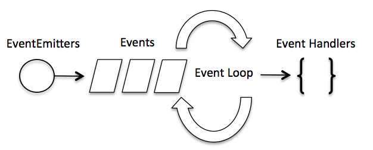

# Node.js 基础

> Node.js 基础；快速、阅览、回顾。全文速览约 7 分钟；打开音乐，让我们开始吧~

// music - Winter Story

### Hello World

``` js
var http = require('http');

http.createServer(function (request, response) {
    // 发送 HTTP 头部 
    // HTTP 状态值: 200 : OK
    // 内容类型: text/plain
    response.writeHead(200, {'Content-Type': 'text/plain'});

    // 发送响应数据 "Hello World"
    response.end('Hello World\n');
}).listen(8888);

// 终端打印如下信息
console.log('Server running at http://127.0.0.1:8888/');
```

### REPL：交互式解释器

下划线(`_`)变量： 你可以使用下划线(`_`)获取上一个表达式的运算结果：
``` bash
$ node
> var x = 10
undefined
> var y = 20
undefined
> x + y
30
> var sum = _
undefined
> console.log(sum)
30
undefined
>
```

### REPL 命令
- ctrl + c - 退出当前终端
- ctrl + c 按下两次 - 退出 Node REPL
- ctrl + d - 退出 Node REPL.
- 向上/向下 键 - 查看输入的历史命令
- tab 键 - 列出当前命令
- .help - 列出使用命令
- .break - 退出多行表达式
- .clear - 退出多行表达式
- .save filename - 保存当前的 Node REPL 会话到指定文件
- .load filename - 载入当前 Node REPL 会话的文件内容

### Node.js 回调函数
回调函数的一个直观作用和意义：

我们可以一边读取文件，一边执行其他命令，
在文件读取完成后，我们将文件内容作为回调函数的参数返回。
这样在执行代码时就没有阻塞或等待文件 I/O 操作。这就大大提高了 Node.js 的性能，可以处理大量的并发请求。

### Node.js 事件循环
- Node.js 是单进程单线程应用程序，但是因为 V8 引擎提供的异步执行回调接口，通过这些接口可以处理大量的并发，所以性能非常高。
- Node.js 几乎每一个 API 都是支持回调函数的。
- Node.js 基本上所有的事件机制都是用设计模式中观察者模式实现。
- Node.js 单线程类似进入一个 `while(true)` 的事件循环，直到没有事件观察者退出，每个异步事件都生成一个事件观察者，如果有事件发生就调用该回调函数。

### 事件驱动程序
Node.js 使用事件驱动模型，当 `web server` 接收到请求，就把它关闭然后进行处理，然后去服务下一个 `web` 请求。

当这个请求完成，它被放回处理队列，当到达队列开头，这个结果被返回给用户。

这个模型非常高效可扩展性非常强，因为 `webserver` 一直接受请求而不等待任何读写操作。（这也称之为非阻塞式IO或者事件驱动IO）

在事件驱动模型中，会生成一个主循环来监听事件，当检测到事件时触发回调函数。

整个事件驱动的流程就是这么实现的，非常简洁。有点类似于观察者模式，事件相当于一个主题(`Subject`)，而所有注册到这个事件上的处理函数相当于观察者(`Observer`)。

Node.js 有多个内置的事件，我们可以通过引入 `events` 模块，并通过实例化 `EventEmitter` 类来绑定和监听事件，如下实例：



在 Node 应用程序中，执行异步操作的函数将回调函数作为最后一个参数， 回调函数接收错误对象作为第一个参数。

### Node.js EventEmitter
Node.js 所有的异步 I/O 操作在完成时都会发送一个事件到事件队列。

Node.js 里面的许多对象都会分发事件：
- 一个 `net.Server` 对象会在每次有新连接时触发一个事件。
- 一个 `fs.readStream` 对象会在文件被打开的时候触发一个事件。 

所有这些产生事件的对象都是 `events.EventEmitter` 的实例。
``` js
//event.js 文件
var EventEmitter = require('events').EventEmitter; 
var event = new EventEmitter(); 
event.on('some_event', function() { 
    console.log('some_event 事件触发'); 
}); 
setTimeout(function() { 
    event.emit('some_event'); 
}, 1000); 

// 1秒后输出： some_event 事件触发
```
`events` 模块只提供了一个对象： `events.EventEmitter`。 `EventEmitter` 的核心就是事件触发与事件监听器功能的封装。
> `EventEmitter` 对象如果在实例化时发生错误，会触发 `error` 事件。当添加新的监听器时，`newListener` 事件会触发，当监听器被移除时，`removeListener` 事件被触发。

`EventEmitter` 的每个事件由一个事件名和 **若干个** 参数组成，事件名是一个字符串，通常表达一定的语义。对于每个事件，`EventEmitter` 支持 **若干个** 事件监听器。

当事件触发时，注册到这个事件的事件监听器被依次调用，事件参数作为回调函数参数传递。
``` js
var events = require('events'); 
var emitter = new events.EventEmitter(); 
emitter.on('someEvent', function(arg1, arg2) { 
    console.log('listener1', arg1, arg2); 
}); 
emitter.on('someEvent', function(arg1, arg2) { 
    console.log('listener2', arg1, arg2); 
}); 
emitter.emit('someEvent', 'arg1 参数', 'arg2 参数'); 

// 输出：
// listener1 arg1 参数 arg2 参数
// listener2 arg1 参数 arg2 参数
```

::: details EventEmitter 的属性/API
#### 方法：
`addListener(event, listener)`、`on(event, listener)`、`removeListener(event, listener)`、`removeAllListeners([event])`、`setMaxListeners(n)`、`listeners(event)`、`emit(event, [arg1], [arg2], [...])`。

#### 类方法：
``` js
listenerCount(emitter, event); // 返回指定事件的监听器数量。
events.EventEmitter.listenerCount(emitter, eventName) //已废弃，不推荐
events.emitter.listenerCount(eventName) //推荐
```

#### 事件：
`newListener`、`removeListener`。

::: tip
关于 `EventEmitter` 的 API 详细使用方法，请查阅文档。
:::
&nbsp;
::: danger 使用时注意
大多数时候我们不会直接使用 `EventEmitter`，而是在对象中继承它。包括 `fs`、`net`、`http` 在内的，只要是支持事件响应的核心模块都是 `EventEmitter` 的子类。

为什么要这样做呢？原因有两点：

首先，具有某个实体功能的对象实现事件符合语义， 事件的监听和发生应该是一个对象的方法。

其次 JavaScript 的对象机制是基于原型的，支持 部分多重继承，继承 EventEmitter 不会打乱对象原有的继承关系。
:::


### Node.js Buffer(缓冲区)
JavaScript 语言自身只有字符串数据类型，没有二进制数据类型。

但在处理像TCP流或文件流时，必须使用到二进制数据。因此在 Node.js中，定义了一个 Buffer 类，该类用来创建一个专门存放二进制数据的缓存区。

在 Node.js 中，Buffer 类是随 Node 内核一起发布的核心库。Buffer 库为 Node.js 带来了一种存储原始数据的方法，可以让 Node.js 处理二进制数据，每当需要在 Node.js 中处理I/O操作中移动的数据时，就有可能使用 Buffer 库。原始数据存储在 Buffer 类的实例中。一个 Buffer 类似于一个整数数组，但它对应于 V8 堆内存之外的一块原始内存。
::: tip
在 v6.0 之前创建Buffer对象直接使用 `new Buffer()` 构造函数来创建对象实例，但是Buffer对内存的权限操作相比很大，可以直接捕获一些敏感信息，所以在 v6.0 以后，官方文档里面建议使用 `Buffer.from()` 接口去创建 `Buffer` 对象。
:::
``` js
const buf = Buffer.from('runoob', 'ascii');
```

::: details 创建 Buffer 类
Buffer 提供了以下 API 来创建 Buffer 类：

- Buffer.alloc(size[, fill[, encoding]])： 返回一个指定大小的 Buffer 实例，如果没有设置 fill，则默认填满 0。
- Buffer.allocUnsafe(size)： 返回一个指定大小的 Buffer 实例，但是它不会被初始化，所以它可能包含敏感的数据。
- Buffer.allocUnsafeSlow(size)
- Buffer.from(array)： 返回一个被 array 的值初始化的新的 Buffer 实例（传入的 array 的元素只能是数字，不然就会自动被 0 覆盖）。
- Buffer.from(arrayBuffer[, byteOffset[, length]])： 返回一个新建的与给定的 ArrayBuffer 共享同一内存的 Buffer。
- Buffer.from(buffer)： 复制传入的 Buffer 实例的数据，并返回一个新的 Buffer 实例。
- Buffer.from(string[, encoding])： 返回一个被 string 的值初始化的新的 Buffer 实例。
:::

``` js
// 创建一个长度为 10、且用 0 填充的 Buffer。
const buf1 = Buffer.alloc(10);

// 创建一个长度为 10、且用 0x1 填充的 Buffer。 
const buf2 = Buffer.alloc(10, 1);

// 创建一个长度为 10、且未初始化的 Buffer。
// 这个方法比调用 Buffer.alloc() 更快，
// 但返回的 Buffer 实例可能包含旧数据，
// 因此需要使用 fill() 或 write() 重写。
const buf3 = Buffer.allocUnsafe(10);

// 创建一个包含 [0x1, 0x2, 0x3] 的 Buffer。
const buf4 = Buffer.from([1, 2, 3]);

// 创建一个包含 UTF-8 字节 [0x74, 0xc3, 0xa9, 0x73, 0x74] 的 Buffer。
const buf5 = Buffer.from('tést');

// 创建一个包含 Latin-1 字节 [0x74, 0xe9, 0x73, 0x74] 的 Buffer。
const buf6 = Buffer.from('tést', 'latin1');
```

#### 写入缓冲区
``` js
const buf = Buffer.from('runoob', 'ascii');
buf.write(string[, offset[, length]][, encoding]);
```
#### 从缓冲区读取数据
``` js
buf.toString([encoding[, start[, end]]])
```
#### 将 Buffer 转换为 JSON 对象
``` js
buf.toJSON()
```
::: tip JSON.parse 不常用的回调函数
``` js
// JSON.parse 回调函数的使用示例
const copy = JSON.parse(json, (key, value) => {
  return value && value.type === 'Buffer' ?
    Buffer.from(value.data) :
    value;
});
```
:::
#### 缓冲区合并
``` js
Buffer.concat(list[, totalLength]);  // 返回一个多个成员合并的新 Buffer 对象。
```
#### 缓冲区比较
``` js
buf.compare(otherBuffer);  // 返回一个数字，表示 buf 在 otherBuffer 之前，之后或相同。
```
#### 拷贝缓冲区
``` js
buf.copy(targetBuffer[, targetStart[, sourceStart[, sourceEnd]]])
```
#### 缓冲区裁剪
``` js
buf.slice([start[, end]])
```
#### 缓冲区长度
``` js
buf.length;  // 返回 Buffer 对象所占据的内存长度。
```

::: details Buffer更多方法/API参考手册
[可以参考的文档](https://www.runoob.com/nodejs/nodejs-buffer.html)
:::


### Node.js Stream(流)
`Stream` 是一个抽象接口，Node 中有很多对象实现了这个接口。例如，对 `http` 服务器发起请求的 `request` 对象就是一个 `Stream`，还有 `stdout`（标准输出）。

Node.js，Stream 有四种流类型：

- Readable - 可读操作。
- Writable - 可写操作。
- Duplex - 可读可写操作.
- Transform - 操作被写入数据，然后读出结果。

所有的 `Stream` 对象都是 `EventEmitter` 的实例。常用的事件有：
- data - 当有数据可读时触发。
- end - 没有更多的数据可读时触发。
- error - 在接收和写入过程中发生错误时触发。
- finish - 所有数据已被写入到底层系统时触发。

#### 从流中读取数据
``` js
// 首先需要创建input.txt文件，里面写点东西
var fs = require("fs");
var data = '';

// 创建可读流
var readerStream = fs.createReadStream('input.txt');
// 设置编码为 utf8。
readerStream.setEncoding('UTF8');

// 处理流事件 --> data, end, and error
readerStream.on('data', function(chunk) {
   data += chunk;
});
readerStream.on('end', function(){
   console.log(data);
});
readerStream.on('error', function(err){
   console.log(err.stack);
});

console.log("程序执行完毕");
```

#### 写入流
``` js
var fs = require("fs");
var data = '目之所及，XXXX，心之所想，XXXX';

// 创建一个可以写入的流，写入到文件 output.txt 中
var writerStream = fs.createWriteStream('output.txt');
// 使用 utf8 编码写入数据
writerStream.write(data, 'UTF8');
// 标记文件末尾
writerStream.end();

// 处理流事件 --> finish、error
writerStream.on('finish', function() {
    console.log("写入完成。");
});
writerStream.on('error', function(err){
   console.log(err.stack);
});

console.log("程序执行完毕");
```

#### 管道流

管道提供了一个输出流到输入流的机制。通常我们用于从一个流中获取数据并将数据传递到另外一个流中。

``` js
var fs = require("fs");

// 创建一个可读流
var readerStream = fs.createReadStream('a.txt');
// 创建一个可写流
var writerStream = fs.createWriteStream('text.txt');

// 管道读写操作
// 读取 input.txt 文件内容，并将内容写入到 output.txt 文件中
readerStream.pipe(writerStream);

console.log("程序执行完毕");
```

#### 链式流

链式是通过连接输出流到另外一个流并创建多个 **流操作链** 的机制。链式流一般用于管道操作。
> 说白了，就是链式操作。

::: details 用管道和链式来压缩和解压文件。
``` js
var fs = require("fs");
var zlib = require('zlib');

// 压缩 input.txt 文件为 input.txt.gz
fs.createReadStream('input.txt')
  .pipe(zlib.createGzip())
  .pipe(fs.createWriteStream('input.txt.gz'));
  
console.log("文件压缩完成。");
```

``` js
var fs = require("fs");
var zlib = require('zlib');

// 解压 input.txt.gz 文件为 input.txt
fs.createReadStream('input.txt.gz')
  .pipe(zlib.createGunzip())
  .pipe(fs.createWriteStream('input.txt'));
  
console.log("文件解压完成。");
```
:::


### Node.js模块系统
为了让 Node.js 的文件可以相互调用，Node.js 提供了一个简单的模块系统。

模块是 Node.js 应用程序的基本组成部分，文件和模块是一一对应的。换言之，一个 Node.js 文件就是一个模块，这个文件可能是 JavaScript 代码、JSON 或者编译过的 C/C++ 扩展。

> 模块系统在平时工作学习中也用的很多，这里不多赘述了，有需要可以看文档。

由于 Node.js 中存在 4 类模块（原生模块和3种文件模块），尽管 require 方法极其简单，但是内部的加载却是十分复杂的，其加载优先级也各自不同。如下图所示：


#### 从文件模块缓存中加载
尽管原生模块与文件模块的优先级不同，但是都会优先从文件模块的缓存中加载已经存在的模块。

#### 从原生模块加载
原生模块的优先级仅次于文件模块缓存的优先级。require 方法在解析文件名之后，优先检查模块是否在原生模块列表中。以 http 模块为例，尽管在目录下存在 http、http.js、http.node、http.json 文件，`require("http")` 都不会从这些文件中加载，而是从原生模块中加载。

原生模块也有一个缓存区，同样也是优先从缓存区加载。如果缓存区没有被加载过，则调用原生模块的加载方式进行加载和执行。

#### 从文件加载
当文件模块缓存中不存在，而且不是原生模块的时候，Node.js 会解析 `require` 方法传入的参数，并从文件系统中加载实际的文件，加载过程中的包装和编译细节在前一节中已经介绍过，这里我们将详细描述查找文件模块的过程，其中，也有一些细节值得知晓。

`require` 方法接受以下几种参数的传递：
- http、fs、path等，原生模块。
- ./mod 或 ../mod，相对路径的文件模块。
- /pathtomodule/mod，绝对路径的文件模块。
- mod，非原生模块的文件模块。

### Node.js 路由
所有数据都会包含在 `request` 对象中，但是为了解析这些数据，我们需要额外的 Node.JS 模块，它们分别是 `url` 和 `querystring` 模块。（两者选其一？这两个模块有什么异同点吗？）

> 路由只是对请求 `request` 对象做解析，然后，对于不同的请求 `pathname` 做不同的相应。

::: details 有网友用 event 来做路由的控制，是一个思路，可以帮助我们理解路由，但实际肯定不能这么用。
``` js
var http = require("http");
var url = require('url');
const { exit } = require("process");
var events = require('events');

// 创建 eventEmitter 对象 
var eventEmitter = new events.EventEmitter();

// route 根路径 
eventEmitter.on('/', function(method, response){
    response.writeHead(200, {'Content-Type': 'text/plain'});
    response.end('Hello World\n');
});
// route 404 
eventEmitter.on('404', function(method, url, response){
    response.writeHead(404, {'Content-Type': 'text/plain'});
    response.end('404 Not Found\n');
});

// 启动服务 
http.createServer(function (request, response) {
    console.log(request.url);
    // 分发 
    if (eventEmitter.listenerCount(request.url) > 0){
        eventEmitter.emit(request.url, request.method, response);
    }
    else {
        eventEmitter.emit('404', request.method, request.url, response);
    }
    
}).listen(8888);

console.log('Server running at http://127.0.0.1:8888/');
```
:::


### Node.js 全局对象
在浏览器 JavaScript 中，通常 `window` 是全局对象， 而 Node.js 中的全局对象是 `global`，所有全局变量（除了 `global` 本身以外）都是 `global` 对象的属性。

在 Node.js 我们可以直接访问到 `global` 的属性，而不需要在应用中包含它。


#### 全局对象与全局变量

`global` 最根本的作用是作为全局变量的宿主。按照 ECMAScript 的定义，满足以下条 件的变量是全局变量：
- 在最外层定义的变量；
- 全局对象的属性；
- 隐式定义的变量（未定义直接赋值的变量）。

当你定义一个全局变量时，这个变量同时也会成为全局对象的属性，反之亦然。需要注 意的是，在 Node.js 中你不可能在最外层定义变量，因为所有用户代码都是属于当前模块的， 而模块本身不是最外层上下文。

> 是不是说，使用 `global.abc = 'xxx'` 的方式才能定义全局变量？

::: danger
注意： 最好不要使用 var 定义变量以避免引入全局变量，因为全局变量会污染命名空间，提高代码的耦合风险。
:::

#### `__filename`
`__filename` 表示当前正在执行的脚本的文件名。它将输出文件所在位置的绝对路径，且和命令行参数所指定的文件名不一定相同。 如果在模块中，返回的值是模块文件的路径。

``` js
// 输出全局变量 __filename 的值
console.log( __filename );

// 打印： /nodejs/main.js
```

#### `__dirname`
`__dirname` 表示当前执行脚本所在的目录。

#### 关于 `setTimeout(cb, ms)`、`clearTimeout(t)`、`setInterval(cb, ms)`、`clearInterval(t)`、`console` 不做过多的赘述

#### process
`process` 是一个全局变量，即 `global` 对象的属性。

它用于描述当前 Node.js 进程状态的对象，提供了一个与操作系统的简单接口。通常在你写本地命令行程序的时候，少不了要和它打交道。下面将会介绍 `process` 对象的一些最常用的成员方法。
``` js
process.on('exit', function(code) {
  // 以下代码永远不会执行
  setTimeout(function() {
    console.log("该代码不会执行");
  }, 0);
  
  console.log('退出码为:', code);
});
console.log("程序执行结束");

// 程序执行结束
// 退出码为: 0
```

> 更多 `process` 的方法/API，以及退出状态码的说明，请查阅文档。


### Node.js 常用工具 - util
`util` 是一个 Node.js 核心模块，提供常用函数的集合，用于弥补核心 JavaScript 的功能 过于精简的不足。
``` js
const util = require('util');
```
#### util.callbackify
`util.callbackify(original)` 将 async 异步函数（或者一个返回值为 Promise 的函数）转换成遵循异常优先的回调风格的函数，例如将 (err, value) => ... 回调作为最后一个参数。 在回调函数中，第一个参数为拒绝的原因（如果 Promise 解决，则为 null），第二个参数则是解决的值。
``` js
const util = require('util');

async function fn() {
  return 'hello world';
}
const callbackFunction = util.callbackify(fn);

callbackFunction((err, ret) => {
  if (err) throw err;
  console.log(ret);
});
```

#### util.inherits
`util.inherits(constructor, superConstructor)` 是一个实现对象间原型继承的函数。

JavaScript 的面向对象特性是基于原型的，与常见的基于类的不同。JavaScript 没有提供对象继承的语言级别特性，而是通过原型复制来实现的。
``` js
var util = require('util'); 
function Base() { 
    this.name = 'base'; 
    this.base = 1991; 
    this.sayHello = function() { 
    console.log('Hello ' + this.name); 
    }; 
} 
Base.prototype.showName = function() { 
    console.log(this.name);
}; 
function Sub() { 
    this.name = 'sub'; 
} 
util.inherits(Sub, Base); 
var objBase = new Base(); 
objBase.showName();   // base
objBase.sayHello();   // Hello base
console.log(objBase);   // { name: 'base', base: 1991, sayHello: [Function] }
var objSub = new Sub(); 
objSub.showName();   // sub
//objSub.sayHello(); 
console.log(objSub);  // { name: 'sub' }
```
::: danger 注意
Sub 仅仅继承了 Base 在原型中定义的函数，而构造函数内部创造的 base 属性和 sayHello 函数都没有被 Sub 继承。

同时，**在原型中定义的属性不会被 console.log 作为对象的属性输出**。
:::

#### util.inspect
`util.inspect(object,[showHidden],[depth],[colors])` 是一个将任意对象转换 为字符串的方法，通常用于调试和错误输出。它至少接受一个参数 object，即要转换的对象。

特别要指出的是，`util.inspect` 并不会简单地直接把对象转换为字符串，即使该对象定义了 `toString` 方法也不会调用。

> 更多 `util` 详情可以访问 [http://nodejs.org/api/util.html](http://nodejs.org/api/util.html) 了解详细内容。

### Node.js 文件系统
Node.js 提供一组类似 UNIX（POSIX）标准的文件操作API。
``` js
var fs = require("fs")
```

#### 异步和同步
Node.js 文件系统（ `fs` 模块）模块中的方法均有异步和同步版本，例如读取文件内容的函数有异步的 `fs.readFile()` 和同步的 `fs.readFileSync()`。

异步的方法函数最后一个参数为回调函数，回调函数的第一个参数包含了错误信息(error)。

建议大家使用异步方法，比起同步，异步方法性能更高，速度更快，而且没有阻塞。

#### 打开文件
``` js
// 异步的
fs.open(path, flags[, mode], callback)
```

#### 获取文件信息
``` js
// 通过异步模式获取文件信息的语法
fs.stat(path, (err, stats) => {})
```
`stats` 是 `fs.Stats` 对象。可以通过 `stats` 类中的提供方法判断文件的相关属性。
`stats` 类中的方法有：
- `stats.isFile()` 如果是文件返回 `true`，否则返回 `false`。
- `stats.isDirectory()` 如果是目录返回 `true`，否则返回 `false`。
- `stats.isBlockDevice()` 如果是块设备返回 `true`，否则返回 `false`。
- `stats.isCharacterDevice()` 如果是字符设备返回 `true`，否则返回 `false`。
- `stats.isSymbolicLink()`  如果是软链接返回 `true`，否则返回 `false`。
- `stats.isFIFO()`  如果是 FIFO，返回 `true`，否则返回 `false`。 FIFO 是 UNIX 中的一种特殊类型的命令管道。
- `stats.isSocket()`  如果是 Socket 返回 true，否则返回 false。

#### 写入文件
``` js
// 异步模式下写入文件的语法
// data - 要写入文件的数据，可以是 String(字符串) 或 Buffer(缓冲) 对象。
fs.writeFile(file, data[, options], callback)
```
`writeFile` 直接打开文件默认是 `w` 模式，所以如果文件存在，该方法写入的内容会覆盖旧的文件内容。

#### 读取文件
``` js
// 异步模式下读取文件的语法
// fd - 通过 fs.open() 方法返回的文件描述符。
fs.read(fd, buffer, offset, length, position, callback)
```
``` js
var fs = require("fs");
var buf = new Buffer.alloc(1024);

fs.open('input.txt', 'r+', function(err, fd) {
   if (err) {
       return console.error(err);
   }
   console.log("文件打开成功！");
   console.log("准备读取文件：");
   fs.read(fd, buf, 0, buf.length, 0, function(err, bytes){
      if (err){
         console.log(err);
      }
      console.log(bytes + "  字节被读取");
      
      // 仅输出读取的字节
      if(bytes > 0){
         console.log(buf.slice(0, bytes).toString());
      }
   });
});
```

> `fs.read()`、`fs.readFile()` 有什么区别？

`fs.readFile(filename[, options], callback)` - 异步读取文件内容。

`fs.read(fd, buffer, offset, length, position, callback)` - 通过文件描述符 `fd` 读取文件内容。

#### 关闭文件
``` js
// 异步模式下关闭文件的语法
fs.close(fd, callback)
```

::: tip 文件模块方法参考手册
更多 `fs` 模块方法请参考文档：

[https://www.runoob.com/nodejs/nodejs-fs.html](https://www.runoob.com/nodejs/nodejs-fs.html)；

[https://nodejs.org/api/fs.html](https://nodejs.org/api/fs.html)
:::


### Node.js GET/POST请求
#### GET 获取 URL 的参数
我们可以使用 `url.parse` 方法来解析 `URL` 中的参数。
``` js
var url = require('url');
var params = url.parse(req.url, true).query;
// params.name，params.id
```

#### 获取 POST 请求内容
POST 请求的内容全部的都在请求体中，`http.ServerRequest` 并没有一个属性内容为请求体，原因是等待请求体传输可能是一件耗时的工作。

比如上传文件，而很多时候我们可能并不需要理会请求体的内容，恶意的 POST 请求会大大消耗服务器的资源，所以 `node.js` 默认是不会解析请求体的，当你需要的时候，需要手动来做。
``` js
http.createServer(function (req, res) {
  var body = "";
  req.on('data', function (chunk) {
    body += chunk;
  });
  req.on('end', function () {
    // 解析参数
    body = querystring.parse(body);
    ...
    res.end();
  })
})
```

### Node.js 工具模块
- OS 模块 - 提供基本的系统操作函数。
- Path 模块 - 提供了处理和转换文件路径的工具。
- Net 模块 - 用于底层的网络通信。提供了服务端和客户端的的操作。
- DNS 模块 - 用于解析域名。
- Domain 模块 - 简化异步代码的异常处理，可以捕捉处理 `try catch` 无法捕捉的。

### Node.js Web 模块
#### 使用 Node 创建 Web 服务器
``` js
let http = require('http');
// 创建服务器
http.createServer( function (request, response) {  
  ...
}).listen(8080);
```

#### 使用 Node 创建 Web 客户端
Node 创建 Web 客户端需要引入 http 模块。
``` js
var http = require('http');
// 用于请求的选项
var options = {
   host: 'localhost',
   port: '8080',
   path: '/index.html'  
};
// 向服务端发送请求
var req = http.request(options, callback);
req.end();
```

### Express
Express 应用使用回调函数的参数： request 和 response 对象来处理请求和响应的数据。
``` js
app.get('/', function (req, res) {
   // --
})
```
**`Request` 对象**： `request` 对象表示 HTTP 请求，包含了请求查询字符串，参数，内容，HTTP 头部等属性。常见属性有： `req.app`、`req.baseUrl`、`req.body/req.cookies`、`req.fresh/req.state`、`req.path`、`req.params` 等等...

**`Response` 对象**： `response` 对象表示 HTTP 响应，即在接收到请求时向客户端发送的 HTTP 响应数据。常见属性有： `res.app`、`res.json()`、`res.jsonp()`、`res.send()`、`res.sendFile()`、`res.set()` 等等...
::: tip
更多 `Request` 对象，`Response` 对象的属性方法请查阅文档。
:::

#### 静态文件
你可以使用 `express.static` 中间件来设置静态文件路径。
``` js
app.use('/public', express.static('public'));
```

#### GET、POST
``` js
var express = require('express');
var app = express();
// get
app.get('/process_get', function (req, res) {
   // 输出 JSON 格式
   var response = {
       "first_name":req.query.first_name,
       "last_name":req.query.last_name
   };
   console.log(response);
   res.end(JSON.stringify(response));
})
// post
app.post('/process_post', function (req, res) {
   // 输出 JSON 格式
   var response = {
       "first_name":req.query.first_name,
       "last_name":req.query.last_name
   };
   console.log(response);
   res.end(JSON.stringify(response));
})
```

#### 文件上传
以下我们创建一个用于上传文件的表单，使用 POST 方法，表单 `enctype` 属性设置为 `multipart/form-data` 。

#### Cookie 管理
我们可以使用中间件向 Node.js 服务器发送 `cookie` 信息。
``` js
var express      = require('express');
var cookieParser = require('cookie-parser');
var util = require('util');
 
var app = express()
app.use(cookieParser())
 
app.get('/', function(req, res) {
    console.log("Cookies: " + util.inspect(req.cookies));
})
app.listen(8081);
```
::: tip
`Express` 参考文档： [https://www.runoob.com/w3cnote/express-4-x-api.html](https://www.runoob.com/w3cnote/express-4-x-api.html)
:::

### Node.js RESTful API
REST 即表述性状态传递（英文：Representational State Transfer，简称REST）。 表述性状态转移是一组架构约束条件和原则。满足这些约束条件和原则的应用程序或设计就是RESTful。需要注意的是，REST是设计风格而不是标准。REST通常基于使用HTTP，URI，和XML（标准通用标记语言下的一个子集）以及HTML（标准通用标记语言下的一个应用）这些现有的广泛流行的协议和标准。REST 通常使用 JSON 数据格式。

REST 基本架构的四个方法： `GET - 用于获取数据`; `PUT - 用于更新或添加数据`； `DELETE - 用于删除数据`； `POST - 用于添加数据`。

> 更多介绍，可以查看：[RESTful 架构详解](https://www.runoob.com/w3cnote/restful-architecture.html)


### Node.js 多进程
我们都知道 Node.js 是以单线程的模式运行的，但它使用的是事件驱动来处理并发，这样有助于我们在多核 cpu 的系统上创建多个子进程，从而提高性能。

每个子进程总是带有三个流对象： `child.stdin`, `child.stdout` 和 `child.stderr`。他们可能会共享父进程的 `stdio` 流，或者也可以是独立的被导流的流对象。

Node 提供了 `child_process` 模块来创建子进程，方法有：
- exec - child_process.exec 使用子进程执行命令，缓存子进程的输出，并将子进程的输出以回调函数参数的形式返回。
- spawn - child_process.spawn 使用指定的命令行参数创建新进程。
- fork - child_process.fork 是 `spawn()` 的特殊形式，用于在子进程中运行的模块，如 `fork('./son.js')` 相当于 `spawn('node', ['./son.js'])` 。与 `spawn` 方法不同的是，`fork` 会在父进程与子进程之间，建立一个通信管道，用于进程之间的通信。

> 想详细了解 Node.js 多进程，请查阅文档。

### Node.js JXcore 打包（多线程）
Node.js 是一个开放源代码、跨平台的、用于服务器端和网络应用的运行环境。

JXcore 是一个支持多线程的 Node.js 发行版本，基本不需要对你现有的代码做任何改动就可以直接线程安全地以多线程运行。

接下来我们使用 `jx` 命令打包以上项目，并指定 `index.js` 为 Node.js 项目的主文件：
``` bash
$ jx package index.js index
```
以上命令执行成功，会生成以下两个文件：

`index.jxp` 这是一个中间件文件，包含了需要编译的完整项目信息。

`index.jx` 这是一个完整包信息的二进制文件，可运行在客户端上。

使用 JXcore 编译后，我们可以使用以下命令来执行生成的 `jx` 二进制文件：
``` bash
$ jx index.jx command_line_arguments
```
> 更多 JXcore 功能特性你可以参考官网： [https://github.com/jxcore/jxcore](https://github.com/jxcore/jxcore)。

### Node.js 连接 MySQL
``` js
var mysql      = require('mysql');
var connection = mysql.createConnection({
  host     : 'localhost',
  user     : 'root',
  password : '123456',
  database : 'test'
});
connection.connect();
```
> 更多数据库连接参数，请查阅文档： [https://github.com/mysqljs/mysql](https://github.com/mysqljs/mysql)

### Node.js 连接 MongoDB
MongoDB是一种文档导向数据库管理系统，由C++撰写而成。
``` bash
// 安装驱动
npm install mongodb
```

#### 创建数据库
要在 MongoDB 中创建一个数据库，首先我们需要创建一个 MongoClient 对象，然后配置好指定的 URL 和 端口号。 如果数据库不存在，MongoDB 将创建数据库并建立连接。
``` js
// 创建连接
var MongoClient = require('mongodb').MongoClient;
var url = "mongodb://localhost:27017/runoob";
 
MongoClient.connect(url, function(err, db) {
  if (err) throw err;
  console.log("数据库已创建!");
  db.close();
});
```

#### 创建集合
我们可以使用 `createCollection()` 方法来创建集合。
``` js
// 创建集合
var MongoClient = require('mongodb').MongoClient;
var url = 'mongodb://localhost:27017/runoob';
MongoClient.connect(url, function (err, db) {
    if (err) throw err;
    console.log('数据库已创建');
    var dbase = db.db("runoob");
    dbase.createCollection('site', function (err, res) {
        if (err) throw err;
        console.log("创建集合!");
        db.close();
    });
});
```

#### 数据库操作( CURD )
与 MySQL 不同的是 MongoDB 会自动创建数据库和集合，所以使用前我们不需要手动去创建。
> 言外之意，前面的创建数据库和创建集合，是意义不大的做法？

``` js
var MongoClient = require('mongodb').MongoClient;
var url = "mongodb://localhost:27017/";
 
MongoClient.connect(url, function(err, db) {
    if (err) throw err;
    var dbo = db.db("runoob");
    var myobj = { name: "菜鸟教程", url: "www.runoob" };
    dbo.collection("site").insertOne(myobj, function(err, res) {
        if (err) throw err;
        console.log("文档插入成功");
        db.close();
    });
});
```

- 插入单条数据： `insertOne()`
- 插入多条数据可以使用： `insertMany()`
- 可以使用 `find()` 来查找数据, `find()` 可以返回匹配条件的所有数据。 如果未指定条件，`find()` 返回集合中的所有数据。
- 更新一条数据： `updateOne()`
- 更新多条数据： `updateMany()`
- 删除一条数据: `deleteOne()`
- 删除多条数据： `deleteMany()`
- 排序： `sort()`
- 查询分页： `limit()`
``` js
dbo.collection("site").find().limit(2).toArray(function(err, result) {
  if (err) throw err;
  console.log(result);
  db.close();
});
```
- 如果要指定跳过的条数，可以使用 `skip()` 方法。
``` js
dbo.collection("site").find().skip(2).limit(2).toArray(function(err, result) {
  if (err) throw err;
  console.log(result);
  db.close();
});
```
- 连接操作。mongoDB 不是一个关系型数据库，但我们可以使用 `$lookup` 来实现左连接。
``` js
// $lookup 实现左连接
var MongoClient = require('mongodb').MongoClient;
var url = "mongodb://127.0.0.1:27017/";
 
MongoClient.connect(url, function(err, db) {
  if (err) throw err;
  var dbo = db.db("runoob");
  dbo.collection('orders').aggregate([
    { $lookup:
       {
         from: 'products',            // 右集合
         localField: 'product_id',    // 左集合 join 字段
         foreignField: '_id',         // 右集合 join 字段
         as: 'orderdetails'           // 新生成字段（类型array）
       }
     }
    ]).toArray(function(err, res) {
    if (err) throw err;
    console.log(JSON.stringify(res));
    db.close();
  });
});
```
- 删除集合。我们可以使用 `drop()` 方法来删除集合：

#### 使用 Promise
``` js
const MongoClient = require("mongodb").MongoClient;
const url = "mongodb://localhost/";
MongoClient.connect(url).then((conn) => {
    console.log("数据库已连接");
    const test = conn.db("testdb").collection("test");
    // 增加
    test.insertOne({ "site": "runoob.com" }).then((res) => {
        // 查询
        return test.find().toArray().then((arr) => {
            console.log(arr);
        });
    }).then(() => {
        // 更改
        return test.updateMany({ "site": "runoob.com" },
            { $set: { "site": "example.com" } });
    }).then((res) => {
        // 查询
        return test.find().toArray().then((arr) => {
            console.log(arr);
        });
    }).then(() => {
        // 删除
        return test.deleteMany({ "site": "example.com" });
    }).then((res) => {
        // 查询
        return test.find().toArray().then((arr) => {
            console.log(arr);
        });
    }).catch((err) => {
        console.log("数据操作失败" + err.message);
    }).finally(() => {
        conn.close();
    });
}).catch((err) => {
    console.log("数据库连接失败");
});
```

#### 使用 async/await
``` js
const MongoClient = require("mongodb").MongoClient;
const url = "mongodb://localhost/";
 
async function dataOperate() {
    var conn = null;
    try {
        conn = await MongoClient.connect(url);
        console.log("数据库已连接");
        const test = conn.db("testdb").collection("test");
        // 增加
        await test.insertOne({ "site": "runoob.com" });
        // 查询
        var arr = await test.find().toArray();
        console.log(arr);
        // 更改
        await test.updateMany({ "site": "runoob.com" },
            { $set: { "site": "example.com" } });
        // 查询
        arr = await test.find().toArray();
        console.log(arr);
        // 删除
        await test.deleteMany({ "site": "example.com" });
        // 查询
        arr = await test.find().toArray();
        console.log(arr);
    } catch (err) {
        console.log("错误：" + err.message);
    } finally {
        if (conn != null) conn.close();
    }
}
 
dataOperate();
```

::: details 笔记汇总来源
[https://www.runoob.com/nodejs](https://www.runoob.com/nodejs)
:::


