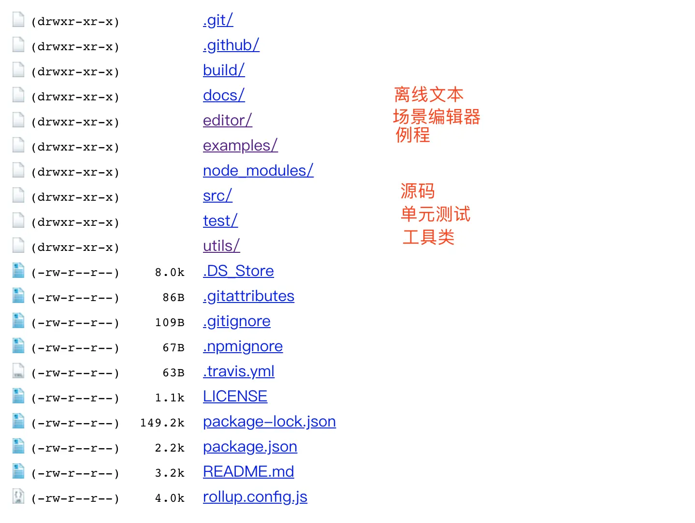
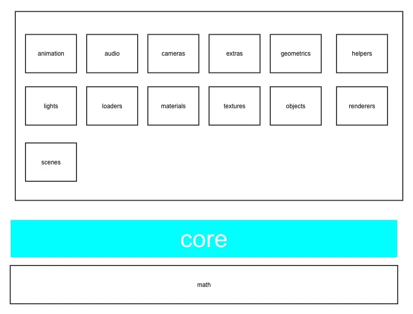
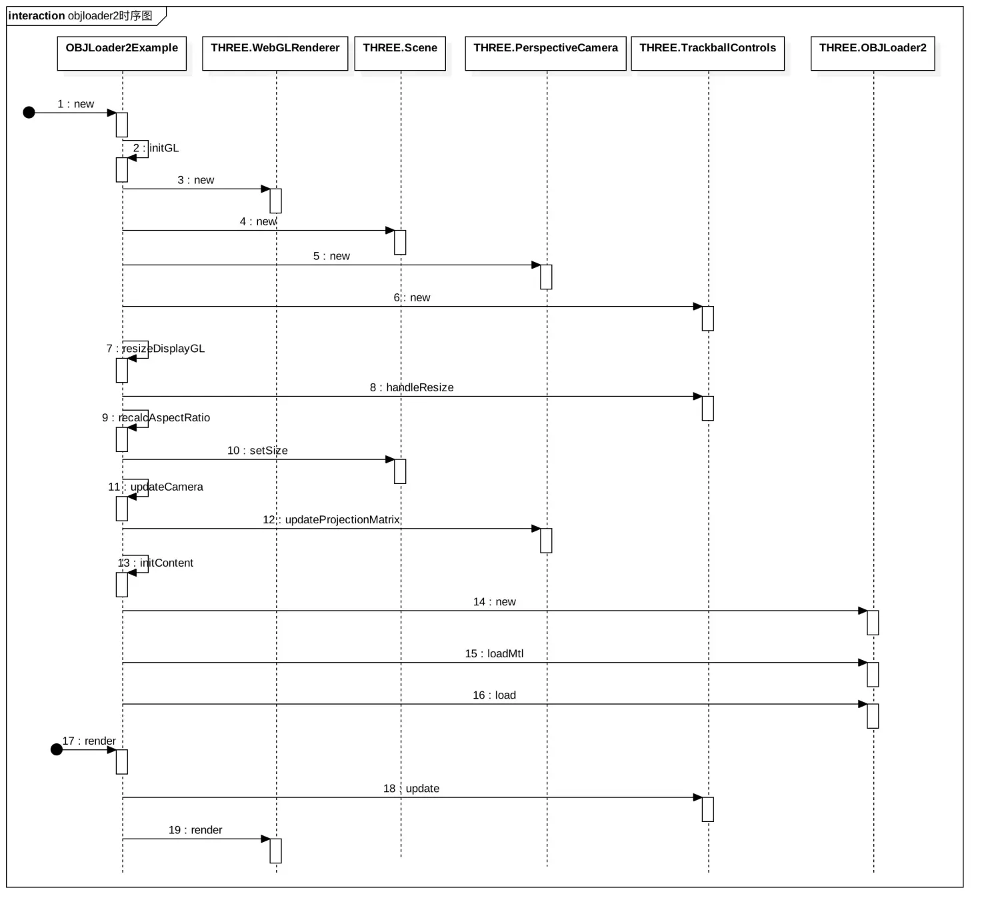

# THREE 教程 【本文面向小白】

1、提前下载好一个你当前想使用的 [three.js 版本](https://github.com/mrdoob/three.js/releases) 到你的电脑本地来。

解压后，用本地服务器的方式来打开它，是最合适的。目录结构，说明如下：




three.js 中模块内容介绍如下：




|模块名|说明|
|:---:|:---:|
|animation|动画模块|
|audio|音频|
|cameras|3D 相机|
|extras|其他|
|geometrics|基础几何对象|
|helpers|帮助类|
|lights|光源|
|loaders|3D 模型加载器|
|materials|材质|
|textures|纹理|
|objects|用于加入到场景中的对象|
|renderers|WebGL渲染，glsl 定义|
|scenes|场景|
|core|属性，几何，3D对象，光线跟踪等|
|math|向量，矩阵等|


2、加载一个 obj 模型

```html
<div id="glFullscreen">
  <!-- 渲染 3D 场景的 canvas -->
  <canvas id="example"></canvas>
</div>
<!-- dat gui 的 div 占位-->
<div id="dat">
```


```html
<!-- 导入 threejs 核心库 -->
<script src="../build/three.js"></script>
<!-- 导入 camera controller，用于响应鼠标/手指的拖动，放大，旋转等操作 -->
<script src="js/controls/TrackballControls.js"></script>
<!-- 材质加载 -->
<script src="js/loaders/MTLLoader.js"></script>
<!-- 三方库 dat gui 库的导入-->
<script src="js/libs/dat.gui.min.js"></script>
<!-- 三方库 stats 的导入-->
<script type="text/javascript" src="js/libs/stats.min.js"></script>
<!-- 构建 mesh,texture 等支持 -->
<script src="js/loaders/LoaderSupport.js"></script>
<!-- 加载 obj 的主要实现 -->
<script src="js/loaders/OBJLoader2.js"></script>
```

模型加载时序图如下：



