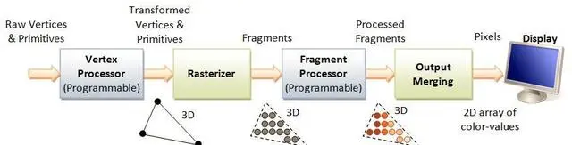

# THREE 知识体系梳理

## 如何系统的了解和学习 Three.js
【准备资料】提前下载好一个你当前想使用的 [three.js 版本](https://github.com/mrdoob/three.js/releases) 到你的电脑本地来。

解压后，用本地服务器的方式来打开它，是最合适的。目录结构，说明如下：


three.js 中模块内容介绍如下：


|模块名|说明|
|:---:|:---:|
|animation|动画模块|
|audio|音频|
|cameras|3D 相机|
|extras|其他|
|geometrics|基础几何对象|
|helpers|帮助类|
|lights|光源|
|loaders|3D 模型加载器|
|materials|材质|
|textures|纹理|
|objects|用于加入到场景中的对象|
|renderers|WebGL渲染，glsl 定义|
|scenes|场景|
|core|属性，几何，3D对象，光线跟踪等|
|math|向量，矩阵等|


## 加载一个 obj 模型（剖析）

```html
<div id="glFullscreen">
  <!-- 渲染 3D 场景的 canvas -->
  <canvas id="example"></canvas>
</div>
<!-- dat gui 的 div 占位-->
<div id="dat">
```


```html
<!-- 导入 threejs 核心库 -->
<script src="../build/three.js"></script>
<!-- 导入 camera controller，用于响应鼠标/手指的拖动，放大，旋转等操作 -->
<script src="js/controls/TrackballControls.js"></script>
<!-- 材质加载 -->
<script src="js/loaders/MTLLoader.js"></script>
<!-- 三方库 dat gui 库的导入-->
<script src="js/libs/dat.gui.min.js"></script>
<!-- 三方库 stats 的导入-->
<script type="text/javascript" src="js/libs/stats.min.js"></script>
<!-- 构建 mesh,texture 等支持 -->
<script src="js/loaders/LoaderSupport.js"></script>
<!-- 加载 obj 的主要实现 -->
<script src="js/loaders/OBJLoader2.js"></script>
```

模型加载时序图如下：


### 1、定义OBJLoader2Example
这里先定义了函数 OBJLoader2Example()，然后再指定OBJLoader2Example的 prototype 的 constructor 为 OBJLoader2Example() 本身，这也就定义了一个 “类” OBJLoader2Example，我们可以使用这个类来声明新的对象。
```js
var OBJLoader2Example = function ( elementToBindTo ) {......};
OBJLoader2Example.prototype = {
  constructor: OBJLoader2Example,
  initGL: function () {......},
  initContent: function () {......},
  _reportProgress: function () {......},
  resizeDisplayGL: function () {......},
  recalcAspectRatio: function () {......},
  resetCamera: function () {......},
  updateCamera: function () {......},
  render: function () {......}
}
```

### 2、OBJLoader2Example 的构造方法
```js
var OBJLoader2Example = function ( elementToBindTo ) {
  // 渲染器，后面它会绑定 canvas 节点
  this.renderer = null;
  // canvas 节点
  this.canvas = elementToBindTo;
  // 视图比例
  this.aspectRatio = 1;
  this.recalcAspectRatio();
  // 3D 场景
  this.scene = null;
  // 默认相机参数
  this.cameraDefaults = {
    // 相机的位置，就是相机该摆在哪里
    posCamera: new THREE.Vector3( 0.0, 175.0, 500.0 ),
    // 相机的目标
    posCameraTarget: new THREE.Vector3( 0, 0, 0 ),
    // 近截面
    near: 0.1,
    // 远截面
    far: 10000,
    // 视景体夹角
    fov: 45
  };
  // 3D 相机
  this.camera = null;
  // 3D 相机的目标，就是相机该盯着哪里看
  this.cameraTarget = this.cameraDefaults.posCameraTarget;
  // 3D 相机控制器，当然也可理解就是一个手势控制器
  this.controls = null;
};
```
构造方法主要是属性的定义，代码中添加了注释简要介绍了各个属性的作用，总体来说就是3D场景、3D 相机，相机控制器以及最重要的渲染器，渲染器绑定了 canvas，3D 场景及其所有的物件都会通过这个渲染器渲染到 canvas 中去。

### 3、initGL()
```js
initGL: function() {
  // 创建渲染器
  this.renderer = new THREE.WebGLRenderer({
    // 绑定 canvas
    canvas: this.canvas,
    // 抗锯齿
    antialias: true,
    autoClear: true
  });
  this.renderer.setClearColor( 0x050505 );

  this.scene = new THREE.Scene();
  // 初始化透视投影相机，这是一个三角的景锥体，物体在其里面呈现的效果是近大远小
  this.camera = new THREE.PerspectiveCamera( this.cameraDefaults.fov, this.aspectRatio, this.cameraDefaults.near, this.cameraDefaults.far );
  this.resetCamera();
  // 初始化 controller
  this.controls = new THREE.TrackballControls( this.camera, this.renderer.domElement );

  // 添加环境光与平行光
  var ambientLight = new THREE.AmbientLight( 0x404040 );
  var directionalLight1 = new THREE.DirectionalLight( 0xC0C090 );
  var directionalLight2 = new THREE.DirectionalLight( 0xC0C090 );

  directionalLight1.position.set( -100, -50, 100 );
  directionalLight2.position.set( 100, 50, -100 );

  this.scene.add( directionalLight1 );
  this.scene.add( directionalLight2 );
  this.scene.add( ambientLight );
  // 添加调试网格
  var helper = new THREE.GridHelper( 1200, 60, 0xFF4444, 0x404040 );
  this.scene.add( helper );
},
```
initGL() 方法中初始化了各个属性，同时还添加了环境光与平行光源，以用于调试的网格帮助模型。在 3D 场景中很多物体都可看成是一个模型，如这里的光源。而 camera 在有一些渲染框架中也会被认为是一个模型，但其只是一个用于参与 3D 渲染时的参数。camera 最主要的作用是决定了投影矩阵，在投影矩阵内的物体可见，而不在里面则不可见。

### 4、initContent()
```js
initContent: function () {
  var modelName = 'female02';
  this._reportProgress( { detail: { text: 'Loading: ' + modelName } } );

  var scope = this;
  // 声明 ObjLoader2 对象
  var objLoader = new THREE.OBJLoader2();
  // 模型加载完成的 call back，加载完成后便会把模型加载到场景中
  var callbackOnLoad = function ( event ) {
    scope.scene.add( event.detail.loaderRootNode );
    console.log( 'Loading complete: ' + event.detail.modelName );
    scope._reportProgress( { detail: { text: '' } } );
  };
  // 材质加载完成的回调，材质加载完成后便会进一步加 obj
  var onLoadMtl = function ( materials ) {
    objLoader.setModelName( modelName );
    objLoader.setMaterials( materials );
    objLoader.setLogging( true, true );
    // 开始加载 obj
    objLoader.load( 'models/obj/female02/female02.obj', callbackOnLoad, null, null, null, false );
  };
  // 开始加载材质
  objLoader.loadMtl( 'models/obj/female02/female02.mtl', null, onLoadMtl );
},
```
内容加载这一块是重点，其主要是通过 ObjLoader2 先是加载了材质然后加载模型。关于 obj 和 mtl 文件， 请打开 `female02.obj` 和 `female02.mtl`，可以发现它就是一个文本文件，通过注释来感受一下其文件格式如何。

**female02.obj部分数据**
```
# Blender v2.54 (sub 0) OBJ File: ''
# www.blender.org
# obj对应的材质文件
mtllib female02.mtl
# o 对象名称(Object name)
o mesh1.002_mesh1-geometry
# 顶点
v 15.257854 104.640892 8.680023
v 14.044281 104.444138 11.718708
v 15.763498 98.955704 11.529579
......
# 纹理坐标
vt 0.389887 0.679023
vt 0.361250 0.679023
vt 0.361250 0.643346
......
# 顶点法线
vn 0.945372 0.300211 0.126926
vn 0.794275 0.212683 0.569079
vn 0.792047 0.184729 0.581805
......
# group
g mesh1.002_mesh1-geometry__03_-_Default1noCulli__03_-_Default1noCulli
# 当前图元所用材质
usemtl _03_-_Default1noCulli__03_-_Default1noCulli
s off
# v1/vt1/vn1 v2/vt2/vn2 v3/vt3/vn3(索引起始于1)    
f 1/1/1 2/2/2 3/3/3
f 1/1/1 4/4/4 2/2/2
f 4/4/4 1/1/1 5/5/5
......
```

**female02.mtl部分数据**
```
......
# 定义一个名为 _03_-_Default1noCulli__03_-_Default1noCulli 的材质
newmtl _03_-_Default1noCulli__03_-_Default1noCulli
# 反射指数 定义了反射高光度。该值越高则高光越密集，一般取值范围在0~1000。
Ns 154.901961
# 材质的环境光（ambient color）
Ka 0.000000 0.000000 0.000000
# 散射光（diffuse color）用Kd
Kd 0.640000 0.640000 0.640000
# 镜面光（specular color）用Ks
Ks 0.165000 0.165000 0.165000
# 折射值 可在0.001到10之间进行取值。若取值为1.0，光在通过物体的时候不发生弯曲。玻璃的折射率为1.5。
Ni 1.000000
# 渐隐指数描述 参数factor表示物体融入背景的数量，取值范围为0.0~1.0，取值为1.0表示完全不透明，取值为0.0时表示完全透明。
d 1.000000
# 指定材质的光照模型。illum后面可接0~10范围内的数字参数。各个参数代表不同的光照模型
illum 2
# 为漫反射指定颜色纹理文件
map_Kd 03_-_Default1noCulling.JPG
......
```
关于 obj 和 mtl 文件中各个字段的意思都在注释中有说明了，至于每个字段参数如何使用，就需要对 OpenGL 如何渲染模型有一定的了解了。继续来看材质的加载和obj 的加载。

### 5、ObjectLoader2#loadMtl()
```js
loadMtl: function( url, content, onLoad, onProgress, onError, crossOrigin, materialOptions ) {
  ......
  this._loadMtl( resource, onLoad, onProgress, onError, crossOrigin, materialOptions );
},
```
调用了内部的 `_loadMtl()`，`_loadMtl()` 函数的实现代码是有点多的，不过不要紧，我给做了精简。
```js
_loadMtl: function ( resource, onLoad, onProgress, onError, crossOrigin, materialOptions ) {
  ......
  // 7. 创建了 materialCreator 后，就会加载到这里。这里最后通过 onLoad 通知给调用者，调用者继续加载模型。
  var processMaterials = function ( materialCreator ) {
    ......
    // 8.创建材质
    materialCreator.preload();
   // 9.回调给调用者
    onLoad( materials, materialCreator );
  }
  ......
  // 1. 构建一个 MTLLoader
  var mtlLoader = new THREE.MTLLoader( this.manager );
 // 4.文件加载成功后回调到 parseTextWithMtlLoader 这里
  var parseTextWithMtlLoader = function ( content ) {
    ......
    contentAsText = THREE.LoaderUtils.decodeText( content );
    ......
    // 5.对文件内容进行解析，解析完成后得到一个 materialCreator 对象，然后再调用 processMaterials
    processMaterials( mtlLoader.parse( contentAsText ) );
  }
  ......
  // 2.构建一个 FileLoader
  var fileLoader = new THREE.FileLoader( this.manager );
  ......
  // 3. 加载文件，文件加载成功能后回调 parseTextWithMtlLoader
  fileLoader.load( resource.url, parseTextWithMtlLoader, onProgress, onError );
}
```
注释里包含了材质加载的整个逻辑，一共 9 个步骤，但这里重点只需要关注以下 3 个步骤：

**(1)文件加载——FileLoader#load()**
```js
load: function ( url, onLoad, onProgress, onError ) {
  ......
  var request = new XMLHttpRequest();
  request.open( 'GET', url, true );
  ......
}
```
FileLoader 是 ThreeJs 库中的代码，关于 load() 方法中的前后代码这里都略去了，重点是知道了它是通过 Get 请求来获取的。

**(2)文件parse——MTLLoader#parse()**
```js
parse: function ( text, path ) {
  var lines = text.split( '\n' );
  var info = {};
  var delimiter_pattern = /\s+/;
  var materialsInfo = {};
  for ( var i = 0; i < lines.length; i ++ ) {
    var line = lines[ i ];
    line = line.trim();
    if ( line.length === 0 || line.charAt( 0 ) === '#' ) {
      // Blank line or comment ignore
      continue;
    }
    var pos = line.indexOf( ' ' );

    var key = ( pos >= 0 ) ? line.substring( 0, pos ) : line;
    key = key.toLowerCase();

    var value = ( pos >= 0 ) ? line.substring( pos + 1 ) : '';
    value = value.trim();

    if ( key === 'newmtl' ) {
      // New material
      info = { name: value };
      materialsInfo[ value ] = info;
    } else {
      if ( key === 'ka' || key === 'kd' || key === 'ks' ) {
        var ss = value.split( delimiter_pattern, 3 );
        info[ key ] = [ parseFloat( ss[ 0 ] ), parseFloat( ss[ 1 ] ), parseFloat( ss[ 2 ] ) ];
      } else {
        info[ key ] = value;
      }
    }
  }
  var materialCreator = new THREE.MTLLoader.MaterialCreator( this.resourcePath || path, this.materialOptions );
  materialCreator.setCrossOrigin( this.crossOrigin );
  materialCreator.setManager( this.manager );
  materialCreator.setMaterials( materialsInfo );
  return materialCreator;
}
```

`parse()` 方法的代码看起来有点多，但其实很简单，就是对着 mtl 文件一行一行的解析。这里的重点是创建了 MaterialCreator并且保存在了 materialsInfo 中。materialsInfo 是一个 map 对象，其中保存的值最重要的是包括了 `map_Kd`，这个在创建材质时要加载的纹理。


**(3)创建材质——MaterialCreator#preload()**
```js
preload: function () {
  for ( var mn in this.materialsInfo ) {
    this.create( mn );
  }
}
```
preload() 中就遍历每一个 material 然后分别调用 create() 。而 create() 又是进一步调用了 `createMaterial_()` 方法。
```js
createMaterial_: function ( materialName ) {
  // Create material
  var scope = this;
  var mat = this.materialsInfo[ materialName ];
  var params = {
    name: materialName,
    side: this.side
  };
  function resolveURL( baseUrl, url ) {
    if ( typeof url !== 'string' || url === '' )
        return '';
    // Absolute URL
    if ( /^https?:\/\//i.test( url ) ) return url;
    return baseUrl + url;
  }
  function setMapForType( mapType, value ) {
    if ( params[ mapType ] ) return; // Keep the first encountered texture
    var texParams = scope.getTextureParams( value, params );
    var map = scope.loadTexture( resolveURL( scope.baseUrl, texParams.url ) );
    map.repeat.copy( texParams.scale );
    map.offset.copy( texParams.offset );
    map.wrapS = scope.wrap;
    map.wrapT = scope.wrap;
    params[ mapType ] = map;
  }
  for ( var prop in mat ) {
    var value = mat[ prop ];
    var n;
    if ( value === '' ) continue;
    switch ( prop.toLowerCase() ) {
      // Ns is material specular exponent
      case 'kd':
        // Diffuse color (color under white light) using RGB values
        params.color = new THREE.Color().fromArray( value );
        break;
      case 'ks':
        // Specular color (color when light is reflected from shiny surface) using RGB values
        params.specular = new THREE.Color().fromArray( value );
        break;
      case 'map_kd':
        // Diffuse texture map
        setMapForType( "map", value );
        break;
      case 'map_ks':
        // Specular map
        setMapForType( "specularMap", value );
        break;
      case 'norm':
        setMapForType( "normalMap", value );
        break;
      case 'map_bump':
      case 'bump':
        // Bump texture map
        setMapForType( "bumpMap", value );
        break;
      case 'map_d':
        // Alpha map
        setMapForType( "alphaMap", value );
        params.transparent = true;
        break;
      case 'ns':
        // The specular exponent (defines the focus of the specular highlight)
        // A high exponent results in a tight, concentrated highlight. Ns values normally range from 0 to 1000.
        params.shininess = parseFloat( value );
        break;
      case 'd':
        n = parseFloat( value );
        if ( n < 1 ) {
          params.opacity = n;
          params.transparent = true;
        }
        break;
      case 'tr':
        n = parseFloat( value );
        if ( this.options && this.options.invertTrProperty ) n = 1 - n;
        if ( n > 0 ) {
          params.opacity = 1 - n;
          params.transparent = true;
        }
        break;
      default:
        break;
    }
  }
  this.materials[ materialName ] = new THREE.MeshPhongMaterial( params );
  return this.materials[ materialName ];
},
```
这里就是告知我们该怎么用 mtl 文件中的每个字段了，这里主要关注一下纹理图片是如何加载的，其他的字段参数再看看 mtl 的注释就可以理解了。map-kd、map_ks、norm、map_bump、bump 以及 map_d 的处理是调用了setMapForType()，他们都是去加载纹理的，只是纹理的形式不一样。
```js
function setMapForType( mapType, value ) {
  ......
  var map = scope.loadTexture( resolveURL( scope.baseUrl, texParams.url ) );
  ......
}
```
这里的 loadTexture() 就是加载纹理的实现，一般来说在材质文件中对纹理的地址要写成相对的，这里会根据材质的地址的 base url 来 resolve 出一个纹理的地址。继续来看loadTexture()。
```js
loadTexture: function ( url, mapping, onLoad, onProgress, onError ) {
  ......
  var loader = THREE.Loader.Handlers.get( url );
  ......
  loader = new THREE.TextureLoader( manager );
  ......
  texture = loader.load( url, onLoad, onProgress, onError );
  return texture;
}
```
其主要是构建一个 TextureLoader，然后调用其 load() 进行加载。
```js
load: function ( url, onLoad, onProgress, onError ) {
  ......
  var loader = new ImageLoader( this.manager );
  ......
  loader.load( url, function ( image ) {}
}
```
又进一步通过了 ImageLoader 来加载。
```js
load: function ( url, onLoad, onProgress, onError ) {
  ......
  var image = document.createElementNS( 'http://www.w3.org/1999/xhtml', 'img' );
  ......
  image.src = url;
  return image;
}
```
原来图片的加载是通过创建一个 `` 标记来加载的。创建一个 `` 标记，在不添加到 dom 树中的情况下，只要给 src 赋了值，就会去下载图片了。

到这里，终于把材质以及纹理的加载分析完了。接下来继续分析 obj 的加载。

### 6、ObjLoader2#load()
```js
load: function ( url, onLoad, onProgress, onError, onMeshAlter, useAsync ) {
  var resource = new THREE.LoaderSupport.ResourceDescriptor( url, 'OBJ' );
  this._loadObj( resource, onLoad, onProgress, onError, onMeshAlter, useAsync );
},
```
同样是进一步的调用，这里调用的是 `_loadObj()`。
```js
_loadObj: function ( resource, onLoad, onProgress, onError, onMeshAlter, useAsync ) {
  ......
  var fileLoaderOnLoad = function ( content ) {
    ......
    // 3.解析 obj
    loaderRootNode: scope.parse( content ),
    ......
  },
  // 1.构建 FileLoader
  var fileLoader = new THREE.FileLoader( this.manager );
  ......
  // 2.加载文件，这里在加载 mtl 的时候已经分析过了，并且最后会回调到 fileLoaderOnLoad
  fileLoader.load( resource.name, fileLoaderOnLoad, onProgress, onError );
}
```
`_loadObj()` 的代码这里也精简了一下，并在注释中说明了逻辑。文件加载已经在前面分析过了，这里就关注一下解析 obj。
```js
/**
* Parses OBJ data synchronously from arraybuffer or string.
*
* @param {arraybuffer|string} content OBJ data as Uint8Array or String
*/
parse: function ( content ) {
  ......
  // 1.初始化 meshBuilder
  this.meshBuilder.init(); 
  // 2.创建一个 Parser
  var parser = new THREE.OBJLoader2.Parser();
  ......
  var onMeshLoaded = function ( payload ) {
    // 4.从 meshBuilder 中获取 mesh ，并把 mesh 都加到节点中
    var meshes = scope.meshBuilder.processPayload( payload );
    var mesh;
    for ( var i in meshes ) {
      mesh = meshes[ i ];
      scope.loaderRootNode.add( mesh );
    }
  } 
  ......
  // 3.解析文本，因为这里传输的就是文本
  parser.parseText( content );
  ......
}
```
这里的重点是parseText()。
```js
parseText: function ( text ) {
  ......
  for ( var char, word = '', bufferPointer = 0, slashesCount = 0, i = 0; i < length; i++ ) {
    ......
    this.processLine( buffer, bufferPointer, slashesCount );
    ......
  }
  ......
}
```
同样，省略的部分这里可以先不看，来看一看具体解析 obj 文件的 processLine()。
```js
processLine: function ( buffer, bufferPointer, slashesCount ) {
  if ( bufferPointer < 1 ) return;
  var reconstructString = function ( content, legacyMode, start, stop ) {
    var line = '';
    if ( stop > start ) {
      var i;
      if ( legacyMode ) {
        for ( i = start; i < stop; i++ ) line += content[ i ];
      } else {
        for ( i = start; i < stop; i++ ) line += String.fromCharCode( content[ i ] );
      }
      line = line.trim();
    }
    return line;
  };
  var bufferLength, length, i, lineDesignation;
  lineDesignation = buffer [ 0 ];
  switch ( lineDesignation ) {
    case 'v':
      this.vertices.push( parseFloat( buffer[ 1 ] ) );
      this.vertices.push( parseFloat( buffer[ 2 ] ) );
      this.vertices.push( parseFloat( buffer[ 3 ] ) );
      if ( bufferPointer > 4 ) {
        this.colors.push( parseFloat( buffer[ 4 ] ) );
        this.colors.push( parseFloat( buffer[ 5 ] ) );
        this.colors.push( parseFloat( buffer[ 6 ] ) );
      }
      break;
    case 'vt':
      this.uvs.push( parseFloat( buffer[ 1 ] ) );
      this.uvs.push( parseFloat( buffer[ 2 ] ) );
      break;
    case 'vn':
      this.normals.push( parseFloat( buffer[ 1 ] ) );
      this.normals.push( parseFloat( buffer[ 2 ] ) );
      this.normals.push( parseFloat( buffer[ 3 ] ) );
      break;
    case 'f':
      bufferLength = bufferPointer - 1;
      // "f vertex ..."
      if ( slashesCount === 0 ) {
        this.checkFaceType( 0 );
        for ( i = 2, length = bufferLength; i < length; i ++ ) {
          this.buildFace( buffer[ 1 ] );
          this.buildFace( buffer[ i ] );
          this.buildFace( buffer[ i + 1 ] );
        }
        // "f vertex/uv ..."
      } else if  ( bufferLength === slashesCount * 2 ) {
        this.checkFaceType( 1 );
        for ( i = 3, length = bufferLength - 2; i < length; i += 2 ) {
          this.buildFace( buffer[ 1 ], buffer[ 2 ] );
          this.buildFace( buffer[ i ], buffer[ i + 1 ] );
          this.buildFace( buffer[ i + 2 ], buffer[ i + 3 ] );
        }
        // "f vertex/uv/normal ..."
      } else if  ( bufferLength * 2 === slashesCount * 3 ) {
        this.checkFaceType( 2 );
        for ( i = 4, length = bufferLength - 3; i < length; i += 3 ) {
          this.buildFace( buffer[ 1 ], buffer[ 2 ], buffer[ 3 ] );
          this.buildFace( buffer[ i ], buffer[ i + 1 ], buffer[ i + 2 ] );
          this.buildFace( buffer[ i + 3 ], buffer[ i + 4 ], buffer[ i + 5 ] );
        }
        // "f vertex//normal ..."
      } else {
        this.checkFaceType( 3 );
        for ( i = 3, length = bufferLength - 2; i < length; i += 2 ) {
          this.buildFace( buffer[ 1 ], undefined, buffer[ 2 ] );
          this.buildFace( buffer[ i ], undefined, buffer[ i + 1 ] );
          this.buildFace( buffer[ i + 2 ], undefined, buffer[ i + 3 ] );
        }
      }
      break;
    case 'l':
    case 'p':
      bufferLength = bufferPointer - 1;
      if ( bufferLength === slashesCount * 2 )  {
        this.checkFaceType( 4 );
        for ( i = 1, length = bufferLength + 1; i < length; i += 2 ) this.buildFace( buffer[ i ], buffer[ i + 1 ] );
      } else {
        this.checkFaceType( ( lineDesignation === 'l' ) ? 5 : 6  );
        for ( i = 1, length = bufferLength + 1; i < length; i ++ ) this.buildFace( buffer[ i ] );
      }
      break;
    case 's':
      this.pushSmoothingGroup( buffer[ 1 ] );
      break;
    case 'g':
      // 'g' leads to creation of mesh if valid data (faces declaration was done before), otherwise only groupName gets set
      this.processCompletedMesh();
      this.rawMesh.groupName = reconstructString( this.contentRef, this.legacyMode, this.globalCounts.lineByte + 2, this.globalCounts.currentByte );
      break;
    case 'o':
      // 'o' is meta-information and usually does not result in creation of new meshes, but can be enforced with "useOAsMesh"
      if ( this.useOAsMesh ) this.processCompletedMesh();
      this.rawMesh.objectName = reconstructString( this.contentRef, this.legacyMode, this.globalCounts.lineByte + 2, this.globalCounts.currentByte );
      break;
    case 'mtllib':
      this.rawMesh.mtllibName = reconstructString( this.contentRef, this.legacyMode, this.globalCounts.lineByte + 7, this.globalCounts.currentByte );
      break;

    case 'usemtl':
      var mtlName = reconstructString( this.contentRef, this.legacyMode, this.globalCounts.lineByte + 7, this.globalCounts.currentByte );
      if ( mtlName !== '' && this.rawMesh.activeMtlName !== mtlName ) {
        this.rawMesh.activeMtlName = mtlName;
        this.rawMesh.counts.mtlCount++;
        this.checkSubGroup();
      }
      break;
    default:
      break;
  }
},
```
这段代码就比较长了，有 150 多行，但内容其实很简单，就是根据 obj 的文件格式进行解析。如果看到这里忘记了 obj 的文件格式，那建议先回顾一下。解析的过程已经非常细节了，就不详细展开了。这里最后的解析结果就是顶点，纹理坐标以及法向根据 face 的索引进行展开，得到的结果是 vvv | vtvt | vnvnvn 这样的 n 组顶点数组 以及 n 组索引数组。顶点数组，索引数组以及材质/纹理构成了用于渲染的3D网格 mesh。

到这里 obj 的加载也分析完了。obj 的加载是主体，但也是最简单的。容易出问题的是在材质和纹理的加载上，需要注意的问题比较多。

[⬆️ThreeJs学习笔记——ObjLoader加载以及渲染分析](https://www.jianshu.com/p/f8747b905393)

## 渲染(render)分析
### 1、构建
```js
// 构建渲染器 WebGLRenderer            
var renderer = new THREE.WebGLRenderer();
// 设置显示比例
renderer.setPixelRatio( window.devicePixelRatio );
// 构建一个透视投影的相机
var camera = new THREE.PerspectiveCamera( 35, window.innerWidth / window.innerHeight, 1, 2000 );
// 构建一个轨道控制器，主要就是通过鼠标来控制相机沿目标物体旋转，从而达到像在旋转场景一样，可以从各个不同角度观察物体
var controls = new THREE.OrbitControls( camera, renderer.domElement );
// 构建场景
var scene = new THREE.Scene();
// 构建Phong网格材质MeshPhongMaterial，该材质可以模拟具有镜面高光的光泽表面，一个用于接收阴影的平面，一个用于场景中的物体 Box
var matFloor = new THREE.MeshPhongMaterial();
var matBox = new THREE.MeshPhongMaterial( { color: 0xaaaaaa } );
// 构建几何体，同样分别用于 平面 和 Box
var geoFloor = new THREE.PlaneBufferGeometry( 2000, 2000 );
var geoBox = new THREE.BoxBufferGeometry( 3, 1, 2 );
// 构建平面网格 mesh
var mshFloor = new THREE.Mesh( geoFloor, matFloor );
mshFloor.rotation.x = - Math.PI * 0.5;
// 构建 box 网格 mesh
var mshBox = new THREE.Mesh( geoBox, matBox );
// 构建环境光
var ambient = new THREE.AmbientLight( 0x111111 );
// 构建 3 个不同颜色的 聚光灯（SpotLight）
var spotLight1 = createSpotlight( 0xFF7F00 );
var spotLight2 = createSpotlight( 0x00FF7F );
var spotLight3 = createSpotlight( 0x7F00FF );
// 声明用于描述聚光灯的 3 个不同光束帮助器
var lightHelper1, lightHelper2, lightHelper3;
```
上面代码中，基本上每一行都添加了详细的注释，其中有调用了一个内部的函数 createSpotlight() ，如下。
```js
function createSpotlight( color ) {
  var newObj = new THREE.SpotLight( color, 2 );

  newObj.castShadow = true;
  newObj.angle = 0.3;
  newObj.penumbra = 0.2;
  newObj.decay = 2;
  newObj.distance = 50;

  newObj.shadow.mapSize.width = 1024;
  newObj.shadow.mapSize.height = 1024;

  return newObj;
}
```

### 2、初始化
```js
function init() {
  ......

  // 将平面，box，环境光以及光源辅助器等全部添加到 scene 中
  scene.add( mshFloor );
  scene.add( mshBox );
  scene.add( ambient );
  scene.add( spotLight1, spotLight2, spotLight3 );
  scene.add( lightHelper1, lightHelper2, lightHelper3 );

  document.body.appendChild( renderer.domElement );
  onResize();
  window.addEventListener( 'resize', onResize, false );

  controls.target.set( 0, 7, 0 );
  controls.maxPolarAngle = Math.PI / 2;
  controls.update();
}
```
初始化主要就是将平面，box ，光照这些都添加进场景中，但是要注意，相机并没有被添加进来。

### 3、渲染
```js
function render() {
  TWEEN.update();
  if ( lightHelper1 ) lightHelper1.update();
  if ( lightHelper2 ) lightHelper2.update();
  if ( lightHelper3 ) lightHelper3.update();
  renderer.render( scene, camera );
  requestAnimationFrame( render );
}
```
渲染函数 render() 中最关键的调用渲染器的 WebGLRenderer#render() 方法同时去渲染场景和相机。

根据上面的分析，以及对 ThreeJs 源码的分析，梳理出如下 2 个类图关系。

图中，渲染器负责同时渲染场景以及相机。而光照和网格都被添加到场景中。几何体以及材质都是网格的 2 个基本属性，也决定一个网格的形状和表面纹理。

该图是对上图的补充，说明光照，相机以及网格都属于 Object3D 对象。在 ThreeJs 中还有许多的类都是继承自 Object3D 的。

### 4、渲染分析
#### 1、WebGL 的渲染管线

先来看一下 WebGL 的流水线渲染管线图，如下所示。这个是必须要了解的，我们可以不必完全理解渲染管线的每个步骤，但我们必须要知道渲染管线的这个流程。


渲染管线指的是WebGL程序的执行过程，如上图所示，主要分为 4 个步骤：

1、顶点着色器的处理，主要是一组矩阵变换操作，用来把3D模型（顶点和原型）投影到viewport上，输出是一个个的多边形，比如三角形。

2、光栅化，也就是把三角形连接区域按一定的粒度逐行转化成片元（fragement），类似于2D空间中，可以把这些片元看做是3D空间的一个像素点。

3、片元着色器的处理，为每个片元添加颜色或者纹理。只要给出纹理或者颜色，以及纹理坐标(uv)，管线就会根据纹理坐标进行插值运算，将纹理或者图片着色在相应的片元上。

4、把3D空间的片元合并输出为2D像素数组并显示在屏幕上。


#### 2、WebGL 一般的开发流程

这里仅根据 Open GL ES 的开发流程，绘制出如下流程图。

流程图中关键的第一步在于创建着色器(Shader)程序，着色器程序主要用 GLSL(GL Shading Language) 语言编写，其直接由 GPU 来执行。第二步是设置顶点，纹理以及其他属性，如我们创建的几何图元 Box，加载的 obj 文件，以及用于矩阵变换的模型矩阵，视图矩阵以及投影矩阵等。第三步便是进行顶点的绘制，如以点绘制，以直线绘制以及以三角形绘制，对于图元，大部分是以三角形绘制。

#### 3、坐标系以及矩阵变换

关于坐标系与矩阵变换，这里一个幅图总结的很不错，画的很详细，一眼就能看出其中的意思。


#### 4、构造方法 WebGLRenderer()
其初始化的属性很多。这里主要关注其 2 个最核心的属性 canvas 以及 context。
```js
function WebGLRenderer( parameters ) {
  console.log( 'THREE.WebGLRenderer', REVISION );
  parameters = parameters || {};
  // 如果参数中有 canvas，就有参数中的，如果没有就通过 document.createElementNS() 来创建一个。和 2D 的概念一样，这里的 canvas 主要是用来进行 3D 渲染的画布。
  var _canvas = parameters.canvas !== undefined ? parameters.canvas : document.createElementNS( 'http://www.w3.org/1999/xhtml', 'canvas' ),
      _context = parameters.context !== undefined ? parameters.context : null,
  ......
  // initialize
  var _gl;
  ......
  // 从 canvas 中获取 context。参数 webgl 是其中之一，其还可以获取 2d 的。这里获取到 webgl 的 context，那就意味者可以通过它进行 3D 绘制了。
  _gl = _context || _canvas.getContext( 'webgl', contextAttributes ) || _canvas.getContext( 'experimental-webgl', contextAttributes );
  ......
  function initGLContext() {
    ......
    _this.context = _gl;
    ......
  }
  ......
}
```
如上面的代码以及注释，canvas 就是 html 的标准元素 `<canvas>`，这玩意儿在 Android 那里也叫做 canvas，反正就代表画布的意思。而 context 则是从该画布获取到的 webgl 上下文，这个上下文是 WebGLRenderingContext，WebGLRenderingContext 接口提供基于 OpenGL ES 2.0 的绘图上下文，用于在 HTML `<canvas>` 元素内绘图。后续的关于 Open GL ES 的相关操作都是基于此进行的。当然，这里还只是创建了用于 Open GL ES 的 WebGLContext，还没有进行初始化。下面再来详细看看它在 initGLContext() 方法中是如何进行初始化的，初始化中具体又详细做了什么具体的事情。

#### 5、初始化上下文方法 initGLContext()
```js
function initGLContext() {

        /**
         * 扩展特性
         */
        extensions = new WebGLExtensions( _gl );

        capabilities = new WebGLCapabilities( _gl, extensions, parameters );

        if ( ! capabilities.isWebGL2 ) {

            extensions.get( 'WEBGL_depth_texture' );
            extensions.get( 'OES_texture_float' );
            extensions.get( 'OES_texture_half_float' );
            extensions.get( 'OES_texture_half_float_linear' );
            extensions.get( 'OES_standard_derivatives' );
            extensions.get( 'OES_element_index_uint' );
            extensions.get( 'ANGLE_instanced_arrays' );

        }

        extensions.get( 'OES_texture_float_linear' );
        /**
         * 工具类
         */
        utils = new WebGLUtils( _gl, extensions, capabilities );
        /**
         * 状态
         */
        state = new WebGLState( _gl, extensions, utils, capabilities );
        state.scissor( _currentScissor.copy( _scissor ).multiplyScalar( _pixelRatio ) );
        state.viewport( _currentViewport.copy( _viewport ).multiplyScalar( _pixelRatio ) );

        info = new WebGLInfo( _gl );
        properties = new WebGLProperties();
        /**
         * 纹理辅助类
         */
        textures = new WebGLTextures( _gl, extensions, state, properties, capabilities, utils, info );
        /**
         * 属性存储辅助类，主要实现 JavaScript 中的变量或者数组、纹理图片传递到 WebGL 中
         */
        attributes = new WebGLAttributes( _gl );
        /**
         * 几何图元
         */
        geometries = new WebGLGeometries( _gl, attributes, info );
        /**
         * Object 类存储类
         */
        objects = new WebGLObjects( geometries, info );
        morphtargets = new WebGLMorphtargets( _gl );
        /**
         * WebGL program
         */
        programCache = new WebGLPrograms( _this, extensions, capabilities );
        renderLists = new WebGLRenderLists();
        renderStates = new WebGLRenderStates();
        /**
         * 背景
         */
        background = new WebGLBackground( _this, state, objects, _premultipliedAlpha );
        /**
         * Buffer
         */
        bufferRenderer = new WebGLBufferRenderer( _gl, extensions, info, capabilities );
        indexedBufferRenderer = new WebGLIndexedBufferRenderer( _gl, extensions, info, capabilities );

        info.programs = programCache.programs;

        _this.context = _gl;
        _this.capabilities = capabilities;
        _this.extensions = extensions;
        _this.properties = properties;
        _this.renderLists = renderLists;
        _this.state = state;
        _this.info = info;

}
```
initGLContext() 方法中初始化了很多的组件，有的组件很容易就能看出来是作什么用的，而有的组件可能就没那么好知道意思，需要等到具体分析 render() 方法时，用到时再来理解。不过，虽然 initGLContext() 方法中看起来有很多的组件初始化，但实质这些组件也只是进行一个最基本的构造而已，没有进一步更深入的过程。因此，这里也粗略的看一下即可。

#### 6、WebGLRenderer#render() 函数分析
整个 render 的过程是十分复杂的，也是漫长的，需要我们耐心去看，去理解。先来简单过一下它的时序图。

从时序图可见，其涉及到的相对象以及步骤是比较多的，共 20 步。其中涉及到的主要对象有：Scene, Camera, WebGLRenderStates, WebGLRenderLists, WebGLBackground, WebGLProgram, `_gl`, WebGLBufferRenderer。我们比较熟悉的是 Scene，因为我们的Object / Mesh 都是被添加到它里面的，另外还有 Camera，我们必须要有一个相机来告诉我们以怎么样的视角来观看这个 3D 世界。另外一些不熟悉的对象，WebGLRenderList 管理着我们需要拿去 render 的 Object / Mesh，WebGLBackground 描述了场景的背景，WebGLProgram 则创建了用于链接、执行 Shader 的程序，而 WebGLBufferRenderer 则是整个 3D 世界被 render 到的目的地。
这里不会按照时序图，逐步逐步地进行分析，而是挑重点，同时保持与前面所述的 OpenGL ES 的流程一致性上进行分析。

##### render() 函数
```js
this.render = function ( scene, camera, renderTarget, forceClear ) {
    // 前面是一些参数的校验，这里省略
    // 1.reset caching for this frame
    ......
    // 2.update scene graph

    if ( scene.autoUpdate === true ) scene.updateMatrixWorld();

    // 3.update camera matrices and frustum

    if ( camera.parent === null ) camera.updateMatrixWorld();

    .....

    // 4. init WebGLRenderState

    currentRenderState = renderStates.get( scene, camera );
    currentRenderState.init();

    scene.onBeforeRender( _this, scene, camera, renderTarget );
    // 5.视景体矩阵计算，为相机的投影矩阵与相机的世界矩阵的逆矩阵的叉乘？
    _projScreenMatrix.multiplyMatrices( camera.projectionMatrix, camera.matrixWorldInverse );
    _frustum.setFromMatrix( _projScreenMatrix );
      
    _localClippingEnabled = this.localClippingEnabled;
    _clippingEnabled = _clipping.init( this.clippingPlanes, _localClippingEnabled, camera );
   // 6.WebGLRenderList 的初始化
    currentRenderList = renderLists.get( scene, camera );
    currentRenderList.init();

    projectObject( scene, camera, _this.sortObjects );

    ......

    // 7. shadow 的绘制

    if ( _clippingEnabled ) _clipping.beginShadows();

    var shadowsArray = currentRenderState.state.shadowsArray;

    shadowMap.render( shadowsArray, scene, camera );

    currentRenderState.setupLights( camera );

    if ( _clippingEnabled ) _clipping.endShadows();

    //

    if ( this.info.autoReset ) this.info.reset();

    if ( renderTarget === undefined ) {

        renderTarget = null;

    }

    this.setRenderTarget( renderTarget );

    // 8.背景的绘制

    background.render( currentRenderList, scene, camera, forceClear );

    // 9.render scene

    var opaqueObjects = currentRenderList.opaque;
    var transparentObjects = currentRenderList.transparent;

    if ( scene.overrideMaterial ) {
                    // 10.强制使用场景的材质 overrideMaterial 来统一 render 物体。
        var overrideMaterial = scene.overrideMaterial;

        if ( opaqueObjects.length ) renderObjects( opaqueObjects, scene, camera, overrideMaterial );
        if ( transparentObjects.length ) renderObjects( transparentObjects, scene, camera, overrideMaterial );

    } else {
                    // 11.分别对 opaque 和 transparent 的物体进行 render
        // opaque pass (front-to-back order)

        if ( opaqueObjects.length ) renderObjects( opaqueObjects, scene, camera );

        // transparent pass (back-to-front order)

        if ( transparentObjects.length ) renderObjects( transparentObjects, scene, camera );

    }

    // Generate mipmap if we're using any kind of mipmap filtering
            .....

    // Ensure depth buffer writing is enabled so it can be cleared on next render

    state.buffers.depth.setTest( true );
    state.buffers.depth.setMask( true );
    state.buffers.color.setMask( true );

    state.setPolygonOffset( false );

    scene.onAfterRender( _this, scene, camera );

    ......
    currentRenderList = null;
    currentRenderState = null;

};
```
render() 是渲染的核心，粗略地看它做了大概以下的事情。

1. reset caching for this frame。
2. update scene graph。
3. update camera matrices and frustum。
4. init WebGLRenderState。
5. 视景体矩阵计算，为相机的投影矩阵与相机的世界矩阵的逆矩阵的叉乘。
6. WebGLRenderList 的初始化。
7. shadow 的绘制。
8. 背景的绘制。
9. render scene。
10. 如果overrideMaterial，则强制使用场景的材质 overrideMaterial 来统一 render 物体。
11. 分别对 opaque 和 transparent 的物体进行 render。

但这里我们不必关注每个处理的细节，仅从几个重要的点着手去理解以及分析。

#### WebGLRenderList 的初始化
WebGLRenderList 的初始化init()方法本身并没有什么，其只是在 WebGLRenderLists 中通过将 scene.id 和 camera.id 建立起一定的关联。而这里更重要的目的是确定有哪些对象是要被渲染出来的，这个最主要的实现就在 projectObject() 方法中。
```js
function projectObject( object, camera, sortObjects ) {
  if ( object.visible === false ) return;
  var visible = object.layers.test( camera.layers );
  if ( visible ) {
    // 是否为光照
    if ( object.isLight ) {
      currentRenderState.pushLight( object );
      ......
    } else if ( object.isSprite ) {
      // 是否为精灵
      if ( ! object.frustumCulled || _frustum.intersectsSprite( object ) ) {
        ......
        currentRenderList.push( object, geometry, material, _vector3.z, null );
      }
    } else if ( object.isImmediateRenderObject ) {
      // 是否为立即要渲染的 Object
      ......
      currentRenderList.push( object, null, object.material, _vector3.z, null );
    } else if ( object.isMesh || object.isLine || object.isPoints ) {
      // 是否为 mesh,line,points 
      ......
      if ( ! object.frustumCulled || _frustum.intersectsObject( object ) ) {
        ......
        if ( Array.isArray( material ) ) {
          var groups = geometry.groups;
          for ( var i = 0, l = groups.length; i < l; i ++ ) {
            ......
            if ( groupMaterial && groupMaterial.visible ) {
              currentRenderList.push( object, geometry, groupMaterial, _vector3.z, group );
            }
          }
        } else if ( material.visible ) {
          // 可见即可渲染
          currentRenderList.push( object, geometry, material, _vector3.z, null );
        }
      }
    }
  }

  // 对每个孩子进行递归遍历
  var children = object.children;
  for ( var i = 0, l = children.length; i < l; i ++ ) {
    projectObject( children[ i ], camera, sortObjects );
  }
}
```
从方法中，我们大致得到如下结论：

1、只有可见的光照，精灵，mesh，line，point 会被实际渲染出来。而如果我们只是 new 一个 Object3D 而被指到具体的 3D 对象上，那么理论上它是不会被渲染的。

2、光照与其他 Object3D 不一样，它是另外单独被放在 currentRenderState 中的。

3、对于整个要渲染的场景图利用递归进行遍历，以确保场景图中的每一个可渲染的 3D object 都可以被渲染出来。这里简单回顾一下，Sence 也是继承自 Object3D 的，而灯光以及可被渲染的 Object 都是作为它的孩子被加入到 Sence 中的。


通过 WebGLRenderList 的初始化基本就确定了当前哪些 Object3D 对象是需要渲染的，接下来就是逐个 Object3D 的渲染了。

#### renderObjects
```js
function renderObjects( renderList, scene, camera, overrideMaterial ) {
  for ( var i = 0, l = renderList.length; i < l; i ++ ) {
    var renderItem = renderList[ i ];
    ......
    if ( camera.isArrayCamera ) {
      ......
    } else {
      _currentArrayCamera = null;
      renderObject( object, scene, camera, geometry, material, group );
    }
  }
}
```
renderObjects 就是遍历所有的 Object3D 对象，然后调用 renderObject() 方法进行进一步渲染。看来脏活都交给了 renderObject()。

#### renderObject
```js
function renderObject( object, scene, camera, geometry, material, group ) {
  ......
  // 计算 mode view matrix 以及 normal matrix
  object.modelViewMatrix.multiplyMatrices( camera.matrixWorldInverse, object.matrixWorld );
  object.normalMatrix.getNormalMatrix( object.modelViewMatrix );
  if ( object.isImmediateRenderObject ) {
    ......
  } else {
    _this.renderBufferDirect( camera, scene.fog, geometry, material, object, group );
  }
  ......
}
```
关于计算 mode view matrix 以及 normal matrix，这里我也不太看明白，所以我选择先跳过。先分析后面的步骤。这里不管是否 isImmediateRenderObject 其流程上差不太多，所以这里先分析 renderBufferDirect()。

#### renderBufferDirect()方法
```js
this.renderBufferDirect = function ( camera, fog, geometry, material, object, group ) {
  ......
  // 1.通过WebGLState设置材质的一些属性
  state.setMaterial( material, frontFaceCW );
  // 2.设置 program
  var program = setProgram( camera, fog, material, object );
  ......
  if ( updateBuffers ) {
  // 3.设置顶点属性
    setupVertexAttributes( material, program, geometry );
    if ( index !== null ) {
      // 4.绑定 buffer
      _gl.bindBuffer( _gl.ELEMENT_ARRAY_BUFFER, attribute.buffer );
    }
  }
  ......
  // 5.根据不同网格类型确定相应的绘制模式
  if ( object.isMesh ) {
    if ( material.wireframe === true ) {
      ......
      renderer.setMode( _gl.LINES );
    } else {
      switch ( object.drawMode ) {
        case TrianglesDrawMode:
          renderer.setMode( _gl.TRIANGLES );
          break;
        case TriangleStripDrawMode:
          renderer.setMode( _gl.TRIANGLE_STRIP );
          break;
        case TriangleFanDrawMode:
          renderer.setMode( _gl.TRIANGLE_FAN );
          break;
      }
    }
  } else if ( object.isLine ) {
    ......
    if ( object.isLineSegments ) {
      renderer.setMode( _gl.LINES );
    } else if ( object.isLineLoop ) {
      renderer.setMode( _gl.LINE_LOOP );
    } else {
      renderer.setMode( _gl.LINE_STRIP );
    }
  } else if ( object.isPoints ) {
    renderer.setMode( _gl.POINTS );
  } else if ( object.isSprite ) {
    renderer.setMode( _gl.TRIANGLES );
  }
  if ( geometry && geometry.isInstancedBufferGeometry ) {
    if ( geometry.maxInstancedCount > 0 ) {
      renderer.renderInstances( geometry, drawStart, drawCount );
    }
  } else {
    // 6.调用 WebGLBufferRenderer#render() 方法进行渲染
    renderer.render( drawStart, drawCount );
  }
};
```
renderBufferDirect()方法是一个比较重要的方法，在这里可以看到一个物体被渲染的“最小完整流程”。

1、通过WebGLState设置材质的一些属性。这个比较形象，因为整个 OpenGL / ES 它就是一个状态机。这里所设置的材质属性也是直接调用底层的 gl_xxx() 之类的方法。而这里实际就是设置了如 CULL_FACE，depthTest，depthWrite，colorWrite 等等。

2、设置 program。
```js
function setProgram( camera, fog, material, object ) {
  .....
  .....
  var materialProperties = properties.get( material );
  var lights = currentRenderState.state.lights;
  if ( material.needsUpdate ) {
    initMaterial( material, fog, object );
    material.needsUpdate = false;
  }
  ......
  // 这里的 program 即 WebGLProgram，也就是我们在流程图中所说的创建程序
  var program = materialProperties.program,
    p_uniforms = program.getUniforms(),
    m_uniforms = materialProperties.shader.uniforms;
  if ( state.useProgram( program.program ) ) {
    refreshProgram = true;
    refreshMaterial = true;
    refreshLights = true;
  }
  ......
  p_uniforms.setValue( _gl, 'modelViewMatrix', object.modelViewMatrix );
  p_uniforms.setValue( _gl, 'normalMatrix', object.normalMatrix );
  p_uniforms.setValue( _gl, 'modelMatrix', object.matrixWorld );
  return program;
}
```
这个方法本身是很长的，这里省略了一万字....
我们再来看看其主要所做的事情，这里的 program 就是 WebGLProgram。而想知道 program 具体是什么，这里就涉及到了 WebGLProgram 的初始化。

```js
function WebGLProgram( renderer, extensions, code, material, shader, parameters, capabilities ) {
  var gl = renderer.context;
  var defines = material.defines;
  // 获取顶点 shader 以及片元 shader
  var vertexShader = shader.vertexShader;
  var fragmentShader = shader.fragmentShader;
  ......
  // 创建 program 
  var program = gl.createProgram();
  ......
  // 构造最终用于进行渲染的 glsl，并且调用 WebGLShader 构造出 shader
  var vertexGlsl = prefixVertex + vertexShader;
  var fragmentGlsl = prefixFragment + fragmentShader;
  // console.log( '*VERTEX*', vertexGlsl );
  // console.log( '*FRAGMENT*', fragmentGlsl );
  var glVertexShader = WebGLShader( gl, gl.VERTEX_SHADER, vertexGlsl );
  var glFragmentShader = WebGLShader( gl, gl.FRAGMENT_SHADER, fragmentGlsl );
  // 将 program 关联 shader
  gl.attachShader( program, glVertexShader );
  gl.attachShader( program, glFragmentShader );
  ......
  // 链接 program
  gl.linkProgram( program );
  ......
}
```
program 的初始化方法也是非常多的，这里简化出关键部分。再回忆一下前面的流程图，就会明白这里主要就是创建 program、shader ，关联 program 和 shader，以及链接程序。链接好了程序之后接下来就可以通过 useProgram() 使用 program 了，这一步骤在 setProgram() 中创建好 program 就调用了。

3、设置顶点属性，就是将我们在外面所构造的 geometry 的顶点送到 shader 中去。
4、绑定 buffer。
5、根据不同网格类型确定相应的绘制模式，如以 LINES 进行绘制，以TRIANGLES 进行绘制。
6、调用 WebGLBufferRenderer#render() 方法进行渲染。如下，就是进行最后的 drawArrays() 调用，将上层创建的 geometry 以及 material(组合起来就叫做 mesh) 渲染到 3D 场景的 canvas 中。

```js
function render( start, count ) {
  gl.drawArrays( mode, start, count );
  info.update( count, mode );
}
```

## 图形绘制基础
WebGL 本质上也是在 canvas 上作画，只不过它基于是一个 3D 的场景。而在 ThreeJs 中，提供了一套 Shape 和 Curve 相关的 API 来帮助我们在 3D 场景中绘制出我们想要的图形。

### 图形绘制主要流程
图形绘制一般流程为：构造 Shape、构造 BufferGeometry 、构造 Mesh 并添加到场景中。

#### 构造 Shape
在构造 Shape 之前，我们先来了解一下 ThreeJs 中的图形绘制基础。

图形绘制的基础有 3 个比较核心的类：Curve，Path 以及 Shape。如下是用于进行图形绘制的一个比较全局的类图。


在实际的开发过程中，我们一般使用 Shape 来绘制出我们想要的形状，和 canvas 一样，也可以绘制出矩形、三角形、直线、圆弧等，甚至可以一并绘制出更复杂的图形，如鱼形、剪刀等。

而在上图中，Shape 继承自 Path，Path 又间接继承自 Curve，Path 封装了各种绘制图形的 API 接口，如 ：
- lineTo: 绘制直线
- quadraticCurveTo: 二次贝塞尔曲线
- bezierCurveTo: 三次贝塞尔曲线
- arc: 弧线
- ellipse: 椭圆

在 Path 的各种绘制 API 中，又是进一步构造相应的曲线，如 new 一个 LineCurve，CubicBezierCurve 等，从而完成曲线的构造。

有了这些图形绘制的 API，在 3D 场景中，利用这些 API 不仅可以绘制 2D 的图形，还可以绘制 3D 的图形。上面类图中，`***Curve` 带后缀 3 的都是进行 3D 的图形绘制，其他自然就都是 2D 的绘制了。

如下，我们利用 Bezier 来构造一个圆。关于如何用 Bezier 来构造圆，就不在这里展开了。
```js
var circleRadius = 40;
var circleShape = new THREE.Shape();
circleShape.moveTo( 0, circleRadius );

circleShape.quadraticCurveTo( circleRadius, circleRadius, circleRadius, 0 );
circleShape.quadraticCurveTo( circleRadius, - circleRadius, 0, - circleRadius );
circleShape.quadraticCurveTo( - circleRadius, - circleRadius, - circleRadius, 0 );
circleShape.quadraticCurveTo( - circleRadius, circleRadius, 0, circleRadius );
```

#### 构造 BufferGeometry
上面通过 Shape 构造出了我们想要的图形，下一步我们需要获取图形的所有点，并从这些点构造 BufferGeometry。

Shape 是间接继承自 Curve ，Curve 定义了 getPoints() 的基础。Shape 的 getPoints() 的具体实现在 CurvePath 中的实现，从而获取构造这个图形所需要的点。
```js
var points = shape.getPoints();
var geometryPoints = new THREE.BufferGeometry().setFromPoints( subPoints );
```

#### 构造网格
拿到 BufferGeometry 就可以构造出我们要的物体了。这里为了效果上表达明显一点，并且炫酷一点，就用 Line 逐段逐段绘制出了我们前面所构造的圆。

实现代码如下：
```js
function addLineShape( shape, color, x, y, z, rx, ry, rz, s ) {
  // lines
  shape.autoClose = true;
  var points = shape.getPoints();
  console.log( "addLineShape ", points );
  let length = points.length;
  let val = 0;
  function drawLine(  ) {
    if(val == length) return;

    let subPoints1 = points[val];
    let subPoints2 = points[(val + 1) % length];

    let subPoints = [];
    subPoints.push(subPoints1);
    subPoints.push(subPoints2);

    var geometryPoints = new THREE.BufferGeometry().setFromPoints( subPoints );

    // solid line

    var line = new THREE.Line( geometryPoints, new THREE.LineBasicMaterial( { color: color } ) );
    line.position.set( x, y, z );
    line.rotation.set( rx, ry, rz );
    line.scale.set( s, s, s );
    scene.add( line );

    val++;

    setTimeout(drawLine,16);
  }
  drawLine();
}
```

## 光和影
光的基类是 Light，其是继承自 Object3D 的。它作为一个对象被添加进了 Scene 中，从而进行渲染的。影的基类是 LightShadow，它是作为光的内部类，供光照在内部进行阴影计算的，我们不能直接构造它。如图，并不是所有的光照都会产生阴影，是否会产生阴影与光照所具备的特性有关。


### Light


### AmbientLight


### DirectionalLight


### HemisphereLight


### PointLight


### RectAreaLight


### SpotLight


### 总结


## 纹理
渲染一个 3D 物体时，网格 Mesh 决定了这个物体的形状态，如一个球，一辆车，一个人等。而纹理决定了这个物体的表面具体长什么样子。一个球包上一层篮球的花纹就是篮球了，而如果包上的是一层足球的花纹那可能就是足球了。


纹理的基类是 Texture，一般我们都使用这个类，通过给其属性 Image 传入一个图片从而构造出一个纹理。纹理是材质的属性，材质和几何体 Gemotry 构成 Mesh ，然后被添加到 Scene 中进行渲染。纹理决定了物体的表面该是什么样子，而材质则决定了物体具备什么样的“气质”。后面还会再专门学习材质，下面再详细地看一看各个纹理的作用及其使用场景。


### CanvasTexture
CanvasTexture 主要是用于将 Dom 元素 `<canvas>` 中绘制的内容，以纹理的方式贴到模型上。在 canvas 中我们可以绘制任何我们想要绘制的图形或者文字。以下代码就是在 Canvas 中绘制文本，从而创建一个 CanvasTexture。

### CompressedTexture
压缩的纹理，基于被压缩的数据，创建一个纹理贴图，例如从一个DDS文件中

### CubeTexture
立方纹理，创建一个由6张图片所组成的纹理对象

特性：一般用于环境贴图，一般由 CubeTextureLoader 来创建，创建时传入一个包括6张独立图片的数组

### DataTexture
数据纹理，直接从原始数据，宽度和高度创建纹理

属性：data，用于构造纹理的数据，其类型必须是ArrayBufferView

### DataTexture3D
创建一个三维的纹理贴图，这种纹理贴图只能被用于webgl2 渲染环境中

### DepthTexture
创建一个作为深度纹理贴图来使用的纹理，需要支持WEBGL_depth_texture扩展。

对于深度纹理贴图，这里首先要弄明白什么是深度图。深度图像包含了普通的RGB三通道彩色图像和Depth Map。而通俗的讲，深度就是每个像素距离当时相机所在位置的距离。

### VideoTexture
创建一个使用视频来作为贴图的纹理对象

## 材质

材质和纹理有那么一点微妙的关系，纹理决定了物体的表面，而材质则决定了物体的“气质”，比如说，反射度，光滑度，金属感，塑料感或者玻璃的模仿等。当然，在 ThreeJs 中，纹理想要被展示出来是要被依附在材质中的。


[所有纹理全介绍](https://www.jianshu.com/p/f708c0930edd)

## 场景和雾

[ThreeJs 认识场景和雾](https://www.jianshu.com/p/c89b0c8d4123)


## 相机

[ThreeJs 认识相机](https://www.jianshu.com/p/6c5a69d5cbc1)

## 核心类

[ThreeJs 认识核心类](https://www.jianshu.com/p/389a9d0651be)

## 补充

[基于 Canvas 手撸一个六边形能力图](https://www.jianshu.com/p/122bd50bc42b)


