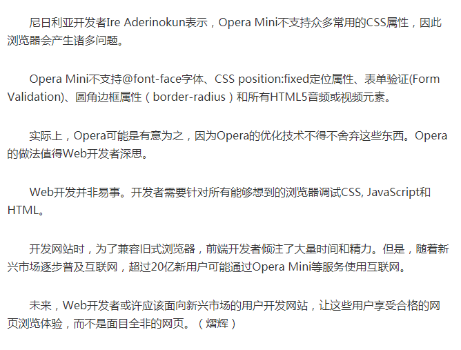

# Opera 浏览器的一些坑

### 关于 opera-mini 浏览器的一些认识

`opera mini` 是挪威 `opera` 公司推出的一款浏览器，除此之外还有 `opera mobile` ，与中国团队合作开发的欧朋，开奇 `opera mini` 以带来一流的浏览体验而著称。快速，省流量，精致小巧，对网页的还原性很强。当然，因为这并不是针对中国本土的浏览器，有些方面可能不太完美，像不支持三大运营商的 `wifi` 登陆界面（支持 `wifi` 上网），对 `wap` 浏览省流量效果不太理想，不支持夜间模式，排版有时候可能有点问题。总的来说 `opera mini` 是我用过最好的浏览器。在速度，省流量和排版方面的浏览体验比之uc，遨游，qq之类都要更好。其实最令人感动的是 `opera mini` 为低端配置手机所做的努力。

`Opera Mini` 是瘦客户端浏览器，适用于几乎所有手机，它使用 `Opera` 先进的服务器压缩技术压缩页面后再传回手机，渲染引擎在服务器端。

`Opera Mobile` 是全功能的浏览器，适用于智能手机，它直接访问网站下载页面使用手机端渲染引擎 – Opera Presto – 渲染页面。
`Opera Mobile` 提供高度友好的浏览体验，推荐在拥有 Wi-Fi 网络或无限流量套餐时使用。而 `Opera Mini` 拥有快如闪电的速度，同时还能帮您节省大量上网费用。很多用户在有 Wi-Fi 时使用 `Opera Mobile`，其他时候则使用 `Opera Mini`。

### 相关资料链接

[Opera Mini 与 JavaScript](http://tieba.baidu.com/p/2006880516)

[https://www.v2ex.com/t/3905](https://www.v2ex.com/t/3905)

[opera mini主流版本详尽介绍](http://tieba.baidu.com/p/670744164)

### Opera Mini

[Opera mini 互动百科](http://www.baike.com/wiki/Opera+mini)

[https://dev.opera.com/articles/opera-binary-markup-language/](https://dev.opera.com/articles/opera-binary-markup-language/)

[Android 版 Opera 常见问题](https://www.opera.com/zh-cn/help/mobile/android)

[Opera Mini浏览器体验欠佳 但用户量已超过3亿](http://tech.qq.com/a/20151225/023653.htm)

